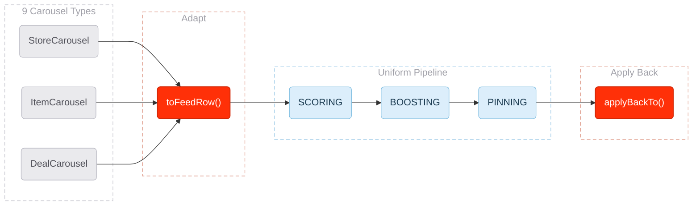

# RFC Guide — Claude Instructions

## Mermaid Diagrams

### Philosophy
Every mermaid diagram in an RFC MUST have:
1. **A reason** — Why does this diagram exist? What question does it answer that prose cannot?
2. **An aha moment** — What is the single insight the reader should walk away with? If the diagram doesn't produce an "oh, now I get it" reaction, it shouldn't exist.

Visualization is the strongest tool for getting a reader to understand what you're proposing. Do not use diagrams as decoration. Each one earns its place by conveying something that would be confusing or tedious in text alone.

### Before Drawing a Diagram
Ask yourself:
- What is the reader confused about at this point in the RFC?
- What will they understand after seeing this diagram that they didn't before?
- Can I state the aha moment in one sentence?

If you can't answer these, the diagram isn't ready.

### Diagram Annotations
Every mermaid diagram MUST include a comment block above it:

```markdown
<!-- Diagram: [Short title]
     Reason: [Why this diagram exists]
     Aha: [The one insight the reader gets] -->
```

### Diagram Selection Guide

| Insight type | Diagram type | When to use |
|---|---|---|
| How data/requests flow through components | `flowchart` | System architecture, request paths, data pipelines |
| What happens over time between services | `sequenceDiagram` | API call chains, async flows, handshakes |
| Lifecycle of an entity through states | `stateDiagram-v2` | Order states, feature flags, deployment stages |
| Timeline or phases of work | `gantt` | Project milestones, rollout phases |
| Decision logic with branches | `flowchart` with diamond nodes | Routing logic, feature branching, error handling |
| Class/data relationships | `classDiagram` | Domain models, schema relationships |

---

### Styling Guidelines

#### Core Principle: Color Earns Its Place

Do not color anything for the sake of doing it. Every color in a diagram must express something. If you can't say *why* a node is colored, it should be gray.

**The process:**
1. Start with the diagram's meaning — what is the story?
2. Identify 2-3 semantic roles that need visual distinction (max)
3. Assign colors from the brand palette to those roles
4. Everything else is gray — data, context, plumbing
5. Verify: if you removed a color, would you lose information? If no, remove it.

#### Visual Hierarchy: Groupings vs Nodes

Subgraphs (groupings) and nodes (boxes) must look different. Subgraphs are labels — they organize. Nodes are the actual things.

**Nodes (the things):**
- Solid borders, opaque fills
- Darker text — primary reading priority
- Rounded shape `("text")` — softer, more approachable than sharp rectangles
- This is what the reader should look at first

**Subgraphs (the labels):**
- Dashed borders (`stroke-dasharray:6 4`) — reads as annotation, not container
- Transparent fill (`fill:transparent`) — doesn't compete with node fills
- Light gray text (`color:#A0A0A8`) — recedes behind node labels
- Padded label strings (`"  Label Text  "`) — breathing room between text and border

```
%% Subgraph styling template
style mySubgraph fill:transparent,stroke:#C8C8D0,stroke-width:1px,stroke-dasharray:6 4,color:#A0A0A8
```

#### Node Shapes
- Rounded `("text")` — default for all nodes. Softer, approachable.
- Diamonds `{"text"}` — decision points only
- Cylinders `[("text")]` — data stores, databases (when needed)

Avoid sharp rectangles `["text"]` — they make diagrams look mechanical. Use rounded by default.

#### Layout
- **Direction**: Use `TB` (top-to-bottom) for hierarchical flows, `LR` (left-to-right) for sequential/timeline flows.
- **Simplicity**: Max 12-15 nodes per diagram. If you need more, split into multiple diagrams with clear scope.
- **Grouping**: Use `subgraph` to cluster related components. Label subgraphs with the bounded context or team boundary.

#### Edge Labels
- Always label edges that aren't self-explanatory.
- Use short verb phrases: `sends request`, `returns cached`, `falls back to`.
- For latency-critical paths, annotate with expected latency: `-- 30ms -->`.

#### Text
- Node labels: 2-4 words max. Use full names, not abbreviations (unless universally known like "API", "DB").
- Subgraph titles: Team or domain name, e.g., `subgraph Routing Platform`.

---

### Color System

#### DoorDash Spark Brand Palette
Source: [Spark Learning Experience Design Guide](https://coda.io/d/Spark-Learning-Experience-Design-Guide_dSexISkBOCq/Color-Brand_su6akA4x#_luEgXFbT) and `rfc-guide/dd-brand-guidelines.pdf`.

| Name | Hex | RGB | Role in brand |
|---|---|---|---|
| Delivery Red (Hero Red) | `#FF3008` | 255, 048, 008 | Primary brand color. Must appear in every DoorDash visual. |
| Detergent | `#80D8FF` | 128, 216, 255 | Light pairing — cool, calming complement to Hero Red |
| Bouquet | `#FFC4FC` | 255, 196, 252 | Light pairing — warm, soft complement to Hero Red |
| Yolk | `#F2D531` | 242, 213, 049 | Light pairing — energetic, attention-grabbing |
| Motor Oil | `#681109` | 104, 017, 009 | Dark pairing — grounding, contrast provider |
| Pinot Noir | `#4C0C3A` | 076, 012, 058 | Dark pairing — grounding, contrast provider |

**Brand rules:**
- Hero Red is the primary brand differentiator. It should appear in every diagram.
- Supporting colors pair WITH Hero Red, never with each other alone.
- Full-saturation brand colors go on nodes, never on subgraph backgrounds.

#### How to Apply Color in Diagrams

**Gray is the default.** Most nodes in any diagram are context — data flowing through, services that exist, things that aren't the point. These are gray.

```
classDef domain fill:#EAEAED,stroke:#B8B8C2,color:#505058,stroke-width:1px
```

**Then ask: what are the 2-3 things that ARE the point?** Assign brand colors only to those. Each diagram should use at most 2-3 semantic colors plus gray.

Common semantic roles and their brand color:

| Role | Brand color | Tint for nodes | Why this color |
|---|---|---|---|
| The action/transformation this RFC proposes | Delivery Red | `fill:#FF3008,stroke:#D42807,color:#FFFFFF` | Red = action, this is what we're building |
| New components that didn't exist before | Detergent | `fill:#DCEEFB,stroke:#7BBCE0,color:#1A3A50` | Cool blue = new, calm, ordered |
| Happy path / desired outcome | Detergent | `fill:#DCEEFB,stroke:#7BBCE0,color:#1A3A50` | Blue = positive, flowing |
| Decision points | Neutral | `fill:#EAEAED,stroke:#B8B8C2,color:#505058` | Decisions are structure, not emphasis |
| Degraded path / fallback | Bouquet | `fill:#FFE8FB,stroke:#E0A8DC,color:#4C0C3A` | Soft pink = caution without alarm |
| Danger / discard / error | Delivery Red (light tint) | `fill:#FFF0EB,stroke:#FF3008,color:#FF3008` | Red border draws the eye to risk |
| External / out-of-scope | Pinot Noir | `fill:#4C0C3A,stroke:#36082A,color:#FFFFFF` | Dark purple = outside our domain |

**Subgraph borders can carry a subtle tint** matching the dominant color inside, but the fill is always transparent:

```
%% Subgraph with red-tinted border (contains hero/action nodes)
style sg fill:transparent,stroke:#E0A090,stroke-width:1px,stroke-dasharray:6 4,color:#A0A0A8

%% Subgraph with blue-tinted border (contains proposed/new nodes)
style sg fill:transparent,stroke:#A0CCE8,stroke-width:1px,stroke-dasharray:6 4,color:#A0A0A8

%% Subgraph with neutral border (contains context/data nodes)
style sg fill:transparent,stroke:#C8C8D0,stroke-width:1px,stroke-dasharray:6 4,color:#A0A0A8
```

---

### Design Process — Step by Step

Follow this sequence when styling a mermaid diagram. Do not skip to colors.

**Step 1: Structure.** Get the nodes, edges, and subgraphs right. No styling yet. Does the topology communicate the idea?

**Step 2: Meaning.** For each element, write down what it IS:
- Is this node the thing we're proposing? Or context?
- Is this subgraph a label or a real boundary?
- Is this edge obvious or does it need a label?

**Step 3: Assign roles.** From the meaning, pick 2-3 semantic roles. Example: "action we're proposing" + "new uniform flow" + "everything else is context."

**Step 4: Color.** Map roles to brand colors. Gray for context. One or two brand colors for the things that matter. If you have more than 3 colors (including gray), you're probably over-styling.

**Step 5: Differentiate layers.** Apply the groupings-vs-nodes rules:
- Nodes: rounded, solid, opaque, darker text
- Subgraphs: dashed, transparent, light text, padded labels
- Subgraph borders: subtle tint matching dominant content

**Step 6: Audit.** For every colored element, ask: "If I made this gray, would the reader lose information?" If no → make it gray.

---

### Example: Well-Structured Diagram

```markdown
<!-- Diagram: Adapt → Rank → Apply Back funnel
     Reason: Readers need to see how 9 heterogeneous types converge to one uniform pipeline
     Aha: The adapter boundary is the only place type-awareness exists — everything downstream is type-agnostic -->
```



**Why each color exists:**
- **Gray nodes** — carousel types are data. They're not the point. They recede.
- **Red nodes** — `toFeedRow()` and `applyBackTo()` are the actions this RFC proposes. Red = "this is what we're building."
- **Blue nodes** — pipeline steps are the new uniform flow. Blue = "this didn't exist before, and it's calm/ordered."
- **Dashed subgraphs** — these are labels, not things. They organize without competing.
- **Tinted borders** — peach on action subgraphs, blue on pipeline, gray on data. Subtle signal, not emphasis.

### Anti-Patterns
- **Box-and-arrow soup**: A diagram with 20+ nodes and no subgraphs. Split it up.
- **The "architecture astronaut"**: Showing every microservice when only 3 are relevant. Scope to what matters.
- **The label-less graph**: Edges without labels force the reader to guess what flows between components.
- **The decorative diagram**: A diagram that restates what the previous paragraph already said clearly. Delete it.
- **Rainbow styling**: More than 3 colors (including gray). If everything is highlighted, nothing is.
- **Solid subgraphs**: Subgraph fills that compete with node fills. Subgraphs are labels — transparent + dashed.
- **Sharp rectangles everywhere**: Use rounded nodes. Sharp corners make diagrams feel like system architecture from 2005.
- **Color without reason**: If you can't say why a node is that color in one sentence, make it gray.
