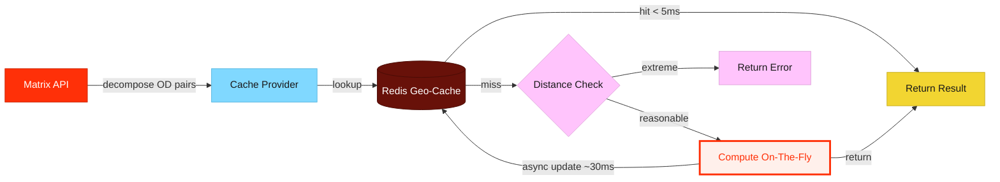

# RFC Guide — Claude Instructions

## Mermaid Diagrams

### Philosophy
Every mermaid diagram in an RFC MUST have:
1. **A reason** — Why does this diagram exist? What question does it answer that prose cannot?
2. **An aha moment** — What is the single insight the reader should walk away with? If the diagram doesn't produce an "oh, now I get it" reaction, it shouldn't exist.

Visualization is the strongest tool for getting a reader to understand what you're proposing. Do not use diagrams as decoration. Each one earns its place by conveying something that would be confusing or tedious in text alone.

### Before Drawing a Diagram
Ask yourself:
- What is the reader confused about at this point in the RFC?
- What will they understand after seeing this diagram that they didn't before?
- Can I state the aha moment in one sentence?

If you can't answer these, the diagram isn't ready.

### Diagram Annotations
Every mermaid diagram MUST include a comment block above it:

```markdown
<!-- Diagram: [Short title]
     Reason: [Why this diagram exists]
     Aha: [The one insight the reader gets] -->
```

Example:
```markdown
<!-- Diagram: Cache lookup flow
     Reason: The fallback chain on cache miss is non-obvious and has latency implications
     Aha: Cache misses only add ~30ms because we precompute on the fly and update async -->
```

### Diagram Selection Guide
Pick the right diagram type for the insight:

| Insight type | Diagram type | When to use |
|---|---|---|
| How data/requests flow through components | `flowchart` | System architecture, request paths, data pipelines |
| What happens over time between services | `sequenceDiagram` | API call chains, async flows, handshakes |
| Lifecycle of an entity through states | `stateDiagram-v2` | Order states, feature flags, deployment stages |
| Timeline or phases of work | `gantt` | Project milestones, rollout phases |
| Decision logic with branches | `flowchart` with diamond nodes | Routing logic, feature branching, error handling |
| Class/data relationships | `classDiagram` | Domain models, schema relationships |

### Styling Guidelines

#### Layout
- **Direction**: Use `TB` (top-to-bottom) for hierarchical flows, `LR` (left-to-right) for sequential/timeline flows.
- **Simplicity**: Max 12-15 nodes per diagram. If you need more, split into multiple diagrams with clear scope.
- **Grouping**: Use `subgraph` to cluster related components. Label subgraphs with the bounded context or team boundary.

#### Node Shapes
- Rectangles `[text]` — services, components
- Rounded `(text)` — data stores, databases
- Diamonds `{text}` — decision points
- Stadium `([text])` — external systems, third-party APIs

#### Color Palette — DoorDash Spark Brand Colors
Source: [Spark Learning Experience Design Guide](https://coda.io/d/Spark-Learning-Experience-Design-Guide_dSexISkBOCq/Color-Brand_su6akA4x#_luEgXFbT) and `rfc-guide/dd-brand-guidelines.pdf`.

**Brand palette reference:**

| Name | Hex | RGB | Role in brand |
|---|---|---|---|
| Delivery Red (Hero Red) | `#FF3008` | 255, 048, 008 | Primary brand color. Must appear in every DoorDash visual. |
| Detergent | `#80D8FF` | 128, 216, 255 | Light pairing — cool, calming complement to Hero Red |
| Bouquet | `#FFC4FC` | 255, 196, 252 | Light pairing — warm, soft complement to Hero Red |
| Yolk | `#F2D531` | 242, 213, 049 | Light pairing — energetic, attention-grabbing |
| Motor Oil | `#681109` | 104, 017, 009 | Dark pairing — grounding, contrast provider |
| Pinot Noir | `#4C0C3A` | 076, 012, 058 | Dark pairing — grounding, contrast provider |

**Brand rules (from guide):**
- Hero Red is the primary brand differentiator. It MUST appear in every diagram.
- Supporting colors pair WITH Hero Red, never with each other alone.
- Yolk, Bouquet, and Detergent are lighter pairings to Hero Red.
- Pinot Noir and Motor Oil are darker pairings for contrast.
- Use lighter tints (from the Color Spectrum in the guide) for subgraph backgrounds where full saturation is too heavy.

**Mermaid classDef definitions — copy-paste into diagrams:**

```
%% DoorDash Spark Colors — Semantic mapping for RFC diagrams
%% Source: dd-brand-guidelines.pdf

classDef hero fill:#FF3008,stroke:#CC2606,color:#FFFFFF
classDef existing fill:#681109,stroke:#4A0C06,color:#FFFFFF
classDef proposed fill:#80D8FF,stroke:#5AB8E0,color:#191919
classDef happy fill:#F2D531,stroke:#C9B028,color:#191919
classDef degraded fill:#FFC4FC,stroke:#E0A8DC,color:#191919
classDef external fill:#4C0C3A,stroke:#36082A,color:#FFFFFF
classDef aha fill:#FFF0EB,stroke:#FF3008,color:#FF3008,stroke-width:3px
```

**Semantic color mapping:**

| classDef | Spark Color | Use for |
|---|---|---|
| `hero` | Delivery Red | The main service/component this RFC proposes. Always present. |
| `existing` | Motor Oil | Existing infrastructure that is NOT changing |
| `proposed` | Detergent | New components or services being introduced |
| `happy` | Yolk | Happy path, desired outcome, success states |
| `degraded` | Bouquet | Degraded path, fallback behavior, warnings |
| `external` | Pinot Noir | External systems, third-party APIs, out-of-scope services |
| `aha` | Red-tinted highlight | The "aha" element — the node or edge that IS the insight. Uses a light red fill with a thick red border to draw the eye. |

**Why this mapping:**
- **Delivery Red = hero**: The RFC exists because of this component. It's the protagonist.
- **Motor Oil = existing**: Dark, stable, already in the ground. Not the focus.
- **Detergent = proposed**: Light blue stands out against the warm palette — it's new and fresh.
- **Yolk = happy path**: Yellow = go, sunshine, success. Naturally reads as positive.
- **Bouquet = degraded**: Soft pink = caution without alarm. Not an error, just not ideal.
- **Pinot Noir = external**: Dark purple = outside our domain. Distant, separate.
- **aha = highlighted red border**: Thin red-tinted node with thick red stroke. This is the node the reader's eye should land on.

#### Edge Labels
- Always label edges that aren't self-explanatory.
- Use short verb phrases: `sends request`, `returns cached`, `falls back to`.
- For latency-critical paths, annotate with expected latency: `-- 30ms -->`.

#### Text
- Node labels: 2-4 words max. Use full names, not abbreviations (unless universally known like "API", "DB").
- Subgraph titles: Team or domain name, e.g., `subgraph Routing Platform`.

### Example: Well-Structured Diagram

```markdown
<!-- Diagram: Geo-grid cache lookup flow
     Reason: Readers need to understand the happy vs sad path and where latency lives
     Aha: Cache hits return in <5ms; misses add only ~30ms via async compute+update -->
```



### Anti-Patterns
- **Box-and-arrow soup**: A diagram with 20+ nodes and no subgraphs. Split it up.
- **The "architecture astronaut"**: Showing every microservice when only 3 are relevant. Scope to what matters for the RFC.
- **The label-less graph**: Edges without labels force the reader to guess what flows between components.
- **The decorative diagram**: A diagram that restates what the previous paragraph already said clearly. Delete it.
- **Rainbow styling**: Using colors arbitrarily. Every color must have semantic meaning per the palette above.
