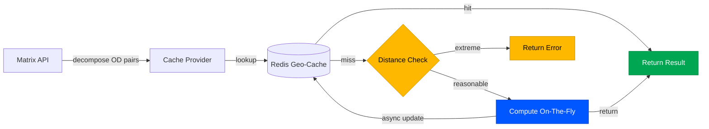

# RFC Guide — Claude Instructions

## Mermaid Diagrams

### Philosophy
Every mermaid diagram in an RFC MUST have:
1. **A reason** — Why does this diagram exist? What question does it answer that prose cannot?
2. **An aha moment** — What is the single insight the reader should walk away with? If the diagram doesn't produce an "oh, now I get it" reaction, it shouldn't exist.

Visualization is the strongest tool for getting a reader to understand what you're proposing. Do not use diagrams as decoration. Each one earns its place by conveying something that would be confusing or tedious in text alone.

### Before Drawing a Diagram
Ask yourself:
- What is the reader confused about at this point in the RFC?
- What will they understand after seeing this diagram that they didn't before?
- Can I state the aha moment in one sentence?

If you can't answer these, the diagram isn't ready.

### Diagram Annotations
Every mermaid diagram MUST include a comment block above it:

```markdown
<!-- Diagram: [Short title]
     Reason: [Why this diagram exists]
     Aha: [The one insight the reader gets] -->
```

Example:
```markdown
<!-- Diagram: Cache lookup flow
     Reason: The fallback chain on cache miss is non-obvious and has latency implications
     Aha: Cache misses only add ~30ms because we precompute on the fly and update async -->
```

### Diagram Selection Guide
Pick the right diagram type for the insight:

| Insight type | Diagram type | When to use |
|---|---|---|
| How data/requests flow through components | `flowchart` | System architecture, request paths, data pipelines |
| What happens over time between services | `sequenceDiagram` | API call chains, async flows, handshakes |
| Lifecycle of an entity through states | `stateDiagram-v2` | Order states, feature flags, deployment stages |
| Timeline or phases of work | `gantt` | Project milestones, rollout phases |
| Decision logic with branches | `flowchart` with diamond nodes | Routing logic, feature branching, error handling |
| Class/data relationships | `classDiagram` | Domain models, schema relationships |

### Styling Guidelines

#### Layout
- **Direction**: Use `TB` (top-to-bottom) for hierarchical flows, `LR` (left-to-right) for sequential/timeline flows.
- **Simplicity**: Max 12-15 nodes per diagram. If you need more, split into multiple diagrams with clear scope.
- **Grouping**: Use `subgraph` to cluster related components. Label subgraphs with the bounded context or team boundary.

#### Node Shapes
- Rectangles `[text]` — services, components
- Rounded `(text)` — data stores, databases
- Diamonds `{text}` — decision points
- Stadium `([text])` — external systems, third-party APIs

#### Color Palette
Use DoorDash Spark brand colors for consistency. Apply via `style` or `classDef`.

```
%% DoorDash Spark Colors — PLACEHOLDER
%% Replace with actual hex codes from Spark Design Guide once provided.
%% Assign semantic meaning to each color:

classDef primary fill:#FF3008,stroke:#CC2606,color:#FFFFFF
classDef secondary fill:#191919,stroke:#000000,color:#FFFFFF
classDef accent fill:#0057FF,stroke:#0044CC,color:#FFFFFF
classDef success fill:#00A651,stroke:#008541,color:#FFFFFF
classDef warning fill:#FFB800,stroke:#CC9300,color:#000000
classDef neutral fill:#F5F5F5,stroke:#E0E0E0,color:#191919
classDef highlight fill:#FFF0EB,stroke:#FF3008,color:#191919
```

**Color usage rules:**
- `primary` — The main service or component being proposed in this RFC
- `secondary` — Existing infrastructure that is not changing
- `accent` — New components or services being introduced
- `success` — Happy path / desired outcome
- `warning` — Degraded path / fallback behavior
- `neutral` — Context / background systems
- `highlight` — The "aha" element — the node or edge that IS the insight

#### Edge Labels
- Always label edges that aren't self-explanatory.
- Use short verb phrases: `sends request`, `returns cached`, `falls back to`.
- For latency-critical paths, annotate with expected latency: `-- 30ms -->`.

#### Text
- Node labels: 2-4 words max. Use full names, not abbreviations (unless universally known like "API", "DB").
- Subgraph titles: Team or domain name, e.g., `subgraph Routing Platform`.

### Example: Well-Structured Diagram

```markdown
<!-- Diagram: Geo-grid cache lookup flow
     Reason: Readers need to understand the happy vs sad path and where latency lives
     Aha: Cache hits return in <5ms; misses add only ~30ms via async compute+update -->
```



### Anti-Patterns
- **Box-and-arrow soup**: A diagram with 20+ nodes and no subgraphs. Split it up.
- **The "architecture astronaut"**: Showing every microservice when only 3 are relevant. Scope to what matters for the RFC.
- **The label-less graph**: Edges without labels force the reader to guess what flows between components.
- **The decorative diagram**: A diagram that restates what the previous paragraph already said clearly. Delete it.
- **Rainbow styling**: Using colors arbitrarily. Every color must have semantic meaning per the palette above.

## TODO: DoorDash Spark Color Palette
> **ACTION REQUIRED**: Replace placeholder hex codes above with actual values from the
> [Spark Learning Experience Design Guide](https://coda.io/d/Spark-Learning-Experience-Design-Guide_dSexISkBOCq/Color-Brand_su6akA4x#_luEgXFbT).
> The user needs to provide these values (Coda is behind auth).
