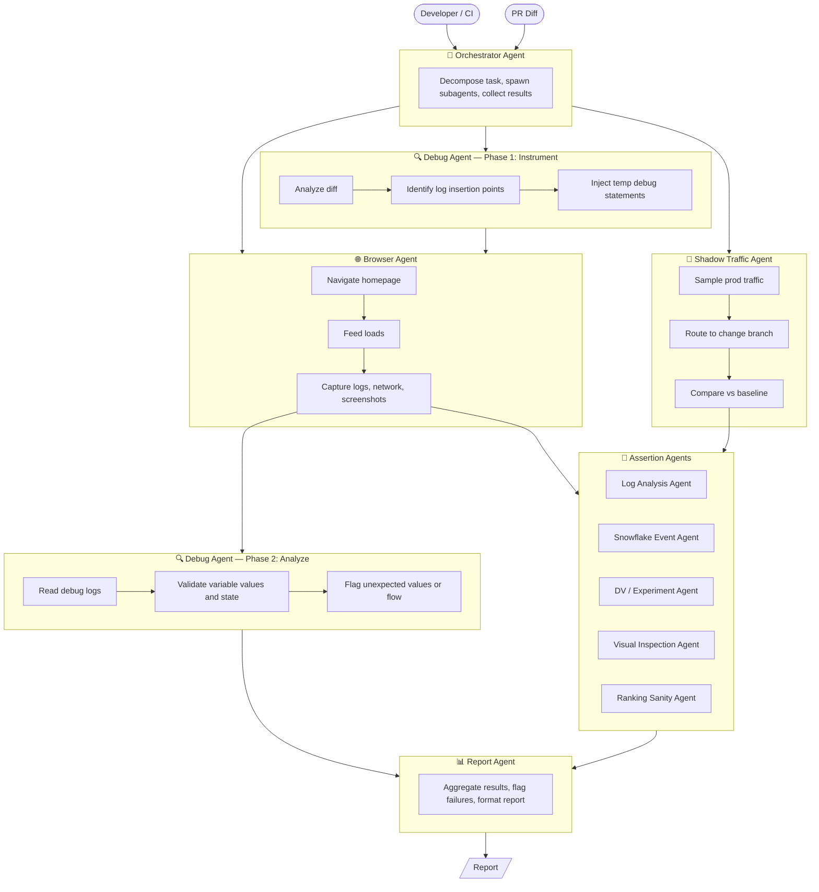
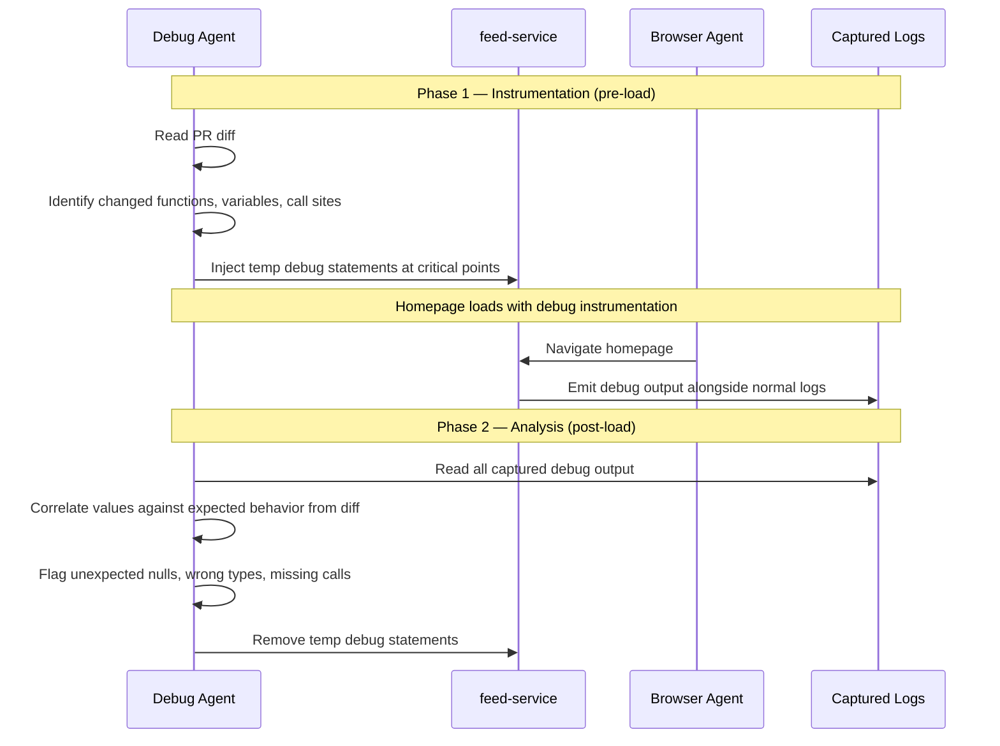
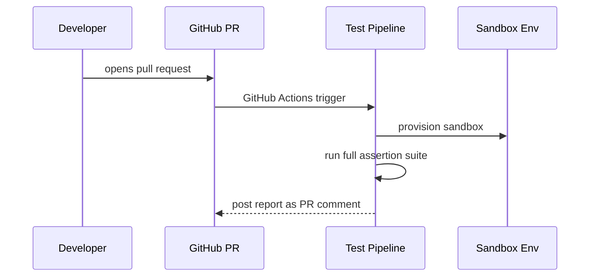

# Feed Service Homepage E2E Sandbox Testing — Vision

This document is the **aspirational end-state**. See `plan.md` for what's built and what's next.

## End-to-End Pipeline



## Assertion Layers

| Layer | Description | Status |
|---|---|---|
| Log / Network | feed-service logs, API response shape, no load errors | **Built** |
| Snowflake Events | impression events, ranking signals, item IDs & positions | **Built** |
| Ranking Sanity | carousel scores ordered correctly, store scores match position | Partial — scores extracted, no order assertion |
| Visual | screenshot diff against baseline, structural snapshot | Partial — screenshot + video, no baseline diff |
| DV / Experiment | enrollment confirmed, correct variant assigned | Not started |
| Shadow Traffic | prod sample routed to change branch, latency & response compared | Not started |
| Debug Analysis | PR diff instrumented with temp logs, variable values validated | Not started |

## Debug Agent — Two-Phase Flow

The most ambitious piece. Bridges PR diff → runtime observability. Instruments code before load, interprets output after.



## Target Report Format

```
┌─────────────────────────────────────────────────────────────────────────┐
│   Homepage E2E Test Report                                              │
│   Sandbox: user-abc  |  2026-03-18 14:32  |  run #42                    │
├─────────────────────────────────────────────────────────────────────────┤
│   🔍  Debug Analysis      ✅  4 vars checked — all values in range       │
│   📋  Feed Load & Logs    ✅  0 errors, 2.1s load                        │
│   🔀  Shadow Traffic      ✅  p50 +2ms vs baseline, responses match      │
│   📡  Snowflake Events    ✅  12 / 12 events emitted                     │
│   🔬  DV / Experiments    ✅  exp-ranking-v3 enrolled                    │
│   🖥️  Visual Snapshot     ⚠️  1 layout diff flagged                      │
│   🧪  Ranking Sanity      ❌  carousel[2] score/order mismatch           │
├─────────────────────────────────────────────────────────────────────────┤
│   Overall: FAIL (4/6)  —  1 warning, 1 failure                          │
└─────────────────────────────────────────────────────────────────────────┘
```

## CI Mode (Not Yet Built)



## Open Questions
- How to parameterize DV/experiment overrides in sandbox?
- Visual diffs: opt-in or always-on?
- Debug Agent: can it reliably identify meaningful instrumentation points from a diff?
