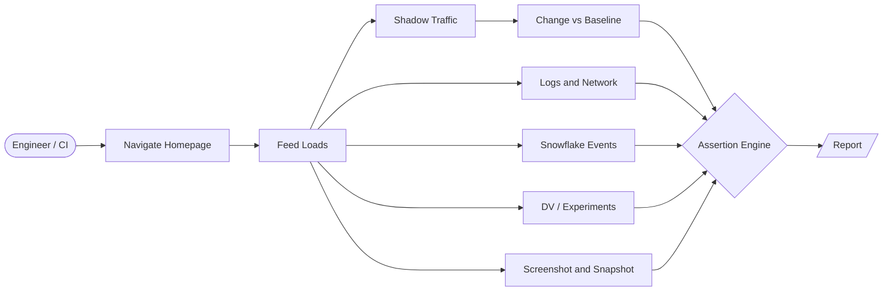
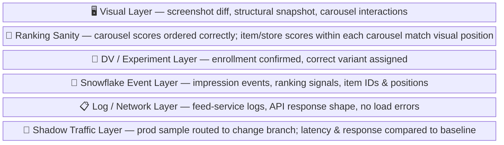
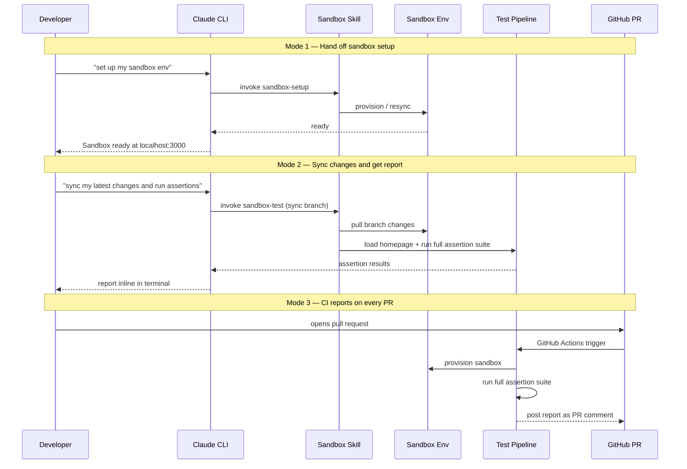

# Feed Service Homepage E2E Sandbox Testing — 1-Pager

## Visuals

### 1. End-to-End Pipeline



---

### 2. Assertion Layers



---

### 3. Test Report Mockup

```
┌──────────────────────────────────────────────────────────────────┐
│  Homepage E2E Test Report                                        │
│  Sandbox: user-abc  |  2026-03-18 14:32  |  run #42             │
├──────────────────────────────────────────────────────────────────┤
│  📋  Feed Load & Logs    ✅  0 errors, 2.1s load                 │
│  🔀  Shadow Traffic      ✅  p50 +2ms vs baseline, responses match│
│  📡  Snowflake Events    ✅  12 / 12 events emitted              │
│  🔬  DV / Experiments    ✅  exp-ranking-v3 enrolled             │
│  🖥️  Visual Snapshot     ⚠️  1 layout diff flagged              │
│  🧪  Ranking Sanity      ❌  carousel[2]: item scores vs visual  │
│                              order mismatch (scores: A>B, shown: B>A)│
├──────────────────────────────────────────────────────────────────┤
│  Overall: FAIL (4/6)  — 1 warning, 1 failure                    │
└──────────────────────────────────────────────────────────────────┘
```

---

### 4. Developer Feedback Loop

Three ways to trigger the same pipeline — manual handoff, on-demand report, and CI on every PR.



---

### 5. CLI Interaction Mockups

**Mode 1 — Sandbox setup**
```
$ claude "set up my sandbox env"

  Spinning up sandbox for user-abc...
  Syncing feed-service branch: feat/ranking-v3
  Sandbox ready at localhost:3000 ✅
```

**Mode 2 — Sync + assertion report**
```
$ claude "sync my latest changes and give me an assertion report"

  Pulling feat/ranking-v3...
  Loading homepage...
  Running assertions...

  ┌──────────────────────────────────────────────────┐
  │  Homepage E2E Report  |  feat/ranking-v3         │
  ├──────────────────────────────────────────────────┤
  │  Feed Load & Logs    ✅  0 errors, 2.1s          │
  │  Shadow Traffic      ✅  p50 +2ms vs baseline    │
  │  Snowflake Events    ✅  12 / 12 emitted         │
  │  DV / Experiments    ✅  exp-ranking-v3 enrolled │
  │  Visual Snapshot     ⚠️  1 layout diff flagged  │
  │  Ranking Sanity      ❌  carousel[2] score/order │
  │                          mismatch (A>B shown B>A)│
  ├──────────────────────────────────────────────────┤
  │  FAIL (4/6)  —  details: /tmp/e2e-report-42/    │
  └──────────────────────────────────────────────────┘
```

**Mode 3 — CI PR comment**
```
🤖 Homepage E2E Report — feat/ranking-v3

| Check            | Result  | Detail                          |
|------------------|---------|---------------------------------|
| Feed Load & Logs | ✅ PASS | 0 errors, 2.1s load             |
| Shadow Traffic   | ✅ PASS | p50 +2ms vs baseline            |
| Snowflake Events | ✅ PASS | 12/12 emitted                   |
| DV / Experiments | ✅ PASS | exp-ranking-v3 enrolled         |
| Visual Snapshot  | ⚠️ WARN | 1 layout diff — [view diff]()   |
| Ranking Sanity   | ❌ FAIL | carousel[2] score/order mismatch|

Overall: FAIL — 1 warning, 1 failure
```

---

## Problem

Validating homepage ranking changes today is manual and slow. Engineers spin up sandbox environments, load the homepage, eyeball the feed, check logs, and try to correlate events and experiment assignments by hand. This is error-prone, doesn't scale, and creates risk when shipping ranking changes.

## Goal

Automate end-to-end homepage validation in sandbox environments so engineers get fast, reproducible signal that:
- The feed loaded correctly
- The right DVs/experiments were applied
- Snowflake events were emitted as expected
- Visual ranking and surface appearance is correct

## Scope

### In Scope
- Spinning up sandbox environments on demand
- Reloading the homepage and triggering a full feed load cycle
- Asserting Snowflake events emitted on page load (impression events, ranking signals)
- Asserting DVs and experiment assignments are present and correct
- Visual inspection of homepage feed (ranking order, surface appearance)
- Basic interactions: scroll, tap/click cards, carousel navigation
- Log analysis: surface errors, unexpected ranking decisions, blending anomalies

### Out of Scope (for now)
- Multi-user / multi-session load testing
- Full regression coverage beyond homepage
- Non-sandbox environments (staging, prod)

## Approach

### 1. Sandbox Provisioning
- Reuse existing sandbox-setup skill/tooling to spin up or resync sandbox env
- Parameterize by user profile, DV overrides, experiment config

### 2. Homepage Load + Log Capture
- Automate homepage navigation (Playwright)
- Capture all network requests, console logs, server-side logs from feed-service
- Assert no load errors, expected response shape from feed ranking endpoint

### 3. Snowflake Event Validation
- After load, query Snowflake (or event sink) for expected impression/engagement events
- Assert event presence, correct item IDs, expected ranking positions

### 4. DV / Experiment Assertion
- Parse feed response or server logs for DV assignment payloads
- Assert expected experiments are enrolled, correct variant applied

### 5. Visual Inspection
- Screenshot homepage at load
- Playwright snapshot for accessibility/structural validation
- Optionally: image diff against baseline to catch visual regressions

### 6. Ranking Sanity Checks
- Assert top-N items match expected ranking heuristics (e.g. no obviously wrong content surfaced)
- Flag anomalies: duplicate content, wrong content type, ranking inversions

## Output / Reporting
- Pass/fail summary per assertion category
- Linked logs, screenshots, and Snowflake event traces for failures
- CI-compatible: can be triggered pre-merge or on a schedule

## Success Criteria
- An engineer can run a single command and get a green/red signal on homepage health
- False positive rate is low enough that failures are actionable
- Covers the most common ranking regression patterns caught manually today

## Open Questions
- What's the right event sink to query — Snowflake directly, or an intermediate event store?
- How do we parameterize DV/experiment overrides in sandbox?
- Should visual diffs be opt-in or always-on?
- What latency is acceptable for the full test run?

## Next Steps
1. Audit existing sandbox-setup and sandbox-test skills for reuse
2. Define the minimal set of Snowflake events to assert
3. Prototype Playwright-based homepage load + log capture
4. Define DV/experiment assertion contract with feed-service response schema
