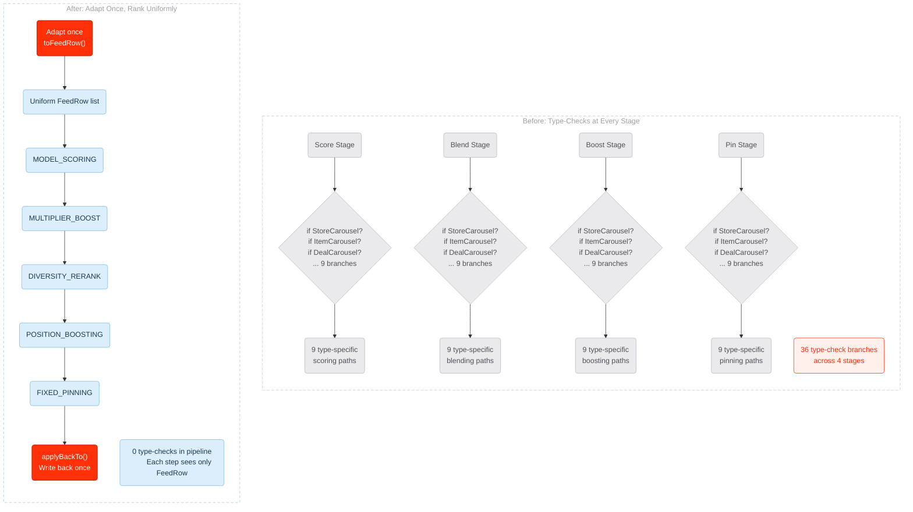
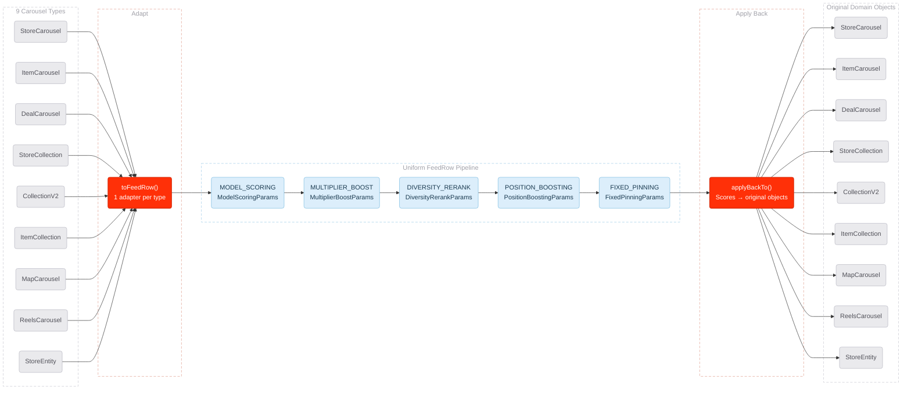
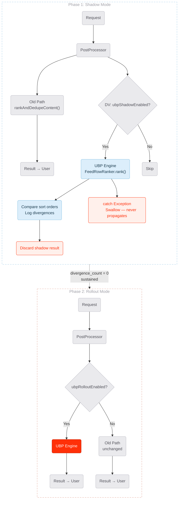
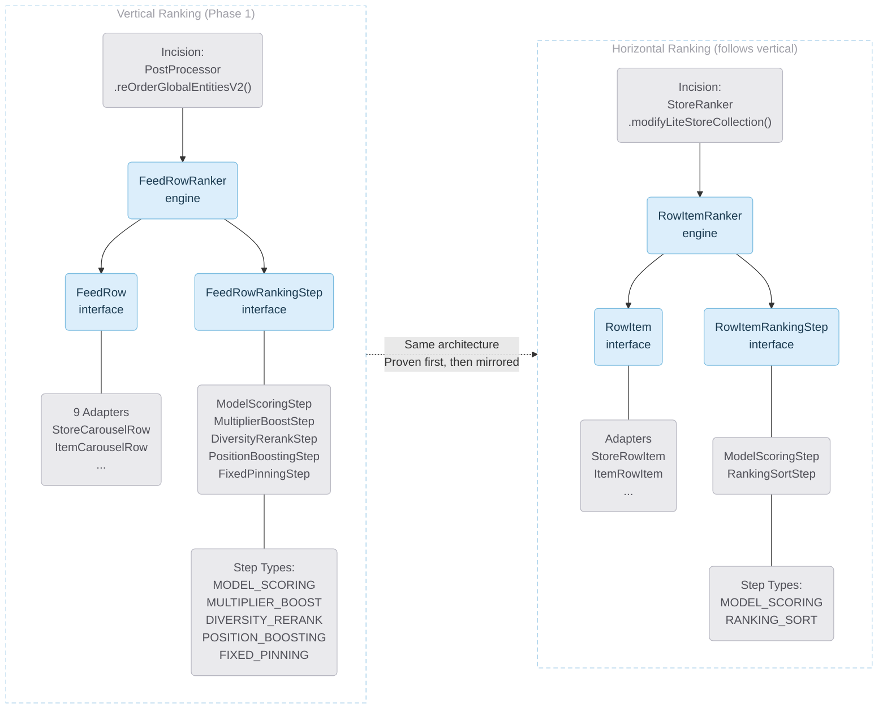
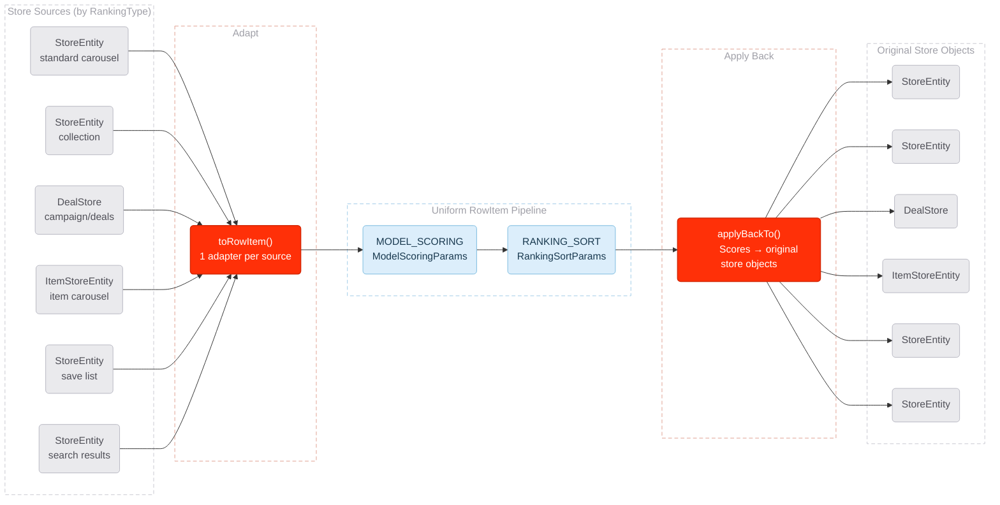
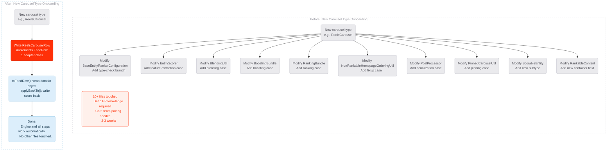

# UBP Abstraction Layer — Visual Diagrams

> Companion to the 1-pager proposal. All diagrams are Mermaid format for embedding in Google Docs,
> Notion, or GitHub.

---

## 1. Class Diagram: Interfaces, Adapters, and Steps

<!-- Diagram: Full class hierarchy
     Reason: Show all interfaces, adapters, steps, and params and how they connect
     Aha: Any carousel type adapts to FeedRow, any ranking algorithm implements FeedRowRankingStep — the engine orchestrates uniformly -->

```mermaid
classDiagram
    direction TB

    class FeedRow {
        <<interface>>
        +id: String
        +type: RowType
        +score: Double
        +metadata: Map~String, Any~
        +applyBackTo()
    }

    class RowType {
        <<enum>>
        STORE_CAROUSEL
        ITEM_CAROUSEL
        DEAL_CAROUSEL
        STORE_COLLECTION
        COLLECTION_V2
        ITEM_COLLECTION
        MAP_CAROUSEL
        REELS_CAROUSEL
        STORE_ENTITY
    }

    class StoreCarouselRow {
        -carousel: StoreCarousel
        +applyBackTo()
    }
    class ItemCarouselRow {
        -carousel: ItemCarousel
        +applyBackTo()
    }
    class DealCarouselRow {
        -carousel: DealCarousel
        +applyBackTo()
    }
    class StoreCollectionRow {
        -collection: StoreCollection
        +applyBackTo()
    }
    class CollectionV2Row {
        -collection: CollectionV2
        +applyBackTo()
    }
    class ItemCollectionRow {
        -collection: ItemCollection
        +applyBackTo()
    }
    class MapCarouselRow {
        -carousel: MapCarousel
        +applyBackTo()
    }
    class ReelsCarouselRow {
        -carousel: ReelsCarousel
        +applyBackTo()
    }
    class StoreEntityRow {
        -entity: StoreEntity
        +applyBackTo()
    }

    FeedRow <|.. StoreCarouselRow
    FeedRow <|.. ItemCarouselRow
    FeedRow <|.. DealCarouselRow
    FeedRow <|.. StoreCollectionRow
    FeedRow <|.. CollectionV2Row
    FeedRow <|.. ItemCollectionRow
    FeedRow <|.. MapCarouselRow
    FeedRow <|.. ReelsCarouselRow
    FeedRow <|.. StoreEntityRow
    FeedRow --> RowType

    class StepType {
        <<string constants>>
        MODEL_SCORING
        MULTIPLIER_BOOST
        DIVERSITY_RERANK
        POSITION_BOOSTING
        FIXED_PINNING
    }

    class FeedRowRankingStep {
        <<interface>>
        +stepType: String
        +paramsClass: Class~StepParams~
        +process(rows, context, params)
    }

    class StepParams {
        <<sealed interface>>
    }

    class ModelScoringParams {
        +predictorRef: String?
        +predictorName: String?
        +modelName: String?
    }
    class MultiplierBoostParams {
        +calibrationConfig: CalibrationConfig
        +intentScoringConfig: IntentScoringConfig
        +verticalBoostWeights: VerticalBoostWeights
    }
    class DiversityRerankParams {
        +enabled: Boolean
        +diversityScoringParams: DiversityScoringParams
    }
    class PositionBoostingParams {
        +dealCarouselMultiplier: Double
        +boostByPositionAllowList: List~String~
        +nvUnpinEnabled: Boolean
    }
    class FixedPinningParams {
        +rules: List~PinRule~
    }
    class PinRule {
        +rowId: String
        +position: Int
    }

    StepParams <|.. ModelScoringParams
    StepParams <|.. MultiplierBoostParams
    StepParams <|.. DiversityRerankParams
    StepParams <|.. PositionBoostingParams
    StepParams <|.. FixedPinningParams
    FixedPinningParams --> PinRule

    class ModelScoringStep {
        -entityScorer: EntityScorer
        +process(rows, context, params)
    }
    class MultiplierBoostStep {
        +process(rows, context, params)
    }
    class DiversityRerankStep {
        +process(rows, context, params)
    }
    class PositionBoostingStep {
        +process(rows, context, params)
    }
    class FixedPinningStep {
        +process(rows, context, params)
    }

    FeedRowRankingStep <|.. ModelScoringStep
    FeedRowRankingStep <|.. MultiplierBoostStep
    FeedRowRankingStep <|.. DiversityRerankStep
    FeedRowRankingStep <|.. PositionBoostingStep
    FeedRowRankingStep <|.. FixedPinningStep
    FeedRowRankingStep --> StepType : type
    FeedRowRankingStep --> StepParams : params

    ModelScoringStep --> ModelScoringParams
    MultiplierBoostStep --> MultiplierBoostParams
    DiversityRerankStep --> DiversityRerankParams
    PositionBoostingStep --> PositionBoostingParams
    FixedPinningStep --> FixedPinningParams

    class FeedRowRanker {
        -stepRegistry: Map~String, FeedRowRankingStep~
        -traceEmitter: UbpTraceEmitter
        +rank(rows, pipeline, context): List~FeedRow~
    }

    FeedRowRanker --> FeedRowRankingStep : dispatches to
    FeedRowRanker --> FeedRow : operates on
```

---

## 2A. Before vs After: Type-Check Branching at Every Stage

<!-- Diagram: Before vs After contrast
     Reason: Show the scale of the problem — 36 type-check branches — next to the clean alternative
     Aha: "Before" is 9x4=36 branches; "After" is 0 type-checks in the pipeline -->

---

## 2B. The Funnel: Adapt Once, Rank Uniformly, Apply Back

<!-- Diagram: Full funnel with all 9 types and params
     Reason: Show the complete fan-in → pipeline → fan-out flow with param details
     Aha: 9 diverse types converge through adapters into one uniform pipeline, then fan back out -->

---

## 3. Strangler Fig: Shadow → Rollout Migration

<!-- Diagram: Two-phase migration with safety mechanisms
     Reason: Show every safety mechanism — catch, discard, DV gates — and how the old path is never at risk
     Aha: The old path is NEVER removed. Shadow can never affect users. Rollout is a DV flip. -->

---

## 4A. Horizontal Mirroring: Same Architecture, Different Types

<!-- Diagram: Vertical and horizontal side by side with full detail
     Reason: Show that horizontal is the exact same architecture — only types and step names differ
     Aha: Once you understand vertical, horizontal is a copy-paste with different names -->

---

## 4B. The Horizontal Funnel: Adapt Once, Rank Stores Uniformly

<!-- Diagram: Horizontal funnel — store types to RowItem pipeline
     Reason: Show that within-carousel ranking follows the exact same adapt → rank → apply pattern
     Aha: 30+ RankingTypes with scattered sort logic collapse into one uniform RowItem pipeline -->

---

## 5. Carousel Onboarding: Before vs After

<!-- Diagram: New carousel type onboarding comparison
     Reason: Show the cost reduction — 10+ files to 1 adapter class
     Aha: Adding a new carousel type goes from 2-3 weeks of deep HP knowledge to writing 1 class -->

