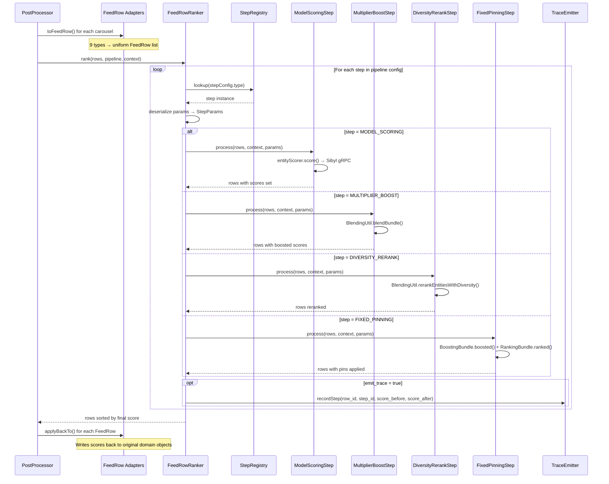
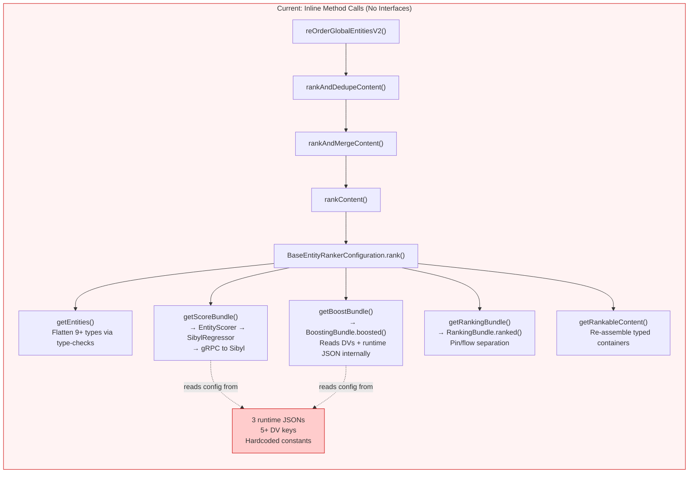
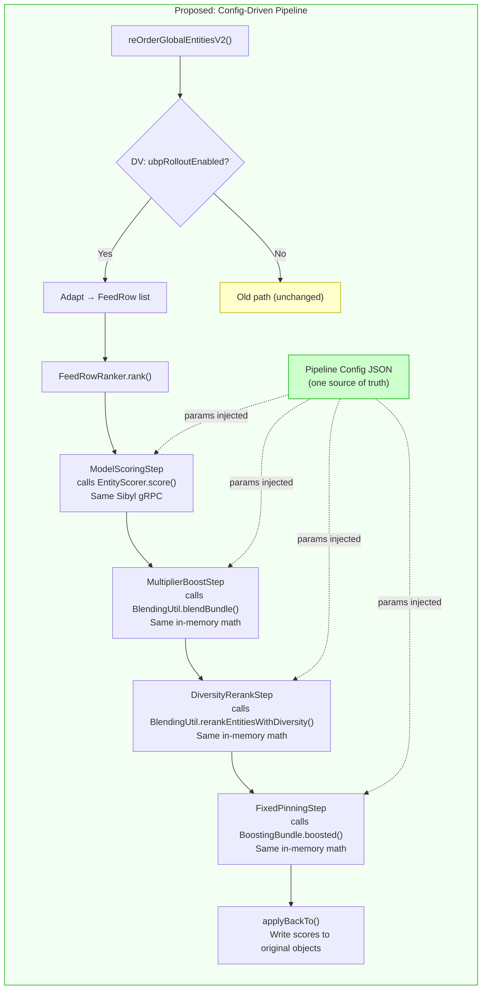
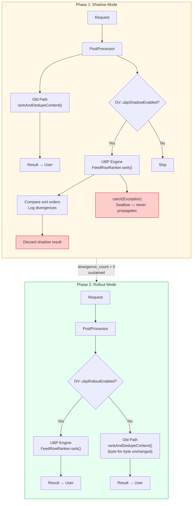
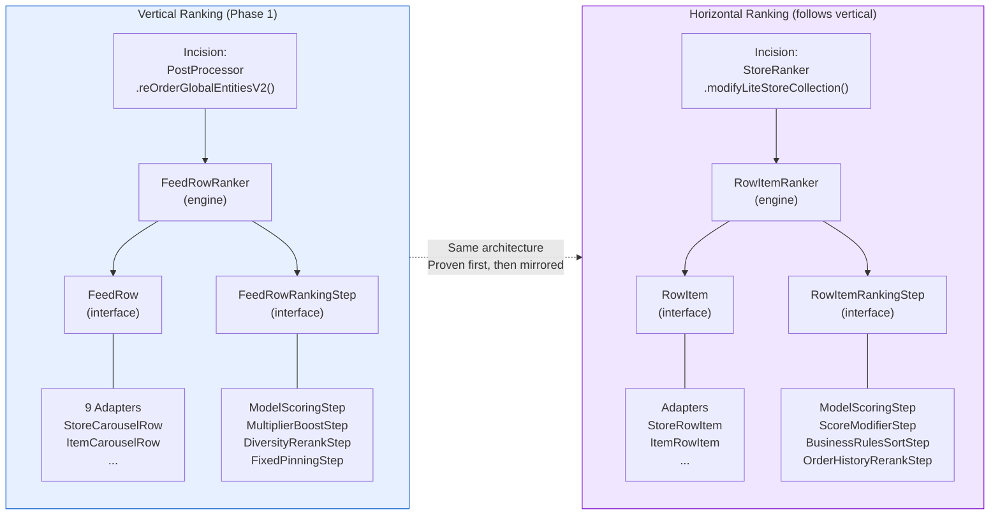
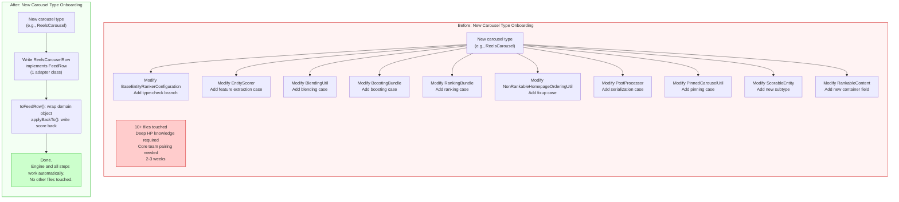

# UBP Abstraction Layer — Visual Diagrams

> Companion to the 1-pager proposal. All diagrams are Mermaid format for embedding in Google Docs,
> Notion, or GitHub.

---

## 1. Class Diagram: Interfaces, Adapters, and Steps

The "aha" moment: any carousel type adapts to `FeedRow`, any ranking algorithm implements
`FeedRowRankingStep`, and the engine orchestrates them uniformly. Teams implement their own
adapters and steps — the engine doesn't change.

```mermaid
classDiagram
    direction TB

    class FeedRow {
        <<interface>>
        +id: String
        +type: RowType
        +score: Double
        +metadata: Map~String, Any~
        +applyBackTo()
    }

    class RowType {
        <<enum>>
        STORE_CAROUSEL
        ITEM_CAROUSEL
        DEAL_CAROUSEL
        STORE_COLLECTION
        COLLECTION_V2
        ITEM_COLLECTION
        MAP_CAROUSEL
        REELS_CAROUSEL
        STORE_ENTITY
    }

    class StoreCarouselRow {
        -carousel: StoreCarousel
        +applyBackTo()
    }
    class ItemCarouselRow {
        -carousel: ItemCarousel
        +applyBackTo()
    }
    class DealCarouselRow {
        -carousel: DealCarousel
        +applyBackTo()
    }
    class StoreCollectionRow {
        -collection: StoreCollection
        +applyBackTo()
    }
    class CollectionV2Row {
        -collection: CollectionV2
        +applyBackTo()
    }
    class ItemCollectionRow {
        -collection: ItemCollection
        +applyBackTo()
    }
    class MapCarouselRow {
        -carousel: MapCarousel
        +applyBackTo()
    }
    class ReelsCarouselRow {
        -carousel: ReelsCarousel
        +applyBackTo()
    }
    class StoreEntityRow {
        -entity: StoreEntity
        +applyBackTo()
    }

    FeedRow <|.. StoreCarouselRow
    FeedRow <|.. ItemCarouselRow
    FeedRow <|.. DealCarouselRow
    FeedRow <|.. StoreCollectionRow
    FeedRow <|.. CollectionV2Row
    FeedRow <|.. ItemCollectionRow
    FeedRow <|.. MapCarouselRow
    FeedRow <|.. ReelsCarouselRow
    FeedRow <|.. StoreEntityRow
    FeedRow --> RowType

    class FeedRowRankingStep {
        <<interface>>
        +stepType: String
        +paramsClass: Class~StepParams~
        +process(rows, context, params)
    }

    class StepParams {
        <<sealed interface>>
    }

    class ModelScoringStep {
        -entityScorer: EntityScorer
        +process(rows, context, params)
    }
    class MultiplierBoostStep {
        +process(rows, context, params)
    }
    class DiversityRerankStep {
        +process(rows, context, params)
    }
    class FixedPinningStep {
        +process(rows, context, params)
    }

    FeedRowRankingStep <|.. ModelScoringStep
    FeedRowRankingStep <|.. MultiplierBoostStep
    FeedRowRankingStep <|.. DiversityRerankStep
    FeedRowRankingStep <|.. FixedPinningStep
    FeedRowRankingStep --> StepParams

    class FeedRowRanker {
        -stepRegistry: Map~String, FeedRowRankingStep~
        -traceEmitter: UbpTraceEmitter
        +rank(rows, pipeline, context): List~FeedRow~
    }

    FeedRowRanker --> FeedRowRankingStep : dispatches to
    FeedRowRanker --> FeedRow : operates on
```

---

## 2. Sequence Diagram: Engine Dispatch Flow

Shows the full lifecycle of a ranking request through the UBP engine: adapt → score → boost →
diversify → pin → apply back. Params are injected at each step from config — steps never read
DVs internally.

---

## 3. Before / After: Current Spaghetti vs Clean Pipeline

### Before: Inline calls through utility objects

No interfaces, no boundaries. Understanding one stage requires reading all stages.

### After: Named steps with typed params

Each step is independent, testable, and configurable. Params flow in from config — no internal
DV reads.

---

## 4. Strangler Fig: Shadow → Rollout Migration

Two phases of wiring. Shadow runs both paths in parallel (new path's result is discarded).
Rollout switches the primary path via DV.

---

## 5. Horizontal Mirroring: Same Architecture, Different Types

Horizontal ranking follows the identical pattern. `RowItem` mirrors `FeedRow`; `RowItemRankingStep`
mirrors `FeedRowRankingStep`. The engine shape is the same — only the abstraction type changes.

---

## 6. Carousel Onboarding: Before vs After

The "aha" for product teams: adding a new carousel type goes from touching 10+ files to writing
1 adapter class.

