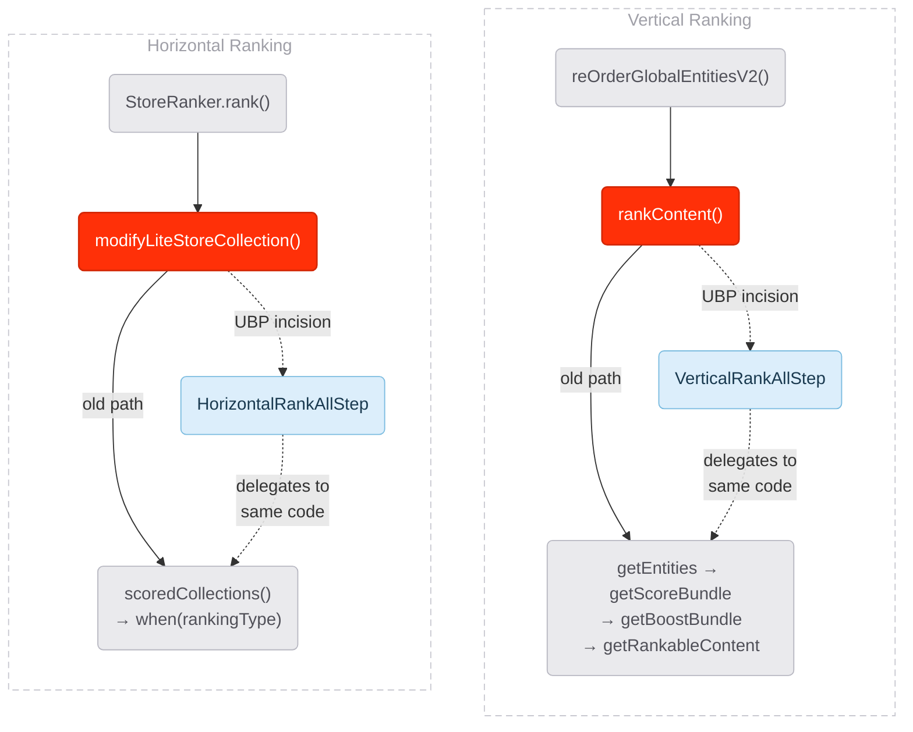
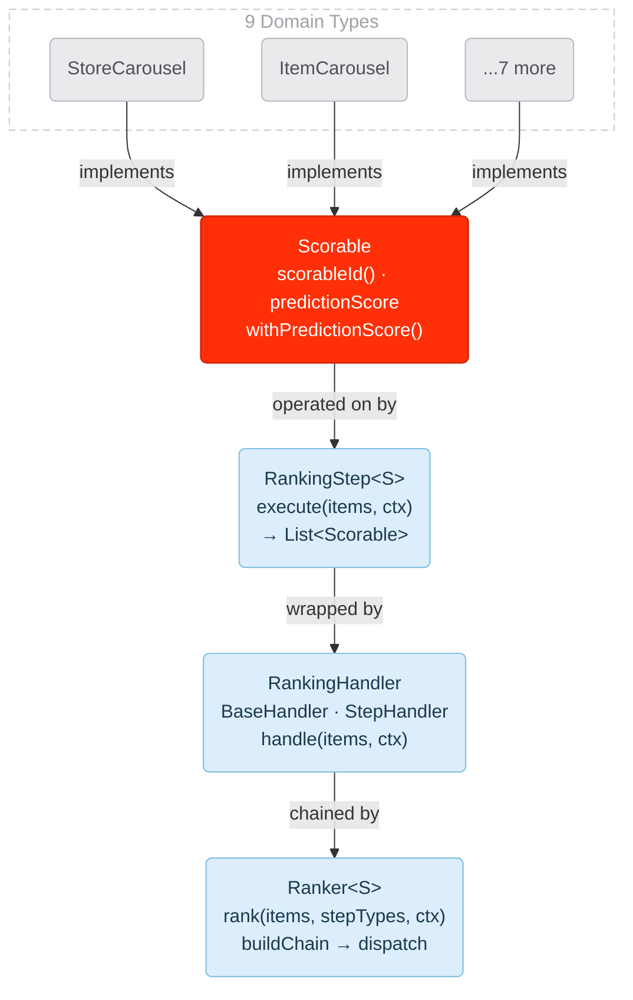
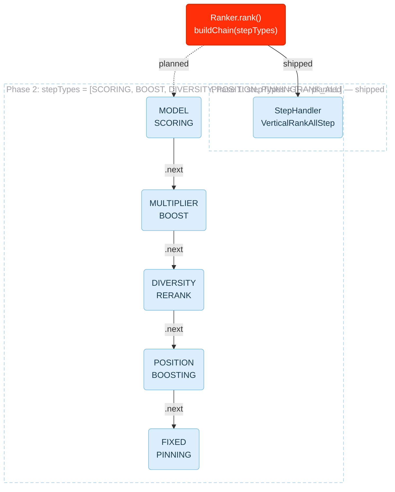
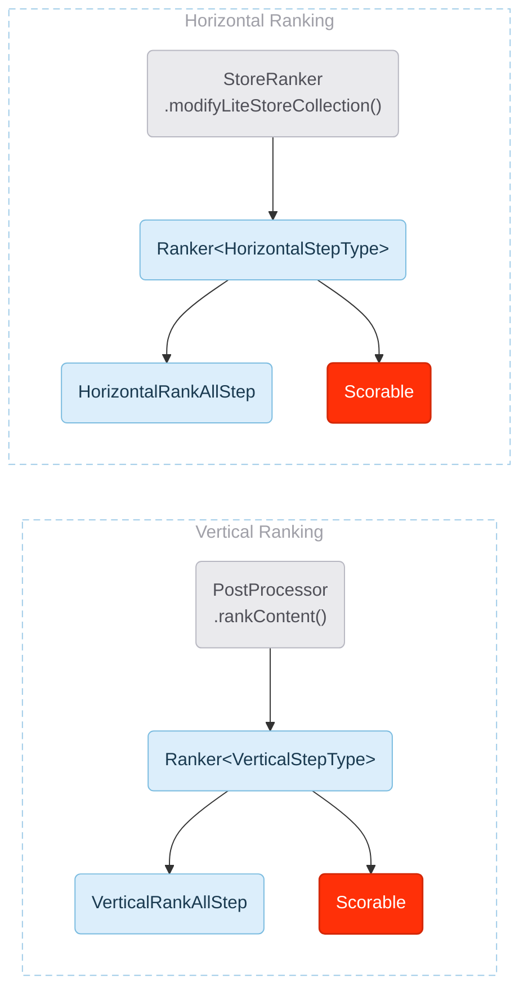
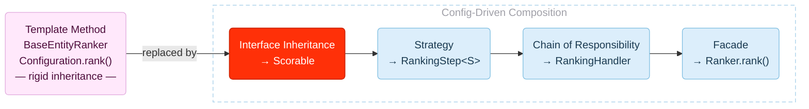
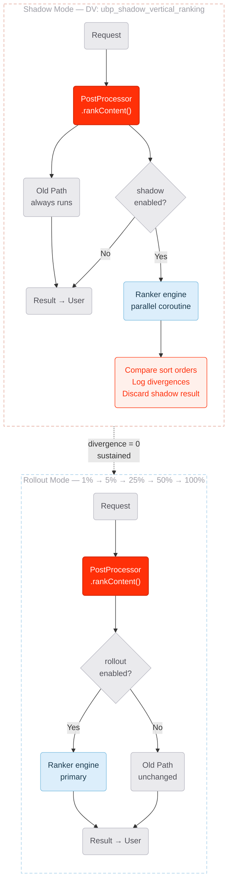
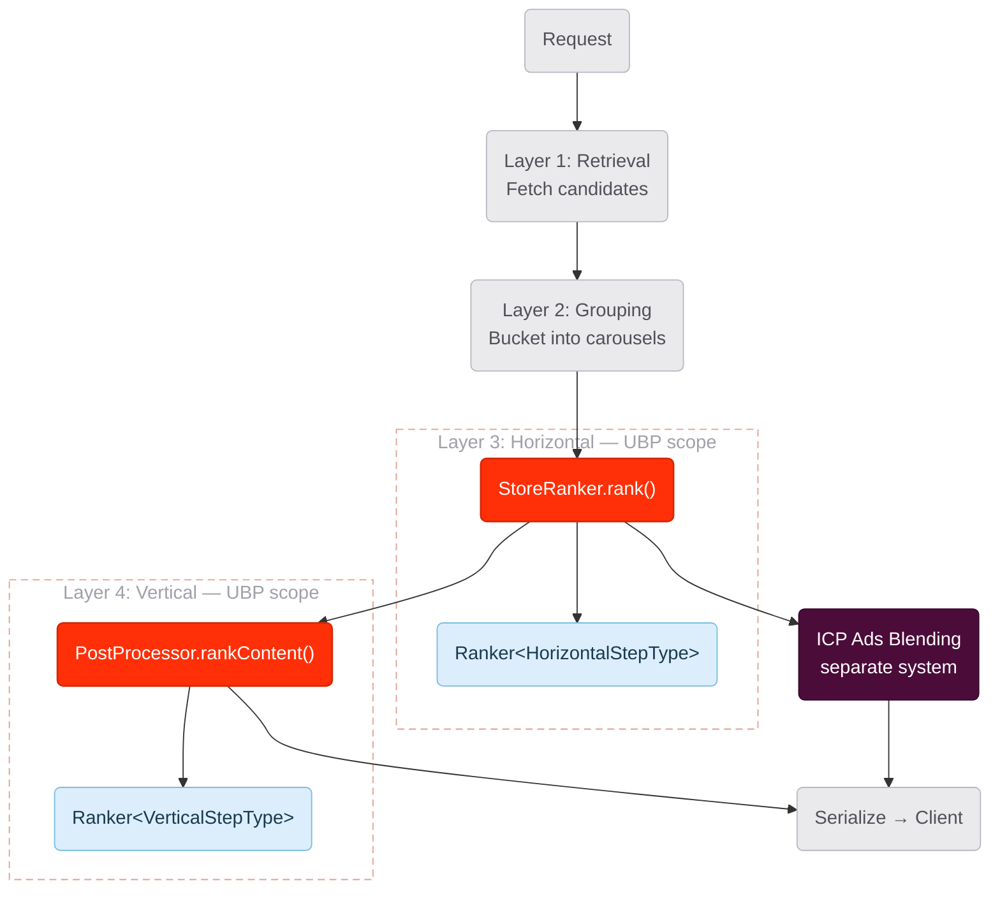

# RFC Mermaid Diagrams — Diagrams 4–10

> Brand-styled mermaid diagrams for the Ranking Abstraction Layer RFC.
> Follows `rfc-guide/CLAUDE.md` design guidelines and DoorDash Spark palette.
> All diagrams reflect the **shipped Phase 1 implementation**.

**Color legend (consistent across all diagrams):**

| Color | Role | ClassDef |
|---|---|---|
| Red (`#FF3008`) | The action / transformation this RFC proposes | `hero` |
| Blue (`#DCEEFB`) | New components that didn't exist before | `newc` |
| Gray (`#EAEAED`) | Context, data, existing code | `domain` |
| Pink (`#FFE8FB`) | Caution / being replaced | `caution` |
| Red tint (`#FFF0EB`) | Discard / danger | `discard` |
| Dark purple (`#4C0C3A`) | External / out of scope | `external` |

---

## Diagram 4: The Seams — Where We Cut

<!-- Diagram: Incision Points
     Reason: Reader needs to see exactly where in the existing code the abstraction boundary is drawn
     Aha: There are only 2 incision points in the entire codebase — rankContent() and modifyLiteStoreCollection() — and Phase 1 wraps everything behind each with a single RANK_ALL step -->

**Why each color:**
- **Red nodes** — `rankContent()` and `modifyLiteStoreCollection()` are the incision points. This is where we cut.
- **Blue nodes** — `VerticalRankAllStep` and `HorizontalRankAllStep` are the new components that wrap the legacy code.
- **Gray nodes** — existing call chain and legacy methods. Context — not the point.
- **Dashed edges** — the UBP path. Solid edges are the existing old path.

---

## Diagram 5: The Four Interfaces

<!-- Diagram: Interface Composition
     Reason: Reader needs to see how 4 interfaces compose into a complete ranking system
     Aha: Each interface has exactly one job — what gets ranked, how ranking works, infrastructure wrapping, orchestration — and they compose top-to-bottom without coupling -->

**Why each color:**
- **Red** — `Scorable` is the core abstraction this RFC proposes. Everything flows from it.
- **Blue** — `RankingStep`, `RankingHandler`, `Ranker` are new engine components. They didn't exist before.
- **Gray** — domain types are existing code. They add `override` and gain the interface — they're not the point.

---

## Diagram 6: Engine Dispatch — Handler Chain

<!-- Diagram: Engine Step Chain
     Reason: Reader needs to understand how Ranker.rank() dispatches work at runtime
     Aha: The engine doesn't change between Phase 1 and Phase 2 — only the step list passed in changes. One RANK_ALL step today, five granular steps tomorrow, same engine code. -->

**Why each color:**
- **Red** — `Ranker.rank()` is the single entry point. The action. Same code in both phases.
- **Blue** — all step handlers are new. Phase 1 has one, Phase 2 has five. Engine unchanged.
- **Solid edge** — shipped path. **Dashed edge** — planned path.

---

## Diagram 7: Vertical + Horizontal Side by Side

<!-- Diagram: Mirror Architecture
     Reason: Reader needs to see that vertical and horizontal are literally the same architecture
     Aha: Same Scorable interface, same Ranker class, same RankingStep contract — only the step type enum and step implementation differ -->

**Why each color:**
- **Red** — `Scorable` appears in both layers. Same interface. The core abstraction.
- **Blue** — `Ranker` and step implementations are new in both layers. Same class, different type parameter.
- **Gray** — incision points are existing code. They're where we wire in, not what we're building.

---

## Diagram 8: Design Patterns — What Replaces What

<!-- Diagram: Pattern Replacement
     Reason: Reader needs to see these aren't arbitrary interfaces — each maps to a well-known pattern
     Aha: Template Method (rigid inheritance skeleton) is replaced by four composable patterns — Interface Inheritance + Strategy + Chain of Responsibility + Facade -->

**Why each color:**
- **Pink** — Template Method is the old pattern being replaced. Caution — this is what's going away.
- **Red** — `Scorable` (Interface Inheritance) is the foundational action. Everything starts here.
- **Blue** — Strategy, Chain of Responsibility, Facade are the new engine patterns. They compose top-to-bottom.

---

## Diagram 9: Shadow Validation → Rollout

<!-- Diagram: Safe Delivery
     Reason: Reader needs confidence that this cannot break production
     Aha: The old path ALWAYS runs during shadow — users are never at risk. The shadow result is discarded. Rollback is instant — flip a DV, no deploy. -->

**Why each color:**
- **Red nodes** — `rankContent()` is the incision point. The action.
- **Blue nodes** — Ranker engine is the new component. In shadow mode it runs silently; in rollout it's primary.
- **Red-tinted node** — "Compare + Discard" is danger/discard. Shadow result is thrown away.
- **Gray** — old path, requests, results. Context that always exists.
- **Subgraph borders** — shadow has red-tinted border (risk-aware); rollout has blue-tinted (new path live).

---

## Diagram 10: The Full Pipeline — 4 Layers

<!-- Diagram: Pipeline Scope
     Reason: Reader needs to know what UBP changes vs what it doesn't touch
     Aha: UBP only governs Layers 3 and 4. Retrieval, grouping, and ICP ads blending are completely untouched. -->

**Why each color:**
- **Red nodes** — incision points where UBP wires in. The action.
- **Blue nodes** — new Ranker engines. The components this RFC proposes.
- **Gray nodes** — retrieval, grouping, serialize. Untouched. Context.
- **Dark purple node** — ICP Ads is external, out of scope, separate system.
- **Red-tinted subgraph borders** — Layers 3 and 4 are UBP scope. The reader's eye is drawn here.
