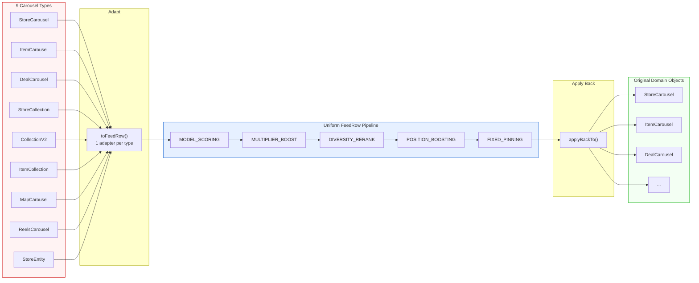
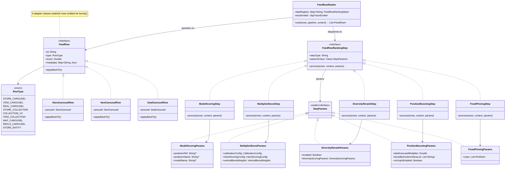
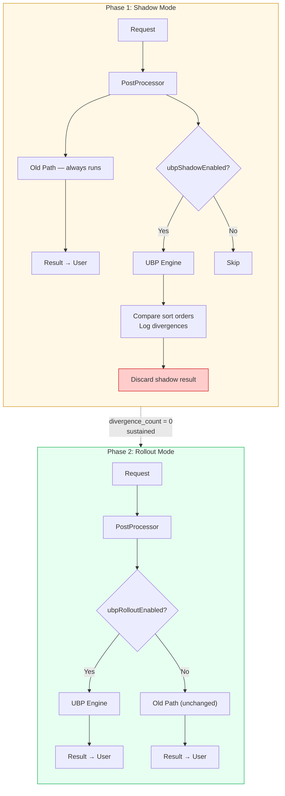
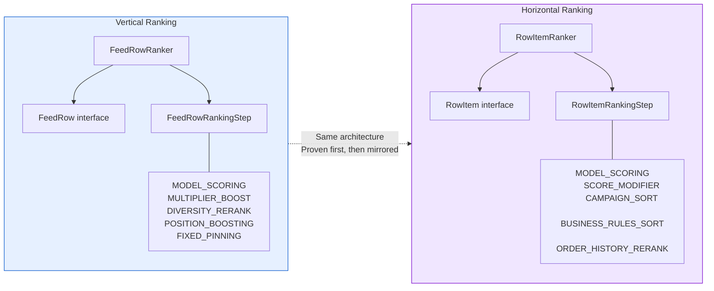

# [RFC] Ranking Abstraction Layer for Homepage Blending

| *Metadata* |  |
| :---- | :---- |
| **Author(s):** | Daniel Fonyo, Yu Zhang |
| **Status:** | Draft |
| **Origin:** | New |
| **History:** | Drafted: Mar 20, 2026 |
| **Keywords:** | Homepage, ranking, blending, abstraction, interfaces, feed-service |
| **References:** | [Draft] Unified Blending Platform (Yu Zhang, Feb 2026) |

**Reviewers**

| Reviewer | Status | Notes |
| :---- | :---- | :---- |
| Yu Zhang | Not started | UBP vision author, HP MLE lead |
| Frank Zhang | Not started | HP tech lead |
| Dipali Ranjan | Not started | HP engineering |

**Dependencies**

| Dependency | Team | DRI | Status | Impact |
| :---- | :---- | :---- | :---- | :---- |
| feed-service | Homepage | Daniel Fonyo | Not started | All changes live here |
| Sibyl | ML Platform | — | None | No changes — same gRPC calls |

---

# What?

Introduce three interfaces into the homepage ranking pipeline in feed-service — `FeedRow`, `FeedRowRankingStep`, and `FeedRowRanker` — that create a clean abstraction boundary between *what gets ranked* and *how ranking works*.

These interfaces are the foundational layer of the Unified Blending Platform (UBP). They don't change any ranking behavior. They wrap existing code behind well-defined contracts so that everything UBP needs — config-driven experiments, self-service traffic management, per-step observability, and eventually a unified value function — can be built on top without rearchitecting the system.

**Thesis:** The homepage ranking pipeline cannot evolve toward UBP without interfaces. Every future UBP goal — experiment velocity, partner self-service, whole-page optimization — depends on having composable, testable ranking steps that operate on a uniform data type. This RFC proposes the interfaces and a safe delivery plan to get them into production.

---

# Why?

## The homepage grew faster than its infrastructure

The DoorDash homepage started as a single-vertical product — just restaurants. Over time it grew to serve 9+ content types on the same page: Rx stores, NV stores, item carousels, deal carousels, collections, map carousels, reels, and standalone store entities. Each was bolted on by different teams at different times.

The result: ranking logic is scattered across utility objects with no shared interface, no clean boundaries, and no way to test or configure one stage independently. Understanding what happens to a carousel's score requires reading 6+ files. Changing one experiment parameter requires touching 10-15 files and 2-3 weeks of HP engineer time.

## Three concrete problems

**1. No shared abstraction for carousel types.**
The pipeline handles 9 domain types (`StoreCarousel`, `ItemCarousel`, `DealCarousel`, `StoreCollection`, `CollectionV2`, `ItemCollection`, `MapCarousel`, `ReelsCarousel`, `StoreEntity`). These have no common interface. Every ranking stage branches on type:

```
Score stage  → if StoreCarousel? if ItemCarousel? if DealCarousel? ... (9 branches)
Blend stage  → if StoreCarousel? if ItemCarousel? if DealCarousel? ... (9 branches)
Boost stage  → if StoreCarousel? if ItemCarousel? if DealCarousel? ... (9 branches)
Pin stage    → if StoreCarousel? if ItemCarousel? if DealCarousel? ... (9 branches)
```

Adding a new carousel type means touching 10+ files across the pipeline.

**2. No abstraction for ranking stages.**
Scoring, boosting, blending, and pinning are inline method calls through utility objects (`BlendingUtil`, `BoostingBundle`, `EntityScorer`). They cannot be tested independently, swapped, or configured without modifying the call chain. Parameters live in 6+ locations (DVs, runtime JSONs, hardcoded constants).

**3. No test coverage on the ranking pipeline.**
There are zero tests covering the end-to-end ranking behavior. Changes are "edit and pray." There is no safe way to refactor or extend the pipeline.

## Why this matters for UBP

The Unified Blending Platform vision (Yu Zhang, Feb 2026) proposes a systematic, ML-driven framework replacing fragmented homepage blending with whole-page optimization. It promises:

- **10x experiment velocity** (2-3 weeks → 2-3 days)
- **Self-service experimentation** for partner teams (NV, Ads, Merch)
- **Unified value function** across all content types
- **Per-step observability** for debugging and counterfactual analysis

None of this is possible without clean interfaces. You cannot make ranking config-driven if there is no step abstraction to configure. You cannot let partners self-serve if there is no extension point. You cannot observe per-step scores if there are no steps.

**This RFC is the first step: establish the interfaces that make everything else buildable.**

---

## Goals

1. **Introduce `FeedRow` interface + 9 adapters** — a uniform type for all carousel kinds so ranking operates on one type, not nine.
2. **Introduce `FeedRowRankingStep` interface + step wrappers** — each ranking stage becomes a named, independently testable step with typed parameters.
3. **Introduce `FeedRowRanker` engine** — a config-driven loop that dispatches to registered steps. Zero business logic.
4. **Shadow validate** — prove the new path produces identical results to the old path before any traffic migrates.
5. **Preserve all existing behavior** — steps wrap existing methods, not replace them. The old code path remains unchanged.

## Non-Goals

| Not doing | Why |
| :---- | :---- |
| Rewriting ranking logic | Steps call the same existing methods — `EntityScorer.score()`, `BlendingUtil.blendBundle()`, etc. |
| Changing experiment behavior or traffic | This is pure infrastructure — no user-visible change |
| Self-service MLE experiments | Future work built on these interfaces |
| Unified value function | Future work — requires calibration infrastructure |
| Horizontal ranking (within-carousel) | Follows once vertical is proven (same architecture, different types) |
| Ads blending | Post-POC — requires shared scoring scale |

---

# Who?

| Person | Role |
| :---- | :---- |
| Daniel Fonyo | Implementation DRI — writes code, drives delivery |
| Yu Zhang | UBP vision author — alignment on interface contracts |
| Frank Zhang | HP tech lead — code review, architecture sign-off |
| Dipali Ranjan | HP engineering — code review |

---

# When?

| Phase | What | Duration |
| :---- | :---- | :---- |
| **0. Characterization tests** | Lock down current ranking behavior with golden master tests | 1 week |
| **1. Interfaces + adapters** | `FeedRow`, `FeedRowRankingStep`, step wrappers, `FeedRowRanker` engine — all pure additions, no existing files modified | 2 weeks |
| **2. Shadow validation** | Wire shadow path in `PostProcessor`. Run both paths, compare sort orders, log divergences. Target: `divergence_count = 0` | 1-2 weeks |
| **3. Rollout** | DV-gated gradual migration: 1% → 5% → 25% → 50% → 100% | 2-3 weeks |
| **4. Horizontal mirroring** | `RowItem` + `RowItemRankingStep` + `RowItemRanker` — same pattern for within-carousel ranking | 2-3 weeks |

Total: ~8-10 weeks. Each phase is independently shippable. If any phase shows risk, we stop and the old path continues serving 100% of traffic.

---

# Design

## Introduction

The ranking pipeline today is a chain of inline method calls with no interfaces between them:

```
reOrderGlobalEntitiesV2()
  └─ rankAndDedupeContent()
       └─ rankAndMergeContent()
            └─ rankContent()
                 └─ BaseEntityRankerConfiguration.rank()
                      ├─ getEntities()         — flatten 9 types via type-checks
                      ├─ getScoreBundle()       — Sibyl ML scoring
                      ├─ getBoostBundle()       — boosting + multipliers
                      ├─ getRankingBundle()     — pin vs flow separation
                      └─ getRankableContent()   — re-assemble typed containers
```

We introduce three interfaces that create clean boundaries at these seams. The existing methods don't change — they get wrapped by step classes that expose them through a uniform contract.

The strategy is simple: **adapt once, rank uniformly, apply back**.



## Architecture

### Interface 1: `FeedRow` — uniform type for all carousel kinds

Today, every ranking stage branches on carousel type because there is no shared interface. With `FeedRow`, we adapt once at the boundary — and everything downstream operates on a single type.

```kotlin
interface FeedRow {
    val id: String
    val type: RowType
    var score: Double
    val metadata: MutableMap<String, Any>
    fun applyBackTo()  // writes final score back to the original domain object
}

enum class RowType {
    STORE_CAROUSEL, ITEM_CAROUSEL, DEAL_CAROUSEL,
    STORE_COLLECTION, COLLECTION_V2, ITEM_COLLECTION,
    MAP_CAROUSEL, REELS_CAROUSEL, STORE_ENTITY,
}
```

One adapter class per carousel type — 9 total. Each wraps the domain object, exposes it as `FeedRow`, and writes scores back via `applyBackTo()`. The domain objects are unchanged.

**What this eliminates:** Type-check branching at every ranking stage. Before: 9 branches × 4 stages = 36 type-checks scattered across files. After: 0 type-checks in the pipeline.

**What this enables:** Adding a new carousel type goes from touching 10+ files to writing 1 adapter class. The engine and all steps work with it automatically.

```
New files (pure additions):
  ubp/vertical/FeedRow.kt              — interface
  ubp/vertical/RowType.kt              — enum
  ubp/vertical/adapters/*.kt           — 9 adapter classes

Existing files modified: NONE
```

### Interface 2: `FeedRowRankingStep` — named, testable ranking stages

Each inline ranking method gets a step wrapper. The step calls the **same existing method** — same class, same arguments, same logic. The step is a thin delegation layer that makes the method independently configurable and testable.

```kotlin
interface FeedRowRankingStep {
    val stepType: String
    val paramsClass: Class<out StepParams>
    suspend fun process(rows: MutableList<FeedRow>, context: RankingContext, params: StepParams)
}
```

Parameters are typed data classes injected from config — steps never read DVs internally. This is the key architectural constraint: **all tunable behavior flows through `params`**.

| Step | Type | Wraps (existing method) | Params |
| :---- | :---- | :---- | :---- |
| `ModelScoringStep` | `MODEL_SCORING` | `EntityScorer.score()` → Sibyl gRPC | `ModelScoringParams(predictorRef, predictorName, modelName)` |
| `MultiplierBoostStep` | `MULTIPLIER_BOOST` | `BlendingUtil.blendBundle()` | `MultiplierBoostParams(calibrationConfig, intentScoringConfig, verticalBoostWeights)` |
| `DiversityRerankStep` | `DIVERSITY_RERANK` | `BlendingUtil.rerankEntitiesWithDiversity()` | `DiversityRerankParams(enabled, diversityScoringParams)` |
| `PositionBoostingStep` | `POSITION_BOOSTING` | Position boost + deal multiplier logic | `PositionBoostingParams(dealCarouselMultiplier, boostByPositionAllowList, nvUnpinEnabled)` |
| `FixedPinningStep` | `FIXED_PINNING` | `BoostingBundle.boosted()` | `FixedPinningParams(rules: List<PinRule>)` |

Each `StepParams` subclass uses real field names from existing feed-service data classes (`VerticalBlendingConfig`, `CalibrationConfig`, `IntentScoringConfig`, `VerticalBoostWeights`, `DiversityScoringParams`). No new config schema to learn — the params mirror what already exists, just structured.

```
New files (pure additions):
  ubp/vertical/FeedRowRankingStep.kt         — interface
  ubp/vertical/StepParams.kt                 — sealed interface + 5 data classes
  ubp/vertical/steps/ModelScoringStep.kt
  ubp/vertical/steps/MultiplierBoostStep.kt
  ubp/vertical/steps/DiversityRerankStep.kt
  ubp/vertical/steps/PositionBoostingStep.kt
  ubp/vertical/steps/FixedPinningStep.kt

Existing files modified: NONE
```

### Interface 3: `FeedRowRanker` — config-driven dispatch engine

The engine reads a step sequence from config, looks up each step in a registry, deserializes its params, and calls `process()`. Zero business logic — pure dispatch.

```kotlin
class FeedRowRanker(
    private val stepRegistry: Map<String, FeedRowRankingStep>,
    private val traceEmitter: UbpTraceEmitter?,
) {
    suspend fun rank(rows: MutableList<FeedRow>, pipeline: ResolvedPipeline, context: RankingContext): List<FeedRow> {
        for (stepConfig in pipeline.steps) {
            val step = stepRegistry[stepConfig.type] ?: continue  // skip unknown + warn
            val params = deserialize(stepConfig.rawParams, step.paramsClass)
            step.process(rows, context, params)
            traceEmitter?.recordStep(rows, stepConfig.id)  // auto-trace when enabled
        }
        return rows.sortedByDescending { it.score }
    }
}
```

```
New files (pure additions):
  ubp/vertical/FeedRowRanker.kt        — engine
  ubp/vertical/StepRegistry.kt         — step lookup

Existing files modified: NONE
```

### Class diagram



### Safe delivery: Shadow → Rollout

We never put users at risk. The migration has two phases:

**Shadow mode:** The old path always runs and always returns the result. The new path runs in parallel (when DV-enabled), its result is discarded, and sort orders are compared. We log every divergence. Target: `divergence_count = 0` across sustained traffic before proceeding.

**Rollout mode:** Once shadow proves zero divergence, a rollout DV gates the new path as primary. Ramped gradually: 1% → 5% → 25% → 50% → 100%. The old path is the `else` branch — compiles and runs identically.



**Characterization tests with UBP flag OFF must remain green at every stage** — proving the old path is untouched.

### Horizontal ranking follows the same pattern

Once vertical is proven, horizontal ranking (store/item ordering within each carousel) uses the identical architecture. `RowItem` mirrors `FeedRow`; `RowItemRankingStep` mirrors `FeedRowRankingStep`. Same engine shape, same shadow → rollout migration.



### Dependencies

**Upstream:** None. This change is internal to feed-service post-processing. Retrieval, grouping, and Sibyl are untouched.

**Downstream:** None. The API response shape is identical. Client apps (iOS, Android, web) see no change. Analytics logging fires from the same callsites with the same data.

### Interface

No new external APIs. All changes are internal to `feed-service`. The UBP engine is called from the same `DefaultHomePagePostProcessor.reOrderGlobalEntitiesV2()` entry point that exists today.

## Service Level Objectives (SLO)

### External vs Internal

Purely internal. No new services, no new RPCs. All changes are within the existing feed-service process.

### Latency

Each step wraps an existing method — there are no new computations.

| Operation | Additional latency |
| :---- | :---- |
| `FeedRow` adapter conversion (20 carousels) | ~1-2ms |
| Step registry lookup (5 steps) | ~0.05ms |
| `StepParams` deserialization (5 steps) | ~0.5ms |
| Trace emission (when enabled, 20 rows × 5 steps) | ~2-3ms |
| **Total additional overhead** | **<5ms** |

No additional Sibyl gRPC calls. No additional cache reads. Same single Sibyl call, same local runtime config reads.

**Shadow mode:** +5-15ms per request (adapter conversion + step dispatch + sort order comparison). User-facing response is unaffected — shadow results are discarded.

### Expected QPS

Same as current homepage QPS. No new endpoints. No change to traffic volume.

### Failure

**Shadow mode:** All exceptions are caught and swallowed. The shadow path can never affect the production result. If the UBP engine throws, we log it and move on.

**Rollout mode:** If the UBP engine throws for DV-enabled traffic, the DV is ramped down. The old path is the `else` branch and remains fully operational.

**Rollback:** Disable the DV. Immediate. No deploy required.

**What cannot fail:**
- The old code path is never modified. It compiles and runs identically at every stage.
- Characterization tests enforce this: UBP flag OFF = old path must match golden master.
- No existing DV keys are modified or removed. Two new DVs are added (shadow enable, rollout enable).

## What These Interfaces Unlock

The interfaces proposed here are not an end in themselves. They are the foundation for the Unified Blending Platform. Here is what becomes possible once they are in production:

| Future capability | How these interfaces enable it |
| :---- | :---- |
| **Config-driven experiments** | `FeedRowRankingStep` + typed `StepParams` = experiments are param changes in JSON, not code changes |
| **Self-service MLE experimentation** | MLE declares `{model_name, traffic_pct, params}` — engine resolves against control config |
| **Per-layer traffic management** | Engine supports experiment resolution per layer — replaces DV waterfall |
| **Per-step observability** | Engine auto-emits `{row_id, step_id, score_before, score_after}` after each step |
| **Unified value function** | Calibration + value weight steps added as new `FeedRowRankingStep` types — no engine change |
| **Partner self-service** | NV/Ads/Merch implement their own `FeedRowRankingStep` — HP registers it once |
| **New carousel type onboarding** | 1 adapter class instead of 10+ file changes |

Without the interfaces, none of these can be built without rearchitecting from scratch. With them, each is an incremental addition.

## Alternative Designs

**1. Build UBP end-to-end in one shot.**
Rejected. Too much risk, too many unknowns. The full UBP vision includes value functions, calibration, ads integration, and traffic management. Shipping all of this at once on the homepage — the front page of every DoorDash session — is unacceptable risk. Interfaces first, then incremental capabilities.

**2. Use the existing `ScorableEntity` hierarchy instead of `FeedRow`.**
Rejected. `ScorableEntity` is tightly coupled to `BaseEntityRankerConfiguration` and the current scoring pipeline. It cannot be used by a new engine without carrying all existing coupling. `FeedRow` is a clean interface with no dependencies on the old ranking code.

**3. Wait for Pedregal (next-gen serving platform) and build on that.**
Rejected. Pedregal timeline is uncertain and addresses a different layer (retrieval/serving). The ranking abstraction problem exists independently of the serving layer. These interfaces work on the current system and transfer cleanly to any future serving platform.

**4. Refactor the existing code without interfaces.**
Rejected. Without a shared type (`FeedRow`) and a step contract (`FeedRowRankingStep`), any refactoring still results in scattered type-checks and inline method chains. Interfaces are the minimum structural change needed to make the pipeline composable.
