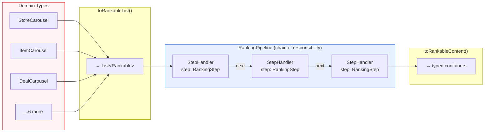
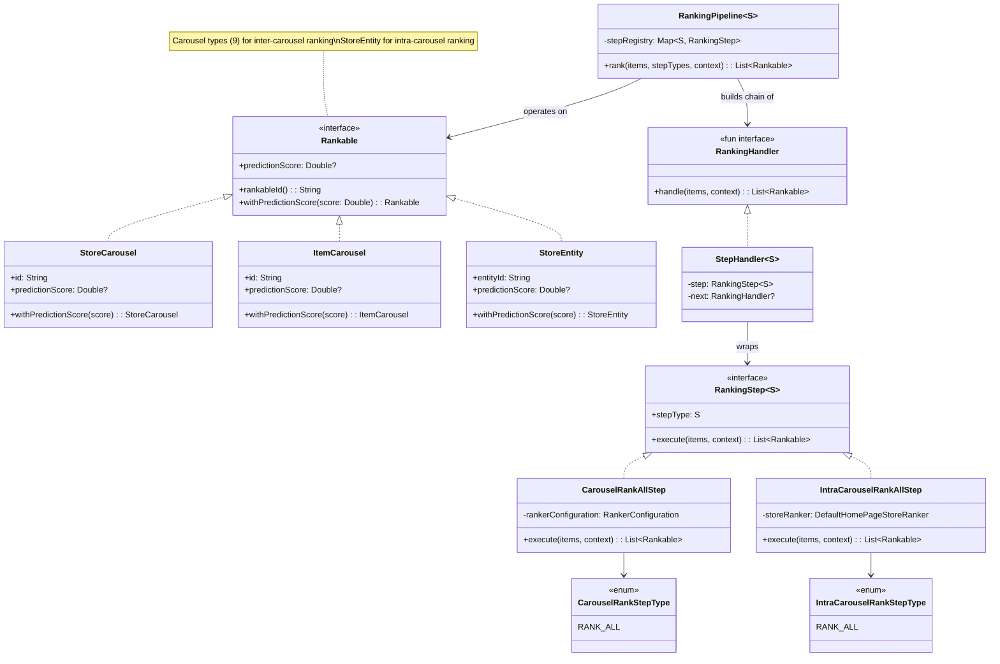
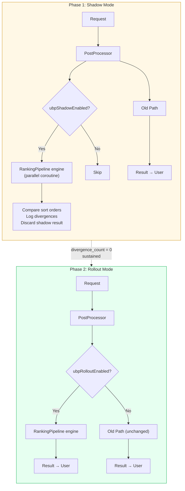

# [RFC] Ranking Abstraction Layer for Homepage Blending

| *Metadata*      |                                                                                       |
| :-------------- | :------------------------------------------------------------------------------------ |
| **Author(s):**  | Daniel Fonyo, Yu Zhang                                                                |
| **Status:**     | Draft                                                                                 |
| **Origin:**     | New                                                                                   |
| **History:**    | Drafted: Mar 20, 2026 · Rewritten: Mar 23, 2026 (aligned with shipped implementation) |
| **Keywords:**   | Homepage, ranking, blending, abstraction, interfaces, feed-service                    |
| **References:** | [Draft] Unified Blending Platform (Yu Zhang, Feb 2026)                                |

**Reviewers**

| Reviewer | Status | Notes |
| :---- | :---- | :---- |
| Yu Zhang | Not started | UBP vision author, HP MLE lead |
| Frank Zhang | Not started | HP tech lead |
| Dipali Ranjan | Not started | HP engineering |

**Dependencies**

| Dependency | Team | DRI | Status | Impact |
| :---- | :---- | :---- | :---- | :---- |
| feed-service | Homepage | Daniel Fonyo | Phase 1 shipped | All changes live here |
| Sibyl | ML Platform | — | None | No changes — same gRPC calls |

---

# What?

The **Unified Blending Platform (UBP)** is a long-term initiative to make homepage ranking composable, testable, and config-driven — enabling MLE experiment velocity, partner self-service, and whole-page optimization. Today none of that is possible because the ranking code has no interfaces, no shared types, and no separation between stages.

This RFC proposes the **first step toward UBP**: three small interfaces that insert clean boundaries into the existing ranking pipeline. No behavior changes. No new services. Just compile-time contracts that make the code extensible.

## Before: no seams

Today the homepage ranking pipeline is a chain of inline method calls with no interfaces between them:

```
reOrderGlobalEntitiesV2()
  └─ rankAndDedupeContent()
       └─ rankAndMergeContent()
            └─ rankContent()
                 └─ BaseEntityRankerConfiguration.rank()
                      ├─ getEntities()         — flatten 9 types via ScorableEntity wrappers
                      ├─ getScoreBundle()       — Sibyl ML scoring
                      ├─ getBoostBundle()       — boosting + multipliers
                      ├─ getRankingBundle()     — pin vs flow separation
                      └─ getRankableContent()   — re-assemble typed containers
```

There's no shared type for carousel items, no composable step abstraction, and no way to test or configure one stage independently.

## After: three interfaces insert clean boundaries

```
reOrderGlobalEntitiesV2()
  └─ rankAndDedupeContent()
       └─ rankAndMergeContent()
            └─ rankContent()
                 ├─ content.toRankableList()              ← Rankable interface
                 ├─ RankingPipeline.rank(items, steps)    ← RankingStep + RankingPipeline
                 │    └─ StepHandler chain
                 │         └─ CarouselRankAllStep.execute()
                 │              └─ RankerConfiguration.rank()   (same legacy code)
                 └─ result.toRankableContent()             ← back to typed containers
```

Three concepts, two ranking layers:

- **`Rankable`** — interface implemented directly by domain types. Carousel types (`StoreCarousel`, `ItemCarousel`, etc.) for inter-carousel ranking. `StoreEntity` for intra-carousel ranking. No wrapper classes.
- **`RankingStep<S : Enum<S>>`** — domain logic contract: items in, items out. Each ranking layer has its own step type enum (`CarouselRankStepType`, `IntraCarouselRankStepType`).
- **`RankingPipeline<S : Enum<S>>`** — config-driven engine that assembles a handler chain from step types and executes it. Same engine for both layers.

These don't change any ranking behavior — they formalize existing conventions into compile-time contracts so that everything UBP needs can be built on top without rearchitecting.

**Thesis:** The homepage ranking pipeline cannot evolve toward UBP without interfaces. Every future UBP goal — experiment velocity, partner self-service, whole-page optimization — depends on composable, testable ranking steps that operate on a uniform data type. This RFC proposes those interfaces and a safe delivery plan to get them into production.

This RFC asks for alignment on these abstractions before implementation begins.

---

# Why?

## The homepage grew faster than its infrastructure

Over time, with many teams contributing their own disjoint experiments, features, and content types, the homepage grew to serve 9+ carousel types on the same page with no shared abstractions between them.

The result: ranking logic is scattered across utility objects with no shared interface, no clean boundaries, and no way to test or configure one stage independently. Understanding what happens to a carousel's score requires reading 6+ files. Changing one experiment parameter requires touching 10-15 files and 2-3 weeks of HP engineer time.

## Three concrete problems

**1. Wrapper adapter explosion for carousel types.**
The pipeline handles 9 domain types (`StoreCarousel`, `ItemCarousel`, `DealCarousel`, `StoreCollection`, `CollectionV2`, `ItemCollection`, `MapCarousel`, `ReelsCarousel`, `StoreEntity`). These have no common interface. To process them uniformly, the existing code wraps each in a `ScorableEntity*` adapter class (`ScorableEntityStoreCarousel`, `ScorableEntityItemCarousel`, etc.) — 9 wrappers, each with mutable `var score` and an `applyBackTo()` method that writes scores back to the original objects. Adding a new carousel type means creating a new wrapper and threading `applyBackTo()` through every stage that touches scoring.

**2. No abstraction for ranking stages.**
Scoring, boosting, blending, and pinning are inline method calls through utility objects (`BlendingUtil`, `BoostingBundle`, `EntityScorer`). They cannot be tested independently, swapped, or configured without modifying the call chain. Parameters live in 6+ locations (DVs, runtime JSONs, hardcoded constants).

**3. No test coverage on the ranking pipeline.**
There are zero tests covering the end-to-end ranking behavior. Changes are "edit and pray." There is no safe way to refactor or extend the pipeline.

## Goals

1. **Introduce `Rankable` interface** — a shared type implemented directly by domain types (no wrapper classes).
2. **Introduce ranking engine** — `RankingStep<S>` + `RankingHandler` + `RankingPipeline<S>` with chain-of-responsibility dispatch.
3. **Align on these as the stable contract** — these interfaces are the API surface all future UBP work builds on.
4. **Preserve existing behavior** — the legacy coupled ranking logic runs unchanged behind the new interfaces. We're building abstractions to allow decoupling, not decoupling yet.
5. **Shadow validate and roll out** — prove the engine produces identical results to the old path, then migrate traffic via DV-gated rollout.

## Non-Goals

1. **Rewriting or decoupling ranking logic** — legacy ranking runs unchanged behind the new interfaces.
2. **Changing experiment behavior or traffic** — this is pure infrastructure, no user-visible change.
3. **Self-service MLE experiments** — future work built on these interfaces.
4. **Unified value function** — future work, requires calibration infrastructure.
5. **Ads blending** — future, requires shared scoring scale.
6. **Granular step decomposition** — future, decompose into composable steps once the interfaces are proven.

---

# Who?

| Person | Role |
| :---- | :---- |
| Daniel Fonyo | Implementation DRI — writes code, drives delivery |
| Yu Zhang | UBP vision author — alignment on interface contracts |
| Frank Zhang | HP tech lead — code review, architecture sign-off |
| Dipali Ranjan | HP engineering — code review |

---

# When?

| Phase                                   | What                                                                                                                                                                      | Status               |
| :-------------------------------------- | :------------------------------------------------------------------------------------------------------------------------------------------------------------------------ | :------------------- |
| **1. Carousel rank interfaces**         | `Rankable` on 9 carousel types, `RankingStep<S>`, `RankingHandler`, `RankingPipeline<S>`, `CarouselRankAllStep` — all pure additions                                      | Proposed |
| **1.5. Intra-carousel rank interfaces** | Same engine applied to within-carousel store ranking. `IntraCarouselRankStepType`, `IntraCarouselRankAllStep` wrapping `DefaultHomePageStoreRanker`. Zero engine changes. | Next                 |
| **2. Shadow validation**                | Wire shadow path for carousel + intra-carousel ranking. Run both paths, compare sort orders, log divergences. Target: `divergence_count = 0`                              | After 1.5            |
| **3. Rollout**                          | DV-gated gradual migration: 1% → 5% → 25% → 50% → 100%                                                                                                                    | After shadow proven  |
| **4. Granular steps**                   | Decompose `RANK_ALL` into composable steps                                                                                                                                | After rollout stable |

Each phase is independently shippable. If any phase shows risk, we stop and the old path continues serving 100% of traffic.

---

# Design

## Architecture Overview

The core flow: diverse types converge to one interface, pass through a step chain, and convert back. Domain types implement `Rankable` directly — no adapter wrappers.



## `Rankable` Interface (Implemented, Not Wrapped)

Today, every ranking stage operates through `ScorableEntity*` wrapper classes because there is no shared interface on the domain types themselves. With `Rankable`, the existing domain types implement the interface directly — wrappers disappear, and everything downstream operates on a single type.

```kotlin
interface Rankable {
    fun rankableId(): String
    val predictionScore: Double?
    fun withPredictionScore(score: Double): Rankable
}
```

Domain types implement `Rankable` by adding `override` annotations to fields they already have, plus a one-line `withPredictionScore()` via Kotlin's `copy()`:

```kotlin
data class StoreCarousel(
    // ... existing fields ...
    override val predictionScore: Double?,
) : Carousel, BaseCarousel, SortablePlacement, Rankable {
    override fun rankableId(): String = id
    override fun withPredictionScore(score: Double): StoreCarousel = copy(predictionScore = score)
}
```

**What this eliminates:** 9 `ScorableEntity*` wrapper classes, each with mutable `var score` and `applyBackTo()` writeback. After: domain types carry their own scores. No adapters, no writeback.

**What this enables:** New carousel type = implement `Rankable` on one class instead of creating a wrapper + threading `applyBackTo()` through every stage.

### Conversion Functions

`RankableContent` (the existing container for all carousel types) converts to/from `List<Rankable>`:

```kotlin
fun RankableContent.toRankableList(): List<Rankable>
fun List<Rankable>.toRankableContent(): RankableContent
```

`toRankableList()` flattens all carousel fields into a single list. `toRankableContent()` reconstructs the typed container by filtering instances back into their original fields. Round-trip preserves all items.

## `RankingStep<S : Enum<S>>`

The step interface is generic over a step type enum, allowing different ranking layers (carousel, intra-carousel) to have their own step type taxonomy:

```kotlin
interface RankingStep<S : Enum<S>> {
    val stepType: S
    suspend fun execute(items: List<Rankable>, context: RankingContext): List<Rankable>
}
```

Phase 1 has one step type (`RANK_ALL`) that wraps the entire legacy pipeline:

```kotlin
enum class CarouselRankStepType {
    RANK_ALL,
}
```

Phase 2 will add granular types: `MODEL_SCORING`, `MULTIPLIER_BOOST`, `DIVERSITY_RERANK`, `POSITION_BOOSTING`, `FIXED_PINNING`.

## `RankingHandler` and Chain of Responsibility

`RankingHandler` is a `fun interface` (SAM) — a single `handle` method. `StepHandler` wraps a `RankingStep` and chains to the next handler via an immutable constructor parameter:

```kotlin
fun interface RankingHandler {
    suspend fun handle(items: List<Rankable>, context: RankingContext): List<Rankable>
}

class StepHandler<S : Enum<S>>(
    private val step: RankingStep<S>,
    private val next: RankingHandler?,
) : RankingHandler {
    override suspend fun handle(items: List<Rankable>, context: RankingContext): List<Rankable> {
        val result = step.execute(items, context)
        return next?.handle(result, context) ?: result
    }
}
```

Steps don't know about chaining. The engine builds the chain; each `StepHandler` receives its `next` at construction.

## `RankingPipeline<S : Enum<S>>` Engine

The engine assembles a handler chain from a step type list and executes it:

```kotlin
class RankingPipeline<S : Enum<S>>(
    private val stepRegistry: Map<S, RankingStep<S>>,
) {
    suspend fun rank(items: List<Rankable>, stepTypes: List<S>, context: RankingContext): List<Rankable>

    private fun buildChain(stepTypes: List<S>): RankingHandler
}
```

`buildChain` uses `foldRight` — each `StepHandler` is constructed with its `next` already set. No mutable linking, no dangling nulls. The chain is complete and immutable the moment it's built.

Zero business logic — pure dispatch. The engine looks up each step type in the registry, wraps it in a `StepHandler`, chains them via `foldRight`, and executes.

## `CarouselRankAllStep` (Phase 1)

The single Phase 1 step delegates to the existing `RankerConfiguration`:

```kotlin
class CarouselRankAllStep(
    private val rankerConfiguration: RankerConfiguration,
) : RankingStep<CarouselRankStepType> {
    override val stepType = CarouselRankStepType.RANK_ALL

    override suspend fun execute(items: List<Rankable>, context: RankingContext): List<Rankable> {
        val content = items.toRankableContent()
        val ranked = rankerConfiguration.rank(context, content)
        return ranked.toRankableList()
    }
}
```

This step calls `rankerConfiguration.rank()` — the same method the old path calls. Identical behavior, different dispatch path.

## Class Diagram



## Intra-Carousel Ranking (Extensibility)

Carousel ranking ranks *carousels against each other* on the page. Intra-carousel ranking ranks *stores within a single carousel*. The same interfaces apply to both — proving the engine is reusable without modification.

### How intra-carousel ranking works today

```
DefaultHomePageStoreRanker.rank()
  ├─ scoredCollections()                    — Sibyl ML scoring per carousel
  │    ├─ StoreCollectionScorer             — most carousel types
  │    ├─ ContextualStoreScorer             — contextual taste carousels
  │    └─ RetentionStoreScorer              — retention carousels
  └─ modifyLiteStoreCollection()            — per-carousel sort + paginate
       └─ sortDiscoveryStoresWithBizRules()
            ├─ StoreStatusComparator        — availability
            ├─ ShipAnywhereComparator       — logistics
            ├─ StoreListComparator          — prioritized store IDs
            ├─ StoreSortOrderMapComparator  — manual overrides
            └─ StoreListComparator          — ML score ranking
```

Key differences from carousel ranking:
- **Types**: operates on `StoreEntity` / `DiscoveryStore` (individual stores), not carousel types
- **Granularity**: runs *per carousel* (each carousel has its own `RankingType` determining sort rules), not once per page
- **Scores**: ML scores live in `LiteStoreCollection.storePredictionScoresMap` (a side-map), not directly on the entity

### How intra-carousel maps to the same interfaces

|                       | Carousel Rank                           | Intra-Carousel Rank                                   |
| --------------------- | --------------------------------------- | ----------------------------------------------------- |
| **`Rankable` type**   | `StoreCarousel`, `ItemCarousel`, etc.   | `StoreEntity` (implements `Rankable`)                 |
| **Step type enum**    | `CarouselRankStepType { RANK_ALL }`     | `IntraCarouselRankStepType { RANK_ALL }`              |
| **RANK_ALL step**     | Wraps `RankerConfiguration.rank()`      | Wraps `DefaultHomePageStoreRanker` per-carousel logic |
| **Pipeline**          | `RankingPipeline<CarouselRankStepType>` | `RankingPipeline<IntraCarouselRankStepType>`          |
| **Engine changes**    | —                                       | None                                                  |
| **Interface changes** | —                                       | None                                                  |

`StoreEntity` will implement `Rankable` — it already has `id` and `predictionScore` fields, so the implementation is the same `override` + `copy()` pattern used for carousel types.

### What gets built

**New files (3, mirroring carousel rank):**

```kotlin
// 1. Step type enum
enum class IntraCarouselRankStepType {
    RANK_ALL,
}

// 2. RANK_ALL step — wraps existing per-carousel ranking
class IntraCarouselRankAllStep(
    private val storeRanker: DefaultHomePageStoreRanker,
) : RankingStep<IntraCarouselRankStepType> {
    override val stepType = IntraCarouselRankStepType.RANK_ALL

    override suspend fun execute(items: List<Rankable>, context: RankingContext): List<Rankable> {
        // Delegate to existing modifyLiteStoreCollection() logic
        // StoreEntity instances pass through as Rankable — no conversion needed
    }
}

// 3. Wiring — same RankingPipeline, different type parameter
val intraCarouselPipeline = RankingPipeline<IntraCarouselRankStepType>(
    stepRegistry = mapOf(IntraCarouselRankStepType.RANK_ALL to intraCarouselRankAllStep)
)
```

The pipeline runs once per carousel, not once per page — the engine is invocation-agnostic. Scores currently live in `LiteStoreCollection.storePredictionScoresMap` rather than on `StoreEntity.predictionScore`, so the `IntraCarouselRankAllStep` delegates directly to the existing comparator-based sorting which already reads from the map.

### Why this proves extensibility

The engine (`RankingPipeline`), the handler chain (`StepHandler`), and the core interface (`Rankable`) are all **completely unchanged** for intra-carousel ranking. The only new code is:
- A new enum (`IntraCarouselRankStepType`)
- A new step implementation (`IntraCarouselRankAllStep`)
- Wiring at the entry point

This is the same pattern as carousel ranking, applied at a different granularity. If the interfaces can absorb both carousel ranking (page-level) and intra-carousel ranking (within-carousel) without modification, they can absorb future UBP capabilities (granular steps, value function, partner self-service) the same way.

## Safe Delivery: Shadow → Rollout

We never put users at risk. The migration has two phases:

**Shadow mode:** The old path always runs and always returns the result. The new path runs **in parallel** (via coroutine, when DV-enabled), its result is discarded, and sort orders are compared. We log every divergence. Target: `divergence_count = 0` across sustained traffic before proceeding.

**Rollout mode:** Once shadow proves zero divergence, a rollout DV gates the new path as primary. Ramped gradually: 1% → 5% → 25% → 50% → 100%. The old path is the `else` branch — compiles and runs identically.



**Characterization tests with UBP flag OFF must remain green at every stage** — proving the old path is untouched.

## Dependencies

**Upstream:** None. Internal to feed-service post-processing. Retrieval, grouping, and Sibyl are untouched.

**Downstream:** None. API response shape is identical. Client apps see no change.

## Service Level Objectives (SLO)

### External vs Internal

Purely internal. No new services, no new RPCs. All changes are within the existing feed-service process.

### Latency — Rollout Mode

Once the UBP path is the primary path (old path off), there is no duplication. `CarouselRankAllStep` wraps `RankerConfiguration.rank()` — same computation, same Sibyl calls, same runtime config reads.

| Operation | Additional latency |
| :---- | :---- |
| `toRankableList()` / `toRankableContent()` conversion | ~1-2ms |
| Step registry lookup + handler chain build | ~0.1ms |
| **Total additional overhead vs current path** | **<3ms** |

### Latency — Shadow Mode (Temporary)

Shadow mode runs old and new paths **in parallel** via coroutines. The user-facing response returns as soon as the old path completes — shadow never blocks the response.

**Wall-clock latency impact:** Minimal. Since both paths run concurrently, the request duration is `max(old_path, new_path)`, not the sum. The new path wraps the same methods as the old path, so it takes roughly the same time.

**Sibyl QPS doubles during shadow.** The old path makes its Sibyl call. The parallel `RANK_ALL` step (which calls `RankerConfiguration.rank()`) makes its own Sibyl call.

| Shadow impact | Cost | Mitigation |
| :---- | :---- | :---- |
| +1 Sibyl gRPC call per request | ~2x carousel-rank Sibyl QPS for shadow traffic | Shadow only on small % (start at 1%). Monitor Sibyl p99 before ramping. |
| Compute (conversion, chain build, comparison) | ~5-15ms CPU per request | Parallel — does not block response |

**Mitigations:**
1. **Sampling** — shadow at low sample rate (e.g., 1-5% of traffic). Caps Sibyl QPS overhead.
2. **Shadow one layer at a time** — validate carousel ranking first, then intra-carousel.
3. **Score reuse** — shadow `RANK_ALL` could reuse scores from old path instead of independent Sibyl call. Eliminates doubling but cannot validate scoring independently. Decision: start independent, switch if needed.
4. **Shadow is temporary** — once `divergence_count = 0` sustained, rollout replaces shadow.

### Expected QPS

No new QPS. This adds no new services or RPCs. The only incremental load is during shadow mode: +1 Sibyl gRPC call per shadowed request (mitigated by sampling at 1-5% of traffic). See Latency — Shadow Mode above.

### Failure

**Shadow mode:** All exceptions caught and swallowed. Shadow can never affect production result.

**Rollout mode:** If engine throws, DV is ramped down. Old path is the `else` branch.

**Rollback:** Disable the DV. Immediate. No deploy required.

## Stability

These are small internal interfaces (3 types, ~10 methods total) within a single service. They don't require the governance overhead of a public API. What can change later without breaking anything: new step type enum values, new `RankingStep` implementations, new `RankingHandler` wrappers — all additive. What would require migration: removing `Rankable` methods or changing the `execute()` signature.

## Extensibility

The interfaces are designed to absorb UBP capabilities incrementally. Each phase adds step types and implementations — the engine, the interface, and the wiring stay unchanged. Phase 1.5 (intra-carousel) is the first concrete proof — see "Phase 1.5: Intra-Carousel Ranking" above.

```
Phase 1   (proposed):  CarouselRank RANK_ALL
                      └─ wraps entire carousel-level legacy pipeline in one step

Phase 1.5 (next):    IntraCarouselRank RANK_ALL
                      └─ wraps per-carousel store ranking — same engine, new step type

Phase 2:             MODEL_SCORING → MULTIPLIER_BOOST → DIVERSITY_RERANK → FIXED_PINNING
                      └─ legacy pipeline decomposed into composable steps

Phase 3:             MODEL_SCORING → CALIBRATION → VALUE_FUNCTION → DIVERSITY → PINNING
                      └─ full UBP pipeline with unified value function
```

| Future capability | How it plugs in |
| :---- | :---- |
| Config-driven experiments | New step type enum value + new `RankingStep` implementation. No engine change. |
| Per-step observability | `StepHandler` already wraps each step — add metrics/tracing in one place. |
| Unified value function | `CALIBRATION` + `VALUE_FUNCTION` steps added to the chain. Engine unchanged. |
| Partner self-service | NV/Ads/Merch implement their own `RankingStep` — HP registers it. |
| New carousel type | Implement `Rankable` on one class. No other files change. |

## Alternative Designs

**1. Build UBP end-to-end in one shot.**
Rejected. Too much risk. The full UBP vision includes value functions, calibration, ads integration, and traffic management. Shipping all at once on the homepage — the front page of every DoorDash session — is unacceptable risk. Interfaces first, then incremental capabilities.

**2. Use adapter wrapper classes instead of interface inheritance.**
Rejected. The original design proposed `ScorableEntity*` wrapper classes around domain types. But the fields (`id`, `predictionScore`) already exist on the domain types. Wrapper classes add 9 new files, mutable `var score`, and `applyBackTo()` writeback complexity — all unnecessary. Interface inheritance formalizes existing fields into a contract with zero new classes.

**3. Wait for Pedregal (next-gen serving platform) and build on that.**
Rejected. Pedregal timeline is uncertain and addresses a different layer (retrieval/serving). The ranking abstraction problem exists independently. These interfaces work on the current system and transfer cleanly to any future serving platform.

**4. Refactor the existing code without interfaces.**
Rejected. Without a shared type (`Rankable`) and a step contract (`RankingStep`), any refactoring still results in wrapper adapters and inline method chains. Interfaces are the minimum structural change needed.

---

# Appendix

## A. Existing Code: Key Files Reference

| What | File | Relevance |
| :---- | :---- | :---- |
| **Rankable interface** | `libraries/platform/.../models/Rankable.kt` | The core interface |
| **Ranking engine** | `libraries/common/.../ubp/RankingEngine.kt` | `RankingPipeline`, `RankingStep`, `RankingHandler`, `StepHandler` |
| **Carousel rank step type** | `libraries/common/.../ubp/CarouselRankStepType.kt` | `enum class CarouselRankStepType { RANK_ALL }` (shipped as `VerticalStepType.kt` — renaming) |
| **Carousel RANK_ALL step** | `libraries/common/.../ubp/CarouselRankAllStep.kt` | Delegates to `RankerConfiguration.rank()` (shipped as `VerticalRankAllStep.kt` — renaming) |
| **Conversion functions** | `libraries/common/.../ubp/RankableContentConversions.kt` | `toRankableList()` / `toRankableContent()` |
| **Pipeline integration test** | `libraries/common/.../ubp/CarouselRankingPipelineTest.kt` | End-to-end: RankingPipeline → CarouselRankAllStep → EntityRankerConfiguration (shipped as `VerticalRankingPipelineTest.kt` — renaming) |
| Carousel ranking entry point | `DefaultHomePagePostProcessor.reOrderGlobalEntitiesV2()` | Incision point for `RankingPipeline<CarouselRankStepType>` |
| Current ranking skeleton | `BaseEntityRankerConfiguration.rank()` | Template Method being replaced |
| Carousel type flattening | `EntityRankerConfiguration.getEntities()` | What `Rankable` interface replaces |
| Sibyl ML scoring + blending | `EntityRankerConfiguration.getScoreBundleWithWorkflowHelper()` | Called by `CarouselRankAllStep` via `RankerConfiguration` |
| Intra-carousel ranking entry point | `DefaultHomePageStoreRanker.rank()` | Incision point for `RankingPipeline<IntraCarouselRankStepType>` |
| Intra-carousel sorting | `StoreCarouselService.sortStoreEntitiesForCarousels()` | Comparator chain wrapped by `IntraCarouselRankAllStep` |
| Intra-carousel ML scoring | `StoreCollectionScorer.scoreCollections()` | Sibyl scoring for stores within carousels |
| Store entity (implements Rankable) | `libraries/platform/.../models/StoreEntity.kt` | `StoreEntity : Rankable` — intra-carousel ranking target type |
| Carousel score container | `LiteStoreCollection.storePredictionScoresMap` | Where intra-carousel ML scores live today |
| Post-ranking fixups (NOT changing) | `NonRankableHomepageOrderingUtil` | NV pin, PAD=3, member pricing — stays as-is |

---

## B. Value Function Reference

The interfaces support an eventual unified value function:

```
EV(c, k) = pImp(k) × pAct(c) × vAct(c)

  pImp(k)  = P(user sees position k) — position decay, BE-owned
  pAct(c)  = P(user acts | they see c) — ML model output (Sibyl)
  vAct(c)  = Value of that action — gov_w × GOV + fiv_w × FIV + strategic_w × Strategic
```

**Phase 1 (current):** `RANK_ALL` wraps the entire pipeline — scoring, blending, and sorting in one step. The value function is implicit in the existing `BlendingUtil` logic.

**Phase 2:** Decompose into `MODEL_SCORING` (sets `pAct`), `CALIBRATION` (normalizes scores), `VALUE_WEIGHTING` (explicit `vAct`), `DIVERSITY` (reranking). Each becomes a separate `RankingStep` — the engine is unchanged, just more steps in the chain.

---

## C. Design Patterns

| Pattern | Where | What it buys us |
| :---- | :---- | :---- |
| **Interface inheritance** | Domain types implement `Rankable` | Formalizes existing fields into a compile-time contract. Zero wrapper overhead — unlike the `ScorableEntity*` adapter pattern it replaces. |
| **Strategy** | `RankingStep<S>` implementations | Each step is an interchangeable algorithm. The engine doesn't know or care which one runs — it just dispatches by enum key. |
| **Chain of Responsibility** | `StepHandler` → `next` chain | Steps execute sequentially with infrastructure (metrics, tracing) injected between them transparently. Replaces the rigid Template Method skeleton in `BaseEntityRankerConfiguration.rank()`. |
| **Facade** | `RankingPipeline.rank()` | Hides chain assembly, registry lookup, and context passing behind one call. Callers see `pipeline.rank(items, steps, ctx)` — nothing else. |

The key migration: **Template Method → Chain of Responsibility.** The existing `BaseEntityRankerConfiguration.rank()` uses Template Method — a rigid inheritance skeleton where subclasses override specific steps. This cannot be configured at runtime, tested in isolation, or extended without subclassing. Chain of Responsibility composes steps from a registry, making the pipeline data-driven and each step independently testable.

---

## D. Per-Step Tracing (Future Iteration)

The engine architecture supports per-step tracing because the engine dispatches to named steps sequentially. `StepHandler` can snapshot `predictionScore` before and after each step — giving full visibility into how each step affected each item's score.

Not part of the current proposal. Will be designed once the interfaces are in production and the step chain has more than one step.
