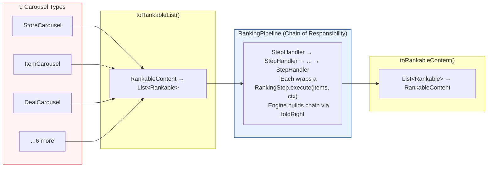
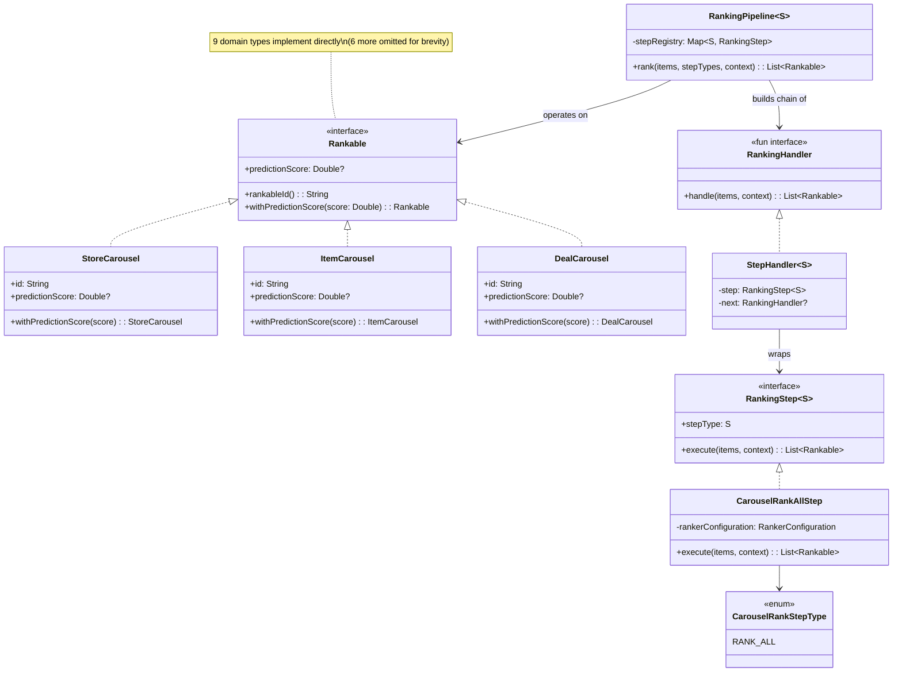

# [RFC] Ranking Abstraction Layer for Homepage Blending

| *Metadata* |  |
| :---- | :---- |
| **Author(s):** | Daniel Fonyo, Yu Zhang |
| **Status:** | Draft |
| **Origin:** | New |
| **History:** | Drafted: Mar 20, 2026 · Rewritten: Mar 23, 2026 |
| **Keywords:** | Homepage, ranking, blending, abstraction, interfaces, feed-service |
| **References:** | [Draft] Unified Blending Platform (Yu Zhang, Feb 2026) |

**Reviewers**

| Reviewer | Status | Notes |
| :---- | :---- | :---- |
| Yu Zhang | Not started | UBP vision author, HP MLE lead |
| Frank Zhang | Not started | HP tech lead |
| Dipali Ranjan | Not started | HP engineering |

---

# What?

The Unified Blending Platform (UBP) is DoorDash's long-term vision for a single, config-driven ranking system across all homepage content — carousels, stores, ads, and future content types. Today the homepage ranking pipeline has no interfaces, no shared types, and no way to compose or test ranking stages independently. This RFC proposes three interfaces that insert clean boundaries into the existing pipeline, creating the foundation everything UBP needs can be built on without rearchitecting.

## Before: no seams

Today the homepage ranking pipeline is a chain of inline method calls with no interfaces between them:

```
reOrderGlobalEntitiesV2()
  └─ rankAndDedupeContent()
       └─ rankAndMergeContent()
            └─ rankContent()
                 └─ BaseEntityRankerConfiguration.rank()
                      ├─ getEntities()         — flatten 9 types via ScorableEntity wrappers
                      ├─ getScoreBundle()       — Sibyl ML scoring
                      ├─ getBoostBundle()       — boosting + multipliers
                      ├─ getRankingBundle()     — pin vs flow separation
                      └─ getRankableContent()   — re-assemble typed containers
```

There's no shared type for carousel items, no composable step abstraction, and no way to test or configure one stage independently.

## After: three interfaces insert clean boundaries

```
reOrderGlobalEntitiesV2()
  └─ rankAndDedupeContent()
       └─ rankAndMergeContent()
            └─ rankContent()
                 ├─ content.toRankableList()              ← Rankable interface
                 ├─ RankingPipeline.rank(items, steps)    ← RankingStep + RankingPipeline
                 │    └─ StepHandler chain
                 │         └─ CarouselRankAllStep.execute()
                 │              └─ RankerConfiguration.rank()   (same legacy code)
                 └─ result.toRankableContent()             ← back to typed containers
```

Three concepts, applicable to both inter-carousel (vertical) and intra-carousel (horizontal/store) ranking:

- **`Rankable`** — interface implemented directly by domain types. For vertical ranking: 9 carousel types (`StoreCarousel`, `ItemCarousel`, etc.). For horizontal ranking: `StoreEntity`. No wrapper classes.
- **`RankingStep<S : Enum<S>>`** — domain logic contract: items in, items out. Identified by a step type enum (`CarouselRankStepType` for vertical, `IntraCarouselRankStepType` for horizontal).
- **`RankingPipeline<S : Enum<S>>`** — config-driven engine that assembles a handler chain from step types and executes it. Same engine, different step type enum per layer.

These don't change any ranking behavior — they formalize existing conventions into compile-time contracts so that everything UBP needs can be built on top without rearchitecting.

**Thesis:** The homepage ranking pipeline cannot evolve toward UBP without interfaces. Every future UBP goal — experiment velocity, partner self-service, whole-page optimization — depends on composable, testable ranking steps that operate on a uniform data type. This RFC proposes those interfaces and a safe delivery plan to get them into production.

This RFC asks for alignment that these are the right abstractions before proceeding to implementation, shadow validation, and horizontal ranking.

---

# Why?

## The homepage grew faster than its infrastructure

Over time, with many teams contributing their own disjoint experiments, features, and content types, the homepage grew to serve 9+ content types on the same page. Each was bolted on independently with no shared abstractions.

The result: ranking logic is scattered across utility objects with no shared interface, no clean boundaries, and no way to test or configure one stage independently. Understanding what happens to a carousel's score requires reading 6+ files. Changing one experiment parameter requires touching 10-15 files and 2-3 weeks of HP engineer time.

## Three concrete problems

**1. Wrapper adapter explosion for carousel types.**
The pipeline handles 9 domain types (`StoreCarousel`, `ItemCarousel`, `DealCarousel`, `StoreCollection`, `CollectionV2`, `ItemCollection`, `MapCarousel`, `ReelsCarousel`, `StoreEntity`). These have no common interface. To process them uniformly, the existing code wraps each in a `ScorableEntity*` adapter class (`ScorableEntityStoreCarousel`, `ScorableEntityItemCarousel`, etc.) — 9 wrappers, each with mutable `var score` and an `applyBackTo()` method that writes scores back to the original objects. Adding a new carousel type means creating a new wrapper and threading `applyBackTo()` through every stage that touches scoring.

**2. No abstraction for ranking stages.**
Scoring, boosting, blending, and pinning are inline method calls through utility objects (`BlendingUtil`, `BoostingBundle`, `EntityScorer`). They cannot be tested independently, swapped, or configured without modifying the call chain. Parameters live in 6+ locations (DVs, runtime JSONs, hardcoded constants).

**3. No test coverage on the ranking pipeline.**
There are zero tests covering the end-to-end ranking behavior. Changes are "edit and pray." There is no safe way to refactor or extend the pipeline.

---

## Goals

1. **Introduce `Rankable` interface** — implemented directly by domain types (no wrapper classes). `StoreCarousel`, `ItemCarousel`, etc. implement `Rankable` via `predictionScore` + `withPredictionScore()` copy pattern.
2. **Introduce ranking engine** — `RankingStep<S>` + `RankingHandler` + `RankingPipeline<S>` with chain-of-responsibility dispatch.
3. **Align on these as the stable contract** — these interfaces and their signatures are the API surface all future UBP work builds on.
4. **Shadow validate** — prove the engine produces identical results to the old path before any traffic migrates.
5. **Roll out** — gradually migrate traffic from old path to new path behind a DV gate.
6. **Preserve all existing behavior** — preserve the legacy coupled ranking in a single step. Build the abstractions to allow decoupling over time. No behavior change.

## Non-Goals

- **Rewriting ranking logic** — the initial step delegates to the same existing methods. No behavior change.
- **Changing experiment behavior or traffic** — this is pure infrastructure, no user-visible change.
- **Self-service MLE experiments** — future work built on these interfaces.
- **Unified value function** — future work, requires calibration infrastructure.
- **Ads blending** — requires shared scoring scale across content types.
- **Granular step decomposition** — decomposing into `MODEL_SCORING`, `DIVERSITY_RERANK`, etc. is future work once the interfaces are proven.

---

# Who?

| Person | Role |
| :---- | :---- |
| Daniel Fonyo | Implementation DRI — writes code, drives delivery |
| Yu Zhang | UBP vision author — alignment on interface contracts |
| Frank Zhang | HP tech lead — code review, architecture sign-off |
| Dipali Ranjan | HP engineering — code review |

---

# When?

| Phase | What | Status |
| :---- | :---- | :---- |
| **1. Rankable + engine** | `Rankable` on 9 vertical types, `RankingStep<S>`, `RankingHandler`, `RankingPipeline<S>`, `CarouselRankAllStep` — all pure additions | **Proposed** |
| **2. Shadow validation** | Wire shadow path in `DefaultHomePagePostProcessor`. Run both paths, compare sort orders, log divergences. Target: `divergence_count = 0` | Next |
| **3. Horizontal** | Same interfaces applied to within-carousel ranking | After vertical proven |
| **4. Rollout** | DV-gated gradual migration: 1% → 5% → 25% → 50% → 100% | After shadow proven |
| **5. Granular steps** | Decompose `RANK_ALL` into composable steps | After rollout stable |

Each phase is independently shippable. If any phase shows risk, we stop and the old path continues serving 100% of traffic.

---

# Design

## Architecture Overview

The core flow: diverse types converge to one interface, pass through a step chain, and convert back. Domain types implement `Rankable` directly — no adapter wrappers.



## `Rankable` Interface (Implemented, Not Wrapped)

Today, every ranking stage operates through `ScorableEntity*` wrapper classes because there is no shared interface on the domain types themselves. With `Rankable`, the existing domain types implement the interface directly — wrappers disappear, and everything downstream operates on a single type.

```kotlin
interface Rankable {
    fun rankableId(): String
    val predictionScore: Double?
    fun withPredictionScore(score: Double): Rankable
}
```

Domain types implement `Rankable` by adding `override` annotations to fields they already have, plus a one-line `withPredictionScore()` via Kotlin's `copy()`:

```kotlin
data class StoreCarousel(
    // ... existing fields ...
    override val predictionScore: Double?,
) : Carousel, BaseCarousel, SortablePlacement, Rankable {
    override fun rankableId(): String = id
    override fun withPredictionScore(score: Double): StoreCarousel = copy(predictionScore = score)
}
```

**What this eliminates:** 9 `ScorableEntity*` wrapper classes, each with mutable `var score` and `applyBackTo()` writeback. After: domain types carry their own scores. No adapters, no writeback.

**What this enables:** New carousel type = implement `Rankable` on one class instead of creating a wrapper + threading `applyBackTo()` through every stage.

### Conversion Functions

`RankableContent` (the existing container for all carousel types) converts to/from `List<Rankable>`:

```kotlin
fun RankableContent.toRankableList(): List<Rankable>
fun List<Rankable>.toRankableContent(): RankableContent
```

`toRankableList()` flattens all carousel fields into a single list. `toRankableContent()` reconstructs the typed container by filtering instances back into their original fields. Round-trip preserves all items.

## `RankingStep<S : Enum<S>>`

The step interface is generic over a step type enum, allowing different ranking layers (vertical, horizontal) to have their own step type taxonomy:

```kotlin
interface RankingStep<S : Enum<S>> {
    val stepType: S
    suspend fun execute(items: List<Rankable>, context: RankingContext): List<Rankable>
}
```

Phase 1 has one step type (`RANK_ALL`) that wraps the entire legacy pipeline:

```kotlin
enum class CarouselRankStepType {
    RANK_ALL,
}
```

Phase 2 will add granular types: `MODEL_SCORING`, `MULTIPLIER_BOOST`, `DIVERSITY_RERANK`, `POSITION_BOOSTING`, `FIXED_PINNING`.

## `RankingHandler` and Chain of Responsibility

`RankingHandler` is a `fun interface` (SAM) — a single `handle` method. `StepHandler` wraps a `RankingStep` and chains to the next handler via an immutable constructor parameter:

```kotlin
fun interface RankingHandler {
    suspend fun handle(items: List<Rankable>, context: RankingContext): List<Rankable>
}

class StepHandler<S : Enum<S>>(
    private val step: RankingStep<S>,
    private val next: RankingHandler?,
) : RankingHandler {
    override suspend fun handle(items: List<Rankable>, context: RankingContext): List<Rankable> {
        val result = step.execute(items, context)
        return next?.handle(result, context) ?: result
    }
}
```

Steps don't know about chaining. The engine builds the chain; each `StepHandler` receives its `next` at construction.

## `RankingPipeline<S : Enum<S>>` Engine

The engine assembles a handler chain from a step type list and executes it:

```kotlin
class RankingPipeline<S : Enum<S>>(
    private val stepRegistry: Map<S, RankingStep<S>>,
) {
    suspend fun rank(items: List<Rankable>, stepTypes: List<S>, context: RankingContext): List<Rankable>

    private fun buildChain(stepTypes: List<S>): RankingHandler
}
```

`buildChain` uses `foldRight` — each `StepHandler` is constructed with its `next` already set. No mutable linking, no dangling nulls. The chain is complete and immutable the moment it's built.

Zero business logic — pure dispatch. The engine looks up each step type in the registry, wraps it in a `StepHandler`, chains them via `foldRight`, and executes.

## `CarouselRankAllStep` — Phase 1 Vertical Step

The single Phase 1 step delegates to the existing `RankerConfiguration`:

```kotlin
class CarouselRankAllStep(
    private val rankerConfiguration: RankerConfiguration,
) : RankingStep<CarouselRankStepType> {
    override val stepType = CarouselRankStepType.RANK_ALL

    override suspend fun execute(items: List<Rankable>, context: RankingContext): List<Rankable> {
        val content = items.toRankableContent()
        val ranked = rankerConfiguration.rank(context, content)
        return ranked.toRankableList()
    }
}
```

This step calls `rankerConfiguration.rank()` — the same method the old path calls. Identical behavior, different dispatch path.

## Class Diagram



## Intra-Carousel (Horizontal) Ranking

The same interfaces apply to within-carousel store ranking. Today, `DefaultHomePageStoreRanker` calls `StoreCollectionScorer` (Sibyl ML scoring) and `StoreCarouselService` (comparator-based sorting) with no shared abstraction. Stores within each carousel have no common ranking interface.

`StoreEntity` will implement `Rankable`. A new `IntraCarouselRankStepType` enum and `IntraCarouselRankAllStep` will wrap the existing `DefaultHomePageStoreRanker.rank()` call — same pattern as vertical. The engine, handler chain, and step interface are reused. Only the step type enum and incision point differ.

Score hydration (Sibyl scores for stores) happens upstream of `DefaultHomePageStoreRanker`. The intra-carousel `RANK_ALL` step will receive pre-scored `StoreEntity` items and apply the existing sorting logic. No additional Sibyl calls are needed within this step.

## Safe Delivery: Shadow → Rollout

We follow the **Strangler Fig pattern** (Fowler, 2004): build the new path alongside the old, prove equivalence, then gradually migrate. The old path is never removed until the new path is proven at 100% traffic. Both coexist behind a DV gate. (See Appendix C for details on the Strangler Fig pattern and the Cover-and-Modify discipline from Feathers' *Working Effectively with Legacy Code*.)

**Shadow mode.** When `ubp_shadow_vertical_ranking` is enabled, the new `RankingPipeline` path runs **in parallel** with the legacy path via a dedicated coroutine on a shadow thread pool. The legacy path always returns the user-facing result. The shadow path has a **hard timeout** (5 seconds via `withTimeoutOrNull`) — if it exceeds the timeout, it is cancelled. All shadow exceptions are **caught and swallowed** — the shadow path can never affect the production response under any circumstance.

After both paths complete, we compare results and emit a divergence metric with two dimensions:

| Metric dimension | What it captures | Target |
| :---- | :---- | :---- |
| **Ranking output** | Compare `rankableId()` ordering of legacy vs shadow results — are the same items in the same order? | `orderMatch = true` for 100% of shadow traffic |
| **Latency** | Wall-clock time of the shadow path vs legacy path | No regression — shadow path ≤ legacy path p99 |

Both dimensions must show zero regression before proceeding to rollout.

**Rollout mode.** Once shadow proves equivalence, a rollout DV gates the new path as primary. Gradual ramp — the old path is the `else` branch, byte-for-byte unchanged. If the engine throws at any point, the DV is ramped down. Rollback is immediate: disable the DV, no deploy required.

**Characterization tests with UBP flag OFF must remain green at every stage** — proving the old path is untouched.

## Service Level Objectives (SLO)

### Rollout Mode

Once the UBP path is the primary path (old path off), there is **zero duplication** of network calls. `CarouselRankAllStep` wraps `RankerConfiguration.rank()` — same Sibyl calls, same downstream RPCs. The only additional overhead is in-process: type conversion (`toRankableList()` / `toRankableContent()`) and handler chain assembly, totaling <3ms.

### Shadow Mode — Network Dependency Duplication

Shadow mode runs both old and new paths in parallel. Because `RANK_ALL` wraps the entire legacy pipeline, the shadow path re-executes all network calls the old path makes. This is the primary cost of shadow validation.

**Vertical ranking (`CarouselRankAllStep`) duplicates:**

| External dependency | Call | Impact |
| :---- | :---- | :---- |
| **Sibyl Prediction Service** (gRPC) | `regressor.computeRegressionScoresWithMultiPredictors()` — main carousel ML scoring | **~2x vertical Sibyl QPS** for shadow traffic |
| **Sibyl Multi-Labels** (gRPC) | `sibylMultiLabels.computeMultiLabelScores()` — multi-label classification | ~2x multi-label QPS |
| **Workflow2** | `workflow.execute()` — orchestrates distributed scoring jobs | ~2x workflow executions |

**Horizontal ranking (`IntraCarouselRankAllStep`) duplicates:**

| External dependency | Call | Impact |
| :---- | :---- | :---- |
| **Sibyl Prediction Service** (gRPC) | `regressor.computeRegressionScores()` — per-carousel store scoring | **~2x horizontal Sibyl QPS** for shadow traffic (called per carousel) |
| **Percentage Match Cache** | `percentageMatchCacheRepository.writePercentageMatchToCache()` | ~2x cache writes |

> **Note:** Discovery Broker, Merchant Data Service, and Geo-Intelligence Service calls happen *upstream* of ranking (during retrieval/grouping) and are **not duplicated** by the shadow path.

### Mitigations

1. **Sampling** — shadow at low sample rate (start at 1-5% of traffic). Caps all network dependency overhead proportionally.
2. **Shadow one layer at a time** — validate vertical first, then horizontal. Never double both simultaneously.
3. **Shadow is temporary** — once `divergence_count = 0` sustained, rollout replaces shadow and duplication drops to zero.

> **TODO:** Determine current Sibyl QPS baseline for vertical and horizontal ranking paths. Use this to calculate the maximum safe shadow sample rate that keeps Sibyl within capacity. This determines how fast we can ramp shadow validation.

### Failure Modes and Mitigations

Every new code path is behind a DV gate. No UBP code executes unless explicitly enabled. The old path is always the `else` branch — byte-for-byte unchanged, compiling and running identically to pre-UBP.

**Shadow mode failures:**

| Failure | Impact | Mitigation |
| :---- | :---- | :---- |
| Shadow path throws exception | None — all exceptions caught and swallowed. Legacy result returned. | Logged via `KontextLogger`. Alert on error rate spike. |
| Shadow path exceeds timeout (5s) | None — `withTimeoutOrNull` cancels the coroutine. Legacy result returned. | Logged as timeout warning. Investigate if timeout rate > threshold. |
| Ranking output mismatch (`orderMatch = false`) | None to users — shadow result is discarded. | Logged with both orderings. Investigate root cause before proceeding to rollout. Target: 0% mismatch across sustained traffic. |
| Latency spike (shadow path slower than legacy) | Minimal — shadow runs on dedicated thread pool, does not block response. However, CPU/memory pressure can affect overall service. | Monitor shadow p99 latency. If shadow path is consistently slower, investigate before rollout. Reduce shadow sample rate if service health degrades. |
| Sibyl QPS overload from double-calling | Increased load on Sibyl during shadow. | Shadow at low sample rate (1-5%). Monitor Sibyl p99 before ramping. |

**Rollout mode failures:**

| Failure | Impact | Mitigation |
| :---- | :---- | :---- |
| Engine throws exception | Users on new path see error. | DV ramped down immediately. Old path serves 100%. No deploy required. |
| Latency regression after rollout | Slower homepage for affected users. | Monitor p50/p99 latency. If regression detected, ramp DV down. |
| Ranking quality regression | Different carousel ordering for affected users. | Monitor ranking quality metrics (CTR, conversion). Ramp down if regression detected. |

**Rollback:** Disable the DV. Immediate. No deploy, no code change required. The old path is always compiled and ready.

### Test Coverage

The ranking pipeline has **zero test coverage today**. This RFC introduces two layers of testing:

**Characterization tests** (Feathers, *Working Effectively with Legacy Code*): Before modifying any ranking code, we write tests that capture what the code *actually does right now* — not what it should do. These use a **golden master** pattern: run the pipeline with a fixed input and mocked Sibyl scores, capture the exact output ordering, and assert against it. If a later change causes the golden master to fail, behavior shifted — investigate before proceeding. Characterization tests are a temporary safety net, replaced with proper unit tests after refactoring.

**Unit tests for new abstractions:** Each new interface (`Rankable`, `RankingStep`, `RankingPipeline`) gets its own unit tests with injected dependencies. `CarouselRankAllStep` is tested end-to-end: `RankingPipeline` → `CarouselRankAllStep` → `EntityRankerConfiguration` with mocked Sibyl. These tests validate the new dispatch path independently of shadow/rollout.

**What if tests miss something?** The DV gate is the final safety net. Even if characterization tests and unit tests fail to catch a behavioral difference, the shadow metric (`orderMatch`) will detect it in production traffic before any user sees the new path. The progression is: characterization tests → unit tests → shadow validation → rollout. Each layer catches what the previous missed.

## Stability

These are small internal interfaces (3 types, ~10 methods total) within a single service. They don't require the governance overhead of a public API. What can change later without breaking anything: new step type enum values, new `RankingStep` implementations, new `RankingHandler` wrappers — all additive. What would require migration: removing `Rankable` methods or changing the `execute()` signature.

## Extensibility

The interfaces are designed to absorb the full UBP vision incrementally. Each capability adds step types and implementations — the engine, the interface, and the wiring stay unchanged.

**Composable steps via chain of responsibility.** Today the entire ranking pipeline is one monolithic call. Once the interfaces are proven, we decompose `RANK_ALL` into granular steps: `MODEL_SCORING → MULTIPLIER_BOOST → DIVERSITY_RERANK → FIXED_PINNING`. Each step is a `RankingStep` registered by enum key — the engine dispatches them in order. Adding, removing, or reordering steps is a config change, not a code change.

**Config-driven experimentation.** Each step type is an enum value in the step registry. An experiment can swap one step implementation for another (e.g., a new diversity algorithm) by registering a different `RankingStep` for that enum key. The MLE experiment config drives which steps run and in what order — no code deployment needed for new ranking experiments.

**Cross-cutting concerns injected transparently.** Because `StepHandler` wraps each step, infrastructure concerns — metrics, per-step tracing, latency budgets, circuit-breaking — can be added in one place without modifying any step. Shadow comparison, A/B metrics emission, and timeout enforcement all live at the handler level.

**Per-layer traffic management.** Vertical and horizontal ranking are separate `RankingPipeline<S>` instances with different step type enums. Each layer can be shadow-validated and rolled out independently. Future layers (e.g., ads ranking, cross-page ranking) follow the same pattern — new enum, new steps, same engine.

**Unified value function.** Once steps are decomposed, calibration and value weighting become explicit steps: `CALIBRATION` (normalizes scores across content types) → `VALUE_FUNCTION` (applies `EV(c,k) = pImp(k) × pAct(c) × vAct(c)`). The engine is unchanged — just more steps in the chain. See Appendix A.

**Partner self-service.** NV, Ads, and Merch teams implement their own `RankingStep` — HP registers it. Each partner owns their step's logic; HP owns the engine and the step registry. No more cross-team code entanglement.

**New carousel type onboarding.** Implement `Rankable` on one class. No other files change. The pipeline, conversion functions, and all existing steps work automatically.

## Alternative Designs

**1. Build UBP end-to-end in one shot.**
Rejected. Too much risk. The full UBP vision includes value functions, calibration, ads integration, and traffic management. Shipping all at once on the homepage — the front page of every DoorDash session — is unacceptable risk. Interfaces first, then incremental capabilities.

**2. Use adapter wrapper classes instead of interface inheritance.**
Rejected. The original design proposed `ScorableEntity*` wrapper classes around domain types. But the fields (`id`, `predictionScore`) already exist on the domain types. Wrapper classes add 9 new files, mutable `var score`, and `applyBackTo()` writeback complexity — all unnecessary. Interface inheritance formalizes existing fields into a contract with zero new classes.

**3. Wait for Pedregal (next-gen serving platform) and build on that.**
Rejected. Pedregal timeline is uncertain and addresses a different layer (retrieval/serving). The ranking abstraction problem exists independently. These interfaces work on the current system and transfer cleanly to any future serving platform.

**4. Refactor the existing code without interfaces.**
Rejected. Without a shared type (`Rankable`) and a step contract (`RankingStep`), any refactoring still results in wrapper adapters and inline method chains. Interfaces are the minimum structural change needed.

---

# Appendix

## A. Value Function Reference

The interfaces support an eventual unified value function:

```
EV(c, k) = pImp(k) × pAct(c) × vAct(c)

  pImp(k)  = P(user sees position k) — position decay, BE-owned
  pAct(c)  = P(user acts | they see c) — ML model output (Sibyl)
  vAct(c)  = Value of that action — gov_w × GOV + fiv_w × FIV + strategic_w × Strategic
```

**Phase 1 (current):** `RANK_ALL` wraps the entire pipeline — scoring, blending, and sorting in one step. The value function is implicit in the existing `BlendingUtil` logic.

**Phase 2:** Decompose into `MODEL_SCORING` (sets `pAct`), `CALIBRATION` (normalizes scores), `VALUE_WEIGHTING` (explicit `vAct`), `DIVERSITY` (reranking). Each becomes a separate `RankingStep` — the engine is unchanged, just more steps in the chain.

---

## B. Design Patterns

| Pattern | Where | What it buys us |
| :---- | :---- | :---- |
| **Interface inheritance** | Domain types implement `Rankable` | Formalizes existing fields into a compile-time contract. Zero wrapper overhead — unlike the `ScorableEntity*` adapter pattern it replaces. |
| **Strategy** | `RankingStep<S>` implementations | Each step is an interchangeable algorithm. The engine doesn't know or care which one runs — it just dispatches by enum key. |
| **Chain of Responsibility** | `StepHandler` → `next` chain | Steps execute sequentially with infrastructure (metrics, tracing) injected between them transparently. Replaces the rigid Template Method skeleton in `BaseEntityRankerConfiguration.rank()`. |
| **Facade** | `RankingPipeline.rank()` | Hides chain assembly, registry lookup, and context passing behind one call. Callers see `pipeline.rank(items, steps, ctx)` — nothing else. |

The key migration: **Template Method → Chain of Responsibility.** The existing `BaseEntityRankerConfiguration.rank()` uses Template Method — a rigid inheritance skeleton where subclasses override specific steps. This cannot be configured at runtime, tested in isolation, or extended without subclassing. Chain of Responsibility composes steps from a registry, making the pipeline data-driven and each step independently testable.

---

## C. Strangler Fig Pattern and Safe Refactoring

**Strangler Fig** (Martin Fowler, "StranglerFigApplication", 2004): Build new functionality alongside old, prove equivalence at every step, then gradually migrate traffic. Both paths coexist until the new path is proven at 100%. The old path is never deleted prematurely — it remains the `else` branch behind a DV gate.

This RFC follows the **Cover and Modify** discipline from Michael Feathers' *Working Effectively with Legacy Code*:

- **Edit and Pray:** Understand the code, make changes, poke around to see if it broke. This is how feed-service ranking changes work today.
- **Cover and Modify:** Write characterization tests that lock down current behavior *before* any code change. If tests pass after extraction, behavior is preserved. If they fail, something changed — investigate or revert.

A **characterization test** (Feathers) tests what the code *actually does right now*, not what it *should* do. Bugs are captured as-is — users depend on this behavior. These tests are a temporary safety net replaced with proper unit tests after refactoring is complete.

**Applied to this RFC:**
1. Write characterization tests for `rankContent()` pipeline output (golden master)
2. Extract interfaces (`Rankable`, `RankingStep`, `RankingPipeline`) — characterization tests stay green
3. Shadow validate: run both paths, compare outputs
4. Ramp traffic from old to new
5. Replace characterization tests with proper unit/integration tests
6. Delete old code path

**References:**
- Fowler, Martin. "StranglerFigApplication." martinfowler.com, 2004.
- Feathers, Michael. *Working Effectively with Legacy Code.* Prentice Hall, 2004.
- Fowler, Martin. *Refactoring: Improving the Design of Existing Code.* Addison-Wesley, 2018 (2nd ed).

---

## D. Per-Step Tracing (Future Iteration)

The engine architecture supports per-step tracing because the engine dispatches to named steps sequentially. `StepHandler` can snapshot `predictionScore` before and after each step — giving full visibility into how each step affected each item's score.

Not part of the current proposal. Will be designed once the interfaces are in production and the step chain has more than one step.
