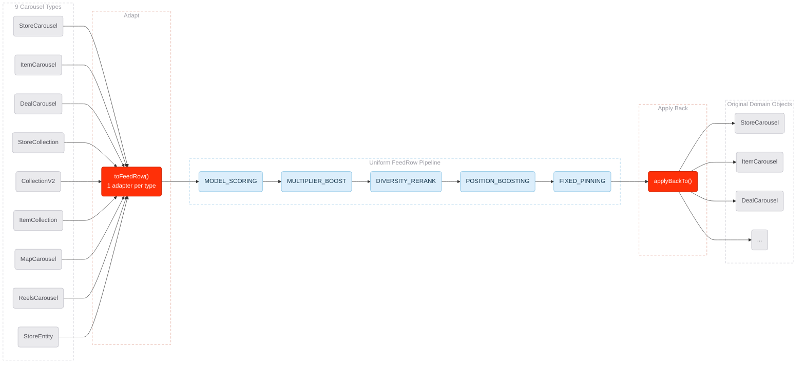
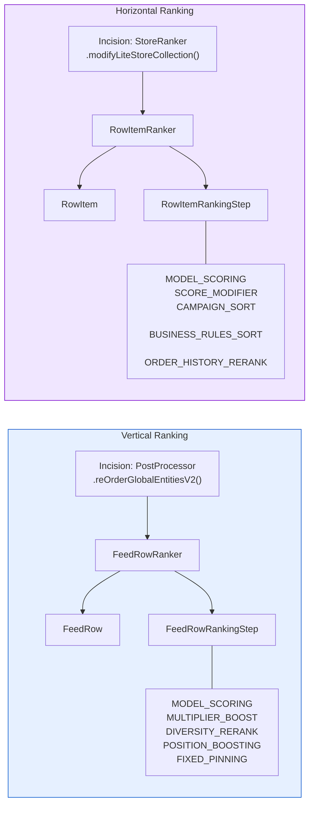
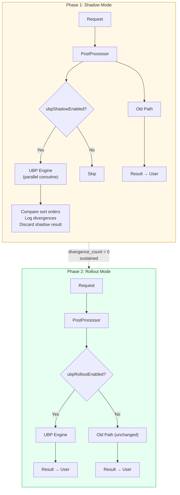

# [RFC] Ranking Abstraction Layer for Homepage Blending

| *Metadata* |  |
| :---- | :---- |
| **Author(s):** | Daniel Fonyo, Yu Zhang |
| **Status:** | Draft |
| **Origin:** | New |
| **History:** | Drafted: Mar 20, 2026 |
| **Keywords:** | Homepage, ranking, blending, abstraction, interfaces, feed-service |
| **References:** | [Draft] Unified Blending Platform (Yu Zhang, Feb 2026) |

**Reviewers**

| Reviewer | Status | Notes |
| :---- | :---- | :---- |
| Yu Zhang | Not started | UBP vision author, HP MLE lead |
| Frank Zhang | Not started | HP tech lead |
| Dipali Ranjan | Not started | HP engineering |

**Dependencies**

| Dependency | Team | DRI | Status | Impact |
| :---- | :---- | :---- | :---- | :---- |
| feed-service | Homepage | Daniel Fonyo | Not started | All changes live here |
| Sibyl | ML Platform | — | None | No changes — same gRPC calls |

---

# What?

Introduce ranking abstraction interfaces for both vertical (carousel ordering) and horizontal (within-carousel store ordering) into feed-service. Six interfaces total:

- **Vertical:** `FeedRow`, `FeedRowRankingStep`, `FeedRowRanker`
- **Horizontal:** `RowItem`, `RowItemRankingStep`, `RowItemRanker`

These create a clean abstraction boundary between *what gets ranked* and *how ranking works*. They don't change any ranking behavior — they wrap existing code behind well-defined contracts so that everything UBP needs can be built on top without rearchitecting.

**Thesis:** The homepage ranking pipeline cannot evolve toward UBP without interfaces. Every future UBP goal — experiment velocity, partner self-service, whole-page optimization — depends on having composable, testable ranking steps that operate on a uniform data type. This RFC proposes the interfaces and a safe delivery plan to get them into production.

**These interfaces are the contract.** Once approved and shipped, `FeedRow`, `RowItem`, their step interfaces, and their typed params become the stable API surface that all future UBP work builds on — from now until Pedregal and beyond. Getting them right matters. This RFC asks for alignment that these are the right abstractions.

---

# Why?

## The homepage grew faster than its infrastructure

The DoorDash homepage started as a single-vertical product — just restaurants. Over time it grew to serve 9+ content types on the same page: Rx stores, NV stores, item carousels, deal carousels, collections, map carousels, reels, and standalone store entities. Each was bolted on by different teams at different times.

The result: ranking logic is scattered across utility objects with no shared interface, no clean boundaries, and no way to test or configure one stage independently. Understanding what happens to a carousel's score requires reading 6+ files. Changing one experiment parameter requires touching 10-15 files and 2-3 weeks of HP engineer time.

## Three concrete problems

**1. No shared abstraction for carousel types.**
The pipeline handles 9 domain types (`StoreCarousel`, `ItemCarousel`, `DealCarousel`, `StoreCollection`, `CollectionV2`, `ItemCollection`, `MapCarousel`, `ReelsCarousel`, `StoreEntity`). These have no common interface. Every ranking stage branches on type:

```
Score stage  → if StoreCarousel? if ItemCarousel? if DealCarousel? ... (9 branches)
Blend stage  → if StoreCarousel? if ItemCarousel? if DealCarousel? ... (9 branches)
Boost stage  → if StoreCarousel? if ItemCarousel? if DealCarousel? ... (9 branches)
Pin stage    → if StoreCarousel? if ItemCarousel? if DealCarousel? ... (9 branches)
```

Adding a new carousel type means touching 10+ files across the pipeline.

**2. No abstraction for ranking stages.**
Scoring, boosting, blending, and pinning are inline method calls through utility objects (`BlendingUtil`, `BoostingBundle`, `EntityScorer`). They cannot be tested independently, swapped, or configured without modifying the call chain. Parameters live in 6+ locations (DVs, runtime JSONs, hardcoded constants).

**3. No test coverage on the ranking pipeline.**
There are zero tests covering the end-to-end ranking behavior. Changes are "edit and pray." There is no safe way to refactor or extend the pipeline.

## Why this matters for UBP

The Unified Blending Platform vision (Yu Zhang, Feb 2026) proposes a systematic, ML-driven framework replacing fragmented homepage blending with whole-page optimization. It promises:

- **10x experiment velocity** (2-3 weeks → 2-3 days)
- **Self-service experimentation** for partner teams (NV, Ads, Merch)
- **Unified value function** across all content types
- **Per-step observability** for debugging and counterfactual analysis

None of this is possible without clean interfaces. You cannot make ranking config-driven if there is no step abstraction to configure. You cannot let partners self-serve if there is no extension point. You cannot observe per-step scores if there are no steps.

**This RFC is the first step: establish the interfaces that make everything else buildable.**

---

## Goals

1. **Introduce vertical interfaces** — `FeedRow` + 9 adapters, `FeedRowRankingStep` + 5 step wrappers, `FeedRowRanker` engine.
2. **Introduce horizontal interfaces** — `RowItem` + adapters, `RowItemRankingStep` + 5 step wrappers, `RowItemRanker` engine.
3. **Align on these as the stable contract** — these interfaces and their typed params are the API surface all future UBP work builds on. They must be right.
4. **Shadow validate both layers** — prove each new path produces identical results to the old path before any traffic migrates.
5. **Preserve all existing behavior** — steps wrap existing methods, not replace them. The old code path remains unchanged.

## Non-Goals

| Not doing | Why |
| :---- | :---- |
| Rewriting ranking logic | Steps call the same existing methods — `EntityScorer.score()`, `BlendingUtil.blendBundle()`, etc. |
| Changing experiment behavior or traffic | This is pure infrastructure — no user-visible change |
| Self-service MLE experiments | Future work built on these interfaces |
| Unified value function | Future work — requires calibration infrastructure |
| Ads blending | Post-POC — requires shared scoring scale |

---

# Who?

| Person | Role |
| :---- | :---- |
| Daniel Fonyo | Implementation DRI — writes code, drives delivery |
| Yu Zhang | UBP vision author — alignment on interface contracts |
| Frank Zhang | HP tech lead — code review, architecture sign-off |
| Dipali Ranjan | HP engineering — code review |

---

# When?

| Phase | What | Duration |
| :---- | :---- | :---- |
| **0. Characterization tests** | Lock down current vertical + horizontal ranking behavior with golden master tests | 1 week |
| **1. Vertical interfaces** | `FeedRow`, `FeedRowRankingStep`, 5 step wrappers, `FeedRowRanker` engine — all pure additions | 2 weeks |
| **2. Horizontal interfaces** | `RowItem`, `RowItemRankingStep`, 5 step wrappers, `RowItemRanker` engine — mirrors vertical | 1-2 weeks |
| **3. Shadow validation** | Wire shadow paths in `PostProcessor` (vertical) and `StoreRanker` (horizontal). Run both paths, compare sort orders, log divergences. Target: `divergence_count = 0` | 2 weeks |
| **4. Rollout** | DV-gated gradual migration per layer: 1% → 5% → 25% → 50% → 100% | 2-3 weeks |

Total: ~8-10 weeks. Each phase is independently shippable. If any phase shows risk, we stop and the old path continues serving 100% of traffic.

---

# Design

## Introduction

The ranking pipeline today is a chain of inline method calls with no interfaces between them:

```
reOrderGlobalEntitiesV2()
  └─ rankAndDedupeContent()
       └─ rankAndMergeContent()
            └─ rankContent()
                 └─ BaseEntityRankerConfiguration.rank()
                      ├─ getEntities()         — flatten 9 types via type-checks
                      ├─ getScoreBundle()       — Sibyl ML scoring
                      ├─ getBoostBundle()       — boosting + multipliers
                      ├─ getRankingBundle()     — pin vs flow separation
                      └─ getRankableContent()   — re-assemble typed containers
```

We introduce three interfaces that create clean boundaries at these seams. The existing methods don't change — they get wrapped by step classes that expose them through a uniform contract.

The strategy is simple: **adapt once, rank uniformly, apply back**.

<!-- Diagram: Adapt → Rank → Apply Back funnel
     Reason: Readers need to see how 9 heterogeneous types converge to one uniform pipeline
     Aha: The adapter boundary is the only place type-awareness exists — everything downstream is type-agnostic -->



## Architecture

### Vertical Adapter: `FeedRow`

Today, every ranking stage branches on carousel type because there is no shared interface. With `FeedRow`, we adapt once at the boundary — everything downstream operates on a single type.

```kotlin
interface FeedRow {
    val id: String            // immutable — set once by adapter
    val type: RowType         // immutable — set once by adapter
    var score: Double         // mutable — steps write scores in-place
    val metadata: MutableMap<String, Any>  // mutable — inter-step data passing
    fun applyBackTo()         // writes final score back to the original domain object
}

enum class RowType {
    STORE_CAROUSEL, ITEM_CAROUSEL, DEAL_CAROUSEL,
    STORE_COLLECTION, COLLECTION_V2, ITEM_COLLECTION,
    MAP_CAROUSEL, REELS_CAROUSEL, STORE_ENTITY,
}
```

One adapter class per carousel type — 9 total. Each wraps the domain object via `val` reference, exposes it as `FeedRow`, and writes scores back via `applyBackTo()`. Domain objects are unchanged.

**What this eliminates:** 9 branches x 4 stages = 36 type-checks scattered across files. After: 0 type-checks in the pipeline.

**What this enables:** New carousel type = 1 adapter class instead of 10+ file changes.

### Horizontal Adapter: `RowItem`

Same pattern for within-carousel ranking. Each carousel type has bespoke sort logic scattered across `StoreRanker`, `CampaignRanker`, and `StoreCarouselService`. `RowItem` unifies store/item types.

```kotlin
interface RowItem {
    val id: String            // immutable
    val type: RowItemType     // immutable
    var score: Double         // mutable — steps write scores in-place
    val metadata: MutableMap<String, Any>  // mutable — inter-step data passing
    fun applyBackTo()
}

enum class RowItemType {
    STORE_ENTITY,
    ITEM_STORE_ENTITY,
    DEAL_STORE,
}
```

The current horizontal codebase handles stores via `LiteStoreCollection` containing `StoreEntity` objects, with `DealStore` and `ItemStoreEntity` as variants.

### Immutability Design

Both `FeedRow` and `RowItem` follow the same immutability contract:

| Field | Mutable? | Why |
| :---- | :---- | :---- |
| `id` | No (`val`) | Identity — never changes |
| `type` | No (`val`) | Set once by adapter |
| `score` | Yes (`var`) | Steps write scores in-place — this is the pipeline's output |
| `metadata` | Yes (`MutableMap`) | Inter-step data passing (e.g., score factors for downstream steps) |
| `applyBackTo()` | N/A | Write-once at pipeline exit — pushes final score to domain object |

Adapters hold the domain object via `val` (immutable reference). `StepParams` subclasses are immutable `data class` instances — all fields are `val`. Steps and engines are stateless — no shared mutable state between requests.

**Mutation is confined to two controlled points:** `score` (the pipeline's output) and `metadata` (inter-step communication). Everything else is immutable by construction.

### Vertical Steps: `FeedRowRankingStep`

Each inline ranking method gets a step wrapper. The step calls the **same existing method** — same class, same arguments, same logic. The step is a thin delegation layer that makes the method independently configurable and testable.

```kotlin
interface FeedRowRankingStep {
    val stepType: String                    // immutable — identifies step type
    val paramsClass: Class<out StepParams>  // immutable — used by engine to deserialize
    suspend fun process(rows: MutableList<FeedRow>, context: RankingContext, params: StepParams)
}
```

**All tunable behavior flows through `params`** — steps never read DVs internally. This is the key architectural constraint.

| Step | Type | Wraps (existing method) | Params |
| :---- | :---- | :---- | :---- |
| `ModelScoringStep` | `MODEL_SCORING` | `EntityScorer.score()` → Sibyl gRPC | `ModelScoringParams(predictorRef, predictorName, modelName)` |
| `MultiplierBoostStep` | `MULTIPLIER_BOOST` | `BlendingUtil.blendBundle()` | `MultiplierBoostParams(calibrationConfig, intentScoringConfig, verticalBoostWeights)` |
| `DiversityRerankStep` | `DIVERSITY_RERANK` | `BlendingUtil.rerankEntitiesWithDiversity()` | `DiversityRerankParams(enabled, diversityScoringParams)` |
| `PositionBoostingStep` | `POSITION_BOOSTING` | Position boost + deal multiplier logic | `PositionBoostingParams(dealCarouselMultiplier, boostByPositionAllowList, nvUnpinEnabled)` |
| `FixedPinningStep` | `FIXED_PINNING` | `BoostingBundle.boosted()` | `FixedPinningParams(rules: List<PinRule>)` |

Each `StepParams` subclass uses real field names from existing feed-service data classes (`VerticalBlendingConfig`, `CalibrationConfig`, `IntentScoringConfig`, `VerticalBoostWeights`, `DiversityScoringParams`). No new config schema — the params mirror what already exists, just structured.

### Horizontal Steps: `RowItemRankingStep`

```kotlin
interface RowItemRankingStep {
    val stepType: String
    val paramsClass: Class<out StepParams>
    suspend fun process(rows: MutableList<RowItem>, context: RankingContext, params: StepParams)
}
```

| Step | Type | Wraps (existing method) | Params |
| :---- | :---- | :---- | :---- |
| `ModelScoringStep` | `MODEL_SCORING` | `StoreCollectionScorer.regressionContext()` → Sibyl gRPC | `ModelScoringParams(predictorRef, predictorName, modelName)` |
| `ScoreModifierStep` | `SCORE_MODIFIER` | `getScoreModifierMap()` in `StoreCollectionScorer` | `ScoreModifierParams(boostEnabled, businessMultipliers, storeMultipliers)` |
| `CampaignSortStep` | `CAMPAIGN_SORT` | `StoreCarouselService.sortStoreEntitiesForCarousels()` | `CampaignSortParams(campaignStoreOrder, businessSortOverrides)` |
| `BusinessRulesSortStep` | `BUSINESS_RULES_SORT` | `StoreCarouselService` comparator chain | `BusinessRulesSortParams(applyOpenClosed, sortBy, alwaysOpenType, priorityBusinessIds, priorityVerticalIds)` |
| `OrderHistoryRerankStep` | `ORDER_HISTORY_RERANK` | `WholeOrderReorderFilterUtil.getGoToOrders()` | `OrderHistoryRerankParams(enabled)` |

`ModelScoringParams` is shared between vertical and horizontal — same struct, same predictor ref semantics.

### Ranking Engines: `FeedRowRanker` and `RowItemRanker`

Both engines share the same shape: read a step sequence from config, look up each step in a registry, deserialize its params, call `process()`. Zero business logic — pure dispatch. The engine architecture also enables per-step request tracing in a future iteration (score snapshots before/after each step).

```kotlin
class FeedRowRanker(
    private val stepRegistry: Map<String, FeedRowRankingStep>,  // immutable registry
) {
    suspend fun rank(rows: MutableList<FeedRow>, pipeline: ResolvedPipeline, context: RankingContext): List<FeedRow> {
        for (stepConfig in pipeline.steps) {
            val step = stepRegistry[stepConfig.type] ?: continue  // skip unknown + warn
            val params = deserialize(stepConfig.rawParams, step.paramsClass)
            step.process(rows, context, params)
        }
        return rows.sortedByDescending { it.score }
    }
}
```

`RowItemRanker` is identical, operating on `MutableList<RowItem>`.

**Vertical incision point:** `DefaultHomePagePostProcessor.reOrderGlobalEntitiesV2()`
**Horizontal incision point:** `DefaultHomePageStoreRanker.rank()` → each `modifyLiteStoreCollection()` call

### Both layers side by side



### Safe Delivery: Shadow → Rollout

We never put users at risk. The migration has two phases:

**Shadow mode:** The old path always runs and always returns the result. The new path runs **in parallel** (via coroutine, when DV-enabled), its result is discarded, and sort orders are compared. We log every divergence. Target: `divergence_count = 0` across sustained traffic before proceeding.

**Rollout mode:** Once shadow proves zero divergence, a rollout DV gates the new path as primary. Ramped gradually: 1% → 5% → 25% → 50% → 100%. The old path is the `else` branch — compiles and runs identically.



**Characterization tests with UBP flag OFF must remain green at every stage** — proving the old path is untouched.

### Dependencies

**Upstream:** None. Internal to feed-service post-processing. Retrieval, grouping, and Sibyl are untouched.

**Downstream:** None. API response shape is identical. Client apps see no change.

## Service Level Objectives (SLO)

### External vs Internal

Purely internal. No new services, no new RPCs. All changes are within the existing feed-service process.

### Latency — Rollout Mode

Once the UBP path is the primary path (old path off), there is no duplication. Each step wraps an existing method — same computation, same Sibyl calls, same runtime config reads.

| Operation | Additional latency |
| :---- | :---- |
| `FeedRow` / `RowItem` adapter conversion | ~1-2ms |
| Step registry lookup (5 steps × 2 layers) | ~0.1ms |
| `StepParams` deserialization (10 steps total) | ~1ms |
| Trace emission (when enabled) | ~2-3ms |
| **Total additional overhead vs current path** | **<5ms** |

### Latency — Shadow Mode (Temporary)

Shadow mode runs old and new paths **in parallel** via coroutines. The user-facing response returns as soon as the old path completes — shadow never blocks the response.

**Wall-clock latency impact:** Minimal. Since both paths run concurrently, the request duration is `max(old_path, new_path)`, not the sum. The new path wraps the same methods as the old path, so it takes roughly the same time. In practice, shadow adds near-zero wall-clock latency to the user-facing response.

**Sibyl QPS doubles during shadow.** This is the real cost. The old path makes its Sibyl call. The parallel UBP `MODEL_SCORING` step makes its own Sibyl call. For shadow-enabled traffic, Sibyl sees 2x the call volume.

| Shadow impact | Cost | Mitigation |
| :---- | :---- | :---- |
| Vertical: +1 Sibyl gRPC call per request | ~2x vertical Sibyl QPS for shadow traffic | Shadow only on small % (start at 1%). Monitor Sibyl p99 before ramping. |
| Horizontal: +1 Sibyl call per carousel | ~2x horizontal Sibyl QPS for shadow traffic | Shadow vertical first, horizontal second. Never shadow both at high %. |
| Compute (adapter conversion, step dispatch, comparison) | ~5-15ms CPU per request | Parallel — does not block response |

**Mitigations:**
1. **Sampling** — shadow does not need to run on every request. A low sample rate (e.g., 1-5% of traffic) is sufficient to validate divergence = 0. This caps the Sibyl QPS overhead to `baseline × sample_rate`.
2. **Shadow one layer at a time** — validate vertical shadow first, then horizontal. Never double both simultaneously.
3. **Consider score reuse** — the shadow `MODEL_SCORING` step could reuse scores from the old path's `ScoreWithFactors` instead of making an independent Sibyl call. This eliminates the Sibyl doubling entirely but means we cannot validate the scoring step independently. **Decision: start with independent calls at low sample rate, switch to score reuse if dependency capacity is a concern.**
4. **Shadow is temporary** — once `divergence_count = 0` is sustained, rollout replaces shadow. The old path turns off and dependency QPS returns to baseline.

**Dependency impact during shadow:** The primary dependency affected is **Sibyl** (gRPC scoring). Other dependencies (runtime config caches, DV reads) are local in-memory reads with no network cost — doubling these is negligible. The QPS impact on Sibyl is bounded by the shadow sample rate. See SLO section for current feed-service dependency QPS baseline (TBD — pending research).

### Expected QPS

Same as current homepage QPS. No new endpoints. No change to traffic volume. During shadow mode, Sibyl sees additional calls proportional to shadow ramp % (see above).

### Failure

**Shadow mode:** All exceptions are caught and swallowed. The shadow path can never affect the production result. If the UBP engine throws, we log it and move on.

**Rollout mode:** If the UBP engine throws for DV-enabled traffic, the DV is ramped down. The old path is the `else` branch and remains fully operational.

**Rollback:** Disable the DV. Immediate. No deploy required.

**What cannot fail:**
- The old code path is never modified. It compiles and runs identically at every stage.
- Characterization tests enforce this: UBP flag OFF = old path must match golden master.
- No existing DV keys are modified or removed. Four new DVs are added (vertical shadow, vertical rollout, horizontal shadow, horizontal rollout).

## Contract Stability

**These interfaces are the long-term contract.** Once approved and shipped, they become the stable API surface that all future UBP work, all MLE experiments, and all partner integrations build against. They persist from now through Pedregal and beyond.

This is why this RFC exists — not just to get code reviewed, but to get alignment that these are the right abstractions. Specifically:

| Interface | What's being committed | Impact of getting it wrong |
| :---- | :---- | :---- |
| `FeedRow` | Field set (`id`, `type`, `score`, `metadata`, `applyBackTo()`) | Every adapter, every step, and every future consumer of vertical ranking depends on this shape |
| `RowItem` | Same field set for horizontal | Every horizontal step and every carousel-level ranking integration depends on this shape |
| `RowType` enum | 9 entries today | Adding is easy; removing or renaming is a breaking change across all adapters and any step that filters by type |
| `FeedRowRankingStep` / `RowItemRankingStep` | `process(rows, context, params)` signature | Every step implementation, every engine dispatch, and every future partner step depends on this signature |
| `StepParams` subclasses | Field names and types (`ModelScoringParams`, `MultiplierBoostParams`, etc.) | All experiment configs, all MLE-facing tooling, and all config validation depends on these field names |

**What can change later:** New `RowType` entries. New `StepParams` subclasses. New step types registered in the engine. New fields added to existing params (with defaults). These are additive and non-breaking.

**What cannot change without migration:** Removing `FeedRow` fields. Changing the `process()` signature. Renaming `StepParams` fields that experiments already reference. Removing `RowType` entries.

**Open question for reviewers:** Are `FeedRow` and `RowItem` the right names? Are the 5 fields on each (`id`, `type`, `score`, `metadata`, `applyBackTo()`) the right surface? This is the time to debate — not after 20 adapters and 10 step implementations depend on them.

---

## What These Interfaces Unlock

The interfaces proposed here are not an end in themselves. They are the foundation for the Unified Blending Platform. Here is what becomes possible once they are in production:

| Future capability | How these interfaces enable it |
| :---- | :---- |
| **Config-driven experiments** | `FeedRowRankingStep` + typed `StepParams` = experiments are param changes in JSON, not code changes |
| **Self-service MLE experimentation** | MLE declares `{model_name, traffic_pct, params}` — engine resolves against control config |
| **Per-layer traffic management** | Engine supports experiment resolution per layer — replaces DV waterfall |
| **Per-step observability** | Engine auto-emits `{row_id, step_id, score_before, score_after}` after each step |
| **Unified value function** | Calibration + value weight steps added as new `FeedRowRankingStep` types — no engine change |
| **Partner self-service** | NV/Ads/Merch implement their own `FeedRowRankingStep` — HP registers it once |
| **New carousel type onboarding** | 1 adapter class instead of 10+ file changes |

Without the interfaces, none of these can be built without rearchitecting from scratch. With them, each is an incremental addition.

## Alternative Designs

**1. Build UBP end-to-end in one shot.**
Rejected. Too much risk, too many unknowns. The full UBP vision includes value functions, calibration, ads integration, and traffic management. Shipping all of this at once on the homepage — the front page of every DoorDash session — is unacceptable risk. Interfaces first, then incremental capabilities.

**2. Use the existing `ScorableEntity` hierarchy instead of `FeedRow`.**
Rejected. `ScorableEntity` is tightly coupled to `BaseEntityRankerConfiguration` and the current scoring pipeline. It cannot be used by a new engine without carrying all existing coupling. `FeedRow` is a clean interface with no dependencies on the old ranking code.

**3. Wait for Pedregal (next-gen serving platform) and build on that.**
Rejected. Pedregal timeline is uncertain and addresses a different layer (retrieval/serving). The ranking abstraction problem exists independently of the serving layer. These interfaces work on the current system and transfer cleanly to any future serving platform.

**4. Refactor the existing code without interfaces.**
Rejected. Without a shared type (`FeedRow`) and a step contract (`FeedRowRankingStep`), any refactoring still results in scattered type-checks and inline method chains. Interfaces are the minimum structural change needed to make the pipeline composable.

---

# Appendix

## A. Design Patterns Used

Each interface in this RFC maps to a well-known design pattern. This section explains why each pattern was chosen and where it appears.

| Pattern | Where it appears | Why |
| :---- | :---- | :---- |
| **Adapter** | `FeedRow` / `RowItem` adapters (9 vertical + 3 horizontal) | Wraps incompatible domain types behind a uniform interface without modifying them |
| **Strategy** | `FeedRowRankingStep` / `RowItemRankingStep` implementations | Each step is an interchangeable algorithm — the engine doesn't know or care which runs |
| **Chain of Responsibility** | Engine step loop | Steps execute sequentially on the same list; step order is load-bearing and config-driven |
| **Facade** | `FeedRowRanker.rank()` / `RowItemRanker.rank()` | Hides config resolution, step dispatch, param deserialization, and tracing behind one call |
| **Observer** | Auto-trace after each step | Steps have zero tracing code — the engine observes score changes and emits events |
| **Null Object** | Unknown treatment → fall back to control | System never crashes on missing config — gracefully serves control behavior |
| **Proxy** | Shadow validation path | Intercepts ranking, forks to both paths, compares outputs, discards shadow results |
| **Template Method** | `BaseEntityRankerConfiguration.rank()` *(being replaced)* | The current pattern — rigid inheritance-based skeleton. UBP replaces this with config-driven Chain of Responsibility |

**Key distinction:** Template Method is what the code uses today. The other patterns are what replace it.

**References:** Gamma et al., *Design Patterns* (1994). refactoring.guru/design-patterns.

---

## B. Safe Refactoring Methodology

All changes follow the discipline from Michael Feathers' *Working Effectively with Legacy Code* (2004):

**Cover and Modify, not Edit and Pray.**
Write tests that lock down current behavior first. Make changes. If tests pass, behavior is preserved. Today the ranking pipeline has zero tests — we write characterization tests before any refactoring.

**Characterization Tests.**
A characterization test captures what the code *actually does*, not what it *should* do. Process: write a test with a wrong assertion, run it, take the actual value as expected. This sounds backwards — that's the point. You don't know what the code does, so you ask it.

**Seams and Enabling Points.**
A seam is where you can alter behavior without editing at that point. Feed-service uses Spring `@Component` with constructor injection — every constructor parameter is a seam. In tests, inject mocks via constructor params.

**Order of Operations.**
1. Scratch refactoring — understand the code (revert when done)
2. Identify seams — find where behavior can be altered without edits
3. Break dependencies — minimal changes to make code testable
4. Write characterization tests — lock down current behavior
5. Extract abstractions — the actual work (tests must stay green)
6. Shadow validate — run both paths, compare, log divergences
7. Switch and clean up — ramp traffic, replace characterization tests with unit tests, delete old code

**Strangler Fig Pattern.**
Build new functionality alongside old, gradually replace without killing the old system. Both paths coexist (DV-gated) until the new path is proven at 100% traffic. The old path is never deleted until 100% rollout is stable.

**References:** Feathers, *Working Effectively with Legacy Code* (2004). Fowler, "StranglerFigApplication" (2004).

---

## C. Value Function Reference

The interfaces support an eventual unified value function. For context on what that means:

```
EV(c, k) = pImp(k) × pAct(c) × vAct(c)

  pImp(k)  = P(user sees position k) — position decay, BE-owned
  pAct(c)  = P(user acts | they see c) — ML model output (Sibyl)
  vAct(c)  = Value of that action — gov_w × GOV + fiv_w × FIV + strategic_w × Strategic
```

**How steps map to the formula today:**

| Step | Formula component | Status |
| :---- | :---- | :---- |
| `MODEL_SCORING` | Sets `pAct(c)` — the Sibyl model score | Explicit |
| `MULTIPLIER_BOOST` | Approximates `vAct(c)` via calibration × intent × boost weights | Implicit — becomes explicit when value weights are configurable |
| `DIVERSITY_RERANK` | Adjusts scores to enforce page diversity constraints | Orthogonal to formula — a post-hoc constraint |
| `POSITION_BOOSTING` | Deal carousel multiplier + position enforcement | Operational — not part of the theoretical formula |
| `FIXED_PINNING` | Hard-pin overrides | Operational — overrides formula output |
| `pImp(k)` | Not yet modeled | Post-POC — steps are position-unaware during scoring |

The interfaces don't commit to a value function. They make it possible to add one incrementally by introducing new step types (e.g., `CALIBRATION`, `VALUE_WEIGHTING`) without changing the engine.

---

## D. Existing Code: Key Files Reference

| What | File | Relevance |
| :---- | :---- | :---- |
| Vertical ranking entry point | `DefaultHomePagePostProcessor.reOrderGlobalEntitiesV2()` | Incision point for `FeedRowRanker` |
| Current ranking skeleton | `BaseEntityRankerConfiguration.rank()` | Template Method being replaced |
| Carousel type flattening (9 types) | `EntityRankerConfiguration.getEntities()` | What `FeedRow` adapters replace |
| Sibyl ML scoring | `SibylRegressor.kt` | Wrapped by `ModelScoringStep` |
| Blending logic | `VerticalBlending.kt`, `BlendingUtil` | Wrapped by `MultiplierBoostStep` + `DiversityRerankStep` |
| Boosting / pinning | `BoostingBundle`, `RankingBundle` | Wrapped by `PositionBoostingStep` + `FixedPinningStep` |
| Blending config (vertical) | `VerticalBlendingConfig.kt` | Source of truth for `MultiplierBoostParams` field names |
| Step params (already in prod) | `StepParams.kt` | Production data classes — `ModelScoringParams`, `MultiplierBoostParams`, etc. |
| Horizontal ranking entry point | `DefaultHomePageStoreRanker.rank()` | Incision point for `RowItemRanker` |
| Horizontal sort logic | `StoreCarouselService.sortDiscoveryStoresWithBizRules()` | 5-level comparator wrapped by `BusinessRulesSortStep` |
| Horizontal score modifiers | `StoreCollectionScorer.getScoreModifierMap()` | Wrapped by `ScoreModifierStep` |
| Post-ranking fixups (NOT changing) | `NonRankableHomepageOrderingUtil` | NV pin, PAD=3, member pricing — stays as-is |

---

## E. Per-Step Tracing (Future Iteration)

The engine architecture is designed to support per-step request tracing in a future iteration. Because the engine dispatches to named steps sequentially, it can snapshot scores before and after each step — giving full visibility into how each step affected each row's score.

This is not part of the current proposal. The tracing infrastructure, schema, and storage will be designed in a follow-up RFC once the interfaces are in production. The key point: **the engine's step-by-step dispatch loop is what makes this possible.** Without it, per-step observability requires ad hoc logging scattered across utility methods.
