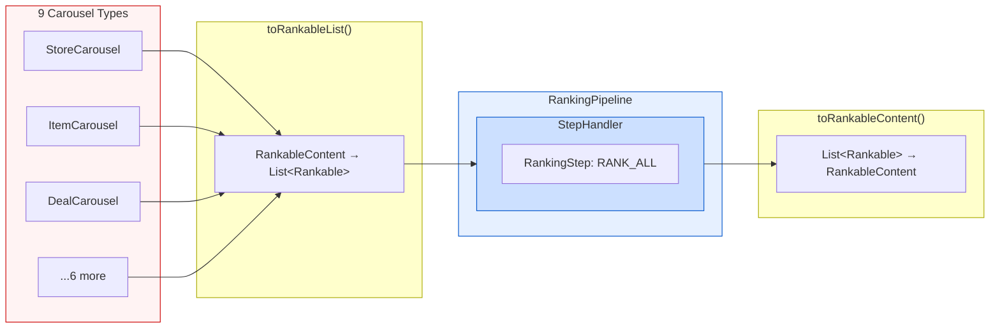
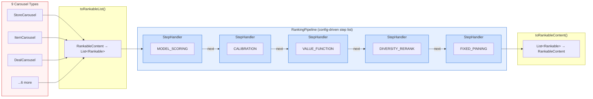

# [RFC] Ranking Abstraction Layer for Homepage Blending

| *Metadata* |  |
| :---- | :---- |
| **Author(s):** | Daniel Fonyo, Yu Zhang |
| **Status:** | Draft |
| **Origin:** | New |
| **History:** | Drafted: Mar 20, 2026 · Rewritten: Mar 23, 2026 |
| **Keywords:** | Homepage, ranking, blending, abstraction, interfaces, feed-service |
| **References:** | [Draft] Unified Blending Platform (Yu Zhang, Feb 2026) |

**Reviewers**

| Reviewer | Status | Notes |
| :---- | :---- | :---- |
| Yu Zhang | Not started | UBP vision author, HP MLE lead |
| Frank Zhang | Not started | HP tech lead |
| Dipali Ranjan | Not started | HP engineering |

---

# What?

The homepage ranking pipeline has grown organically over years. Ranking logic is scattered across utility classes, helper methods, and inline call chains with no interfaces between them. There are no shared types for the content being ranked, no contracts between ranking stages, and no way to test, configure, or reason about one stage independently of the rest. Nine carousel types go through the same ranking flow, but each is wrapped in a bespoke adapter class just to give them a common shape. Understanding what happens to a carousel's score means tracing through half a dozen files. Changing one experiment parameter means touching ten to fifteen files and weeks of engineer time.

The Unified Blending Platform (UBP) is DoorDash's long-term vision for homepage ranking: a single, config-driven system where ranking is composed of discrete, testable steps operating on a uniform data type. In the northstar state, MLEs configure ranking experiments by swapping step implementations without code deploys. New content types plug in by implementing one interface. Whole-page optimization, partner self-service, and ads blending become possible because every content type speaks the same language and every ranking stage has a clean contract.

Getting there is a multi-step journey. This RFC addresses the first and most foundational piece: defining the interfaces and abstractions that everything else builds on. We propose three concepts, applicable to both inter-carousel (vertical) and intra-carousel (horizontal) ranking:

- **A shared interface for ranked content.** Domain types implement this directly. No wrapper classes, no adapters. The fields the ranking pipeline needs already exist on these types; we formalize them into a compile-time contract.
- **A contract for ranking logic.** Each ranking operation becomes a self-contained step with a clear signature: items in, items out. Steps are identified by type, independently testable, and swappable.
- **A config-driven ranking engine.** The engine assembles steps into a pipeline and executes them in sequence. The step list is data, not code. The same engine serves both vertical and horizontal ranking, differing only in which steps it runs.

These don't change any ranking behavior. They formalize existing conventions into compile-time contracts so that everything UBP needs can be built on top without rearchitecting.

**Thesis:** The homepage ranking pipeline cannot evolve toward UBP without interfaces. Every future UBP goal (experiment velocity, partner self-service, whole-page optimization) depends on composable, testable ranking steps that operate on a uniform data type. This RFC proposes those interfaces and a safe delivery plan to get them into production.

The remainder of this RFC details the interface design, safe delivery strategy, and how these abstractions naturally extend to support the full UBP vision.

---

# Why?

## The homepage grew faster than its infrastructure

Over time, with many teams contributing their own disjoint experiments, features, and content types, the homepage grew to serve 9+ content types on the same page. Each was bolted on independently with no shared abstractions.

The result: ranking logic is scattered across utility objects with no shared interface, no clean boundaries, and no way to test or configure one stage independently. Understanding what happens to a carousel's score requires reading 6+ files. Changing one experiment parameter requires touching 10-15 files and 2-3 weeks of HP engineer time.

## Three concrete problems

**1. No shared type for ranked content.**
The pipeline handles nine different carousel types. They all go through the same ranking flow, but they have no common interface. To process them uniformly, every type gets wrapped in a bespoke adapter class with mutable score fields and writeback methods that copy scores back to the original objects after ranking. Adding a new carousel type means creating yet another wrapper and threading the writeback logic through every stage that touches scoring. It's fragile, verbose, and entirely unnecessary because the fields the ranking pipeline needs already exist on the domain types themselves.

**2. No abstraction for ranking stages.**
Scoring, boosting, blending, and pinning are inline method calls chained through utility objects. There's no interface, no contract, no boundary between them. They can't be tested independently, swapped out, or configured without modifying the call chain. Parameters live in six or more locations (dynamic values, runtime configs, hardcoded constants), and there's no single place to see what a ranking stage does or what it depends on.

**3. No test coverage on the ranking pipeline.**
There are zero tests covering end-to-end ranking behavior. Changes are "edit and pray." There is no safe way to refactor, extend, or even verify that a change preserved existing behavior.

---

## Goals

1. **Introduce `Rankable` interface.** Implemented directly by domain types (no wrapper classes). `StoreCarousel`, `ItemCarousel`, etc. implement `Rankable` via `predictionScore` + `withPredictionScore()` copy pattern.
2. **Introduce ranking engine.** `RankingStep<S>` + `RankingHandler` + `RankingPipeline<S>` with chain-of-responsibility dispatch.
3. **Align on these as the stable contract.** These interfaces and their signatures are the API surface all future UBP work builds on.
4. **Shadow validate.** Prove the engine produces identical results to the old path before any traffic migrates.
5. **Roll out.** Gradually migrate traffic from old path to new path behind a DV gate.
6. **Preserve all existing behavior.** Preserve the legacy coupled ranking in a single step. Build the abstractions to allow decoupling over time. No behavior change.

## Non-Goals

- **Rewriting ranking logic.** The initial step delegates to the same existing methods. No behavior change.
- **Changing experiment behavior or traffic.** This is pure infrastructure, no user-visible change.
- **Self-service MLE experiments.** Future work built on these interfaces.
- **Unified value function.** Future work, requires calibration infrastructure.
- **Ads blending.** Requires shared scoring scale across content types.
- **Granular step decomposition.** Decomposing into `MODEL_SCORING`, `DIVERSITY_RERANK`, etc. is future work once the interfaces are proven.

---

# Who?

| Person | Role |
| :---- | :---- |
| Daniel Fonyo | Implementation DRI: writes code, drives delivery |
| Yu Zhang | UBP vision author: alignment on interface contracts |
| Frank Zhang | HP tech lead: code review, architecture sign-off |
| Dipali Ranjan | HP engineering: code review |

---

# When?

| Phase | What | Status |
| :---- | :---- | :---- |
| **1. Rankable + engine** | `Rankable` on 9 vertical types, `RankingStep<S>`, `RankingHandler`, `RankingPipeline<S>`, `CarouselRankAllStep` (all pure additions) | **Proposed** |
| **2. Shadow validation** | Wire shadow path in `DefaultHomePagePostProcessor`. Run both paths, compare sort orders, log divergences. Target: `divergence_count = 0` | Next |
| **3. Rollout** | DV-gated gradual migration: 1% → 5% → 25% → 50% → 100% | After shadow proven |
| **4. Granular steps** | Decompose `RANK_ALL` into composable steps | After rollout stable |

Each phase is independently shippable. If any phase shows risk, we stop and the old path continues serving 100% of traffic.

---

# Design

## Architecture Overview

The core flow: diverse types converge to one interface, pass through a step chain, and convert back. Domain types implement `Rankable` directly, with no adapter wrappers.



Today the pipeline contains a single step (`RANK_ALL`) that wraps all existing ranking logic. As we decompose ranking into granular operations, each becomes its own step in the chain. The engine, the wiring, and the interfaces stay the same.

## `Rankable` Interface (Implemented, Not Wrapped)

Domain types implement `Rankable` directly, eliminating 9 adapter wrapper classes and their mutable writeback logic. The fields the ranking pipeline needs already exist on these types; `Rankable` formalizes them into a contract.

```kotlin
interface Rankable {
    fun rankableId(): String
    val predictionScore: Double?
    fun withPredictionScore(score: Double): Rankable
}
```

Implementation is minimal. Existing fields get `override` annotations, plus a one-line copy method:

```kotlin
data class StoreCarousel(
    // ... existing fields ...
    override val predictionScore: Double?,
) : Carousel, BaseCarousel, SortablePlacement, Rankable {
    override fun rankableId(): String = id
    override fun withPredictionScore(score: Double): StoreCarousel = copy(predictionScore = score)
}
```

Adding a new carousel type means implementing `Rankable` on one class. No wrappers, no writeback threading.

## `RankingStep<S : Enum<S>>`

Each ranking operation is a step: items in, items out. The interface is generic over a step type enum so each ranking layer (vertical, horizontal) has its own taxonomy.

```kotlin
interface RankingStep<S : Enum<S>> {
    val stepType: S
    suspend fun execute(items: List<Rankable>, context: RankingContext): List<Rankable>
}
```

Initially, all existing logic stays in a single step type (`RANK_ALL`), preserving current behavior while proving the interfaces:

```kotlin
enum class CarouselRankStepType {
    RANK_ALL,
    // MODEL_SCORING,
    // MULTIPLIER_BOOST,
    // DIVERSITY_RERANK,
    // FIXED_PINNING,
}
```

Once proven, `RANK_ALL` can be decomposed into distinct steps (scoring, boosting, diversity, pinning) without changing the engine.

## `RankingHandler` and Chain of Responsibility

The engine uses the **Chain of Responsibility** pattern: each step is wrapped in a handler, and each handler knows the next one in the chain. A handler does its work, then forwards the result. No handler knows about the full chain or its position in it; it only knows how to do its own work and where to send the result. Handlers can be added, removed, or reordered without any handler needing to change.

`RankingHandler` is the handler interface:

```kotlin
fun interface RankingHandler {
    suspend fun handle(items: List<Rankable>, context: RankingContext): List<Rankable>
}
```

`StepHandler` connects a `RankingStep` to the chain. It executes the step, then delegates to the next handler:

```kotlin
class StepHandler<S : Enum<S>>(
    private val step: RankingStep<S>,
    private val next: RankingHandler?,
) : RankingHandler {
    override suspend fun handle(items: List<Rankable>, context: RankingContext): List<Rankable> {
        val result = step.execute(items, context)
        return next?.handle(result, context) ?: result
    }
}
```

The separation is deliberate. Steps contain domain logic and know nothing about chaining. Handlers own orchestration. Step authors write pure ranking logic; the engine takes care of composition. Cross-cutting infrastructure (metrics, tracing, timeouts, experiment gating) can be injected at the handler level without touching any step.

## `RankingPipeline<S : Enum<S>>` Engine

The entry point for ranking. Owns a registry of steps keyed by type, exposes a single `rank()` method. Looks up requested steps, assembles the handler chain, executes it.

```kotlin
class RankingPipeline<S : Enum<S>>(
    private val stepRegistry: Map<S, RankingStep<S>>,
) {
    suspend fun rank(items: List<Rankable>, stepTypes: List<S>, context: RankingContext): List<Rankable>

    private fun buildChain(stepTypes: List<S>): RankingHandler
}
```

The step list is data, not code. Today it is `[RANK_ALL]`. Tomorrow it could be `[MODEL_SCORING, MULTIPLIER_BOOST, DIVERSITY_RERANK, FIXED_PINNING]`. The engine does not change; only the step list does.

## `CarouselRankAllStep`: Preserving Existing Behavior

In this initial refactor, a single step (`CarouselRankAllStep`) wraps all existing vertical ranking logic. It delegates directly to the same `RankerConfiguration.rank()` method the current code path calls, producing identical behavior through the new dispatch path.

```kotlin
class CarouselRankAllStep(
    private val rankerConfiguration: RankerConfiguration,
) : RankingStep<CarouselRankStepType> {
    override val stepType = CarouselRankStepType.RANK_ALL

    override suspend fun execute(items: List<Rankable>, context: RankingContext): List<Rankable> {
        val content = items.toRankableContent()
        val ranked = rankerConfiguration.rank(context, content)
        return ranked.toRankableList()
    }
}
```

This is intentional. By keeping all ranking logic inside one step, we preserve exactly the current behavior while proving out the interfaces. Once the abstraction layer is validated in production, we can decompose `RANK_ALL` into distinct, independently testable steps (scoring, boosting, diversity, pinning) to support UBP goals. The engine and interfaces remain unchanged; only the step list grows.

## Class Diagram


## Extensibility

The same interfaces apply to both ranking layers. Each capability below adds step types and implementations; the engine, the interfaces, and the wiring stay unchanged.

**Intra-carousel (horizontal) ranking.** Store ordering within each carousel today uses a separate ranker with no shared abstraction. `StoreEntity` implements `Rankable`, and a new step type enum (`IntraCarouselRankStepType`) defines the horizontal ranking vocabulary. The engine, handler chain, and step interface are reused identically. Only the step type enum and entry point differ.

### Future State: Decomposed Pipeline



Each step receives its configuration as data (model names, weight parameters, constraint rules). The engine and interfaces are identical to the current state; only the step list grows.

**Config-driven experimentation.** Each step type is an enum value in the step registry. An experiment can swap one step implementation for another (e.g., a new diversity algorithm) by registering a different `RankingStep` for that enum key. The MLE experiment config drives which steps run and in what order, with no code deployment needed for new ranking experiments.

**Cross-cutting concerns injected transparently.** Because `StepHandler` wraps each step, infrastructure concerns (metrics, per-step tracing, latency budgets, circuit-breaking) can be added in one place without modifying any step. Shadow comparison, A/B metrics emission, and timeout enforcement all live at the handler level.

**Per-layer traffic management.** Vertical and horizontal ranking are separate `RankingPipeline<S>` instances with different step type enums. Each layer can be shadow-validated and rolled out independently. Future layers (e.g., ads ranking, cross-page ranking) follow the same pattern: new enum, new steps, same engine.

**Unified value function.** Once steps are decomposed, calibration and value weighting become explicit steps: `CALIBRATION` (normalizes scores across content types) followed by `VALUE_FUNCTION` (applies `EV(c,k) = pImp(k) × pAct(c) × vAct(c)`). The engine is unchanged; just more steps in the chain. See Appendix A.

**Partner self-service.** NV, Ads, and Merch teams implement their own `RankingStep` and HP registers it. Each partner owns their step's logic; HP owns the engine and the step registry. No more cross-team code entanglement.

**New carousel type onboarding.** Implement `Rankable` on one class. No other files change. The pipeline, conversion functions, and all existing steps work automatically.

## Safe Delivery: Shadow → Rollout

We follow the **Strangler Fig pattern** (Fowler, 2004): build the new path alongside the old, prove equivalence, then gradually migrate. Both paths coexist behind a single DV gate. The old path is never removed until the new path is proven at 100% traffic. See Appendix C for background on the Strangler Fig pattern and Cover-and-Modify discipline.

All new code is behind this DV gate. No UBP code executes unless explicitly enabled. The old path is always the `else` branch, byte-for-byte unchanged. Disabling the DV immediately reverts to the old path with no deploy required.

### Shadow Mode

The new `RankingPipeline` path runs in parallel with the legacy path on a dedicated thread pool. The legacy path always returns the user-facing result. The shadow path has a hard timeout (5 seconds); if exceeded, it is cancelled. All shadow exceptions are caught and swallowed. The shadow path can never affect the production response.

After both paths complete, we compare ranking output ordering and latency. Both must show zero divergence before proceeding to rollout.

**Cost of shadow validation.** Because `RANK_ALL` wraps the entire legacy pipeline, the shadow path re-executes all network calls (Sibyl ML scoring, multi-label classification, Workflow2 orchestration). Retrieval and grouping calls (Discovery Broker, Merchant Data Service, Geo-Intelligence) happen upstream and are not duplicated.

**Mitigations:**
1. Shadow at a low sample rate (1-5%) to cap network overhead proportionally.
2. Validate vertical and horizontal layers separately, never both simultaneously.
3. Shadow is temporary. Once divergence reaches zero sustained, rollout replaces shadow and duplication drops to zero.

> **TODO:** Determine current Sibyl QPS baseline to calculate the maximum safe shadow sample rate.

### Rollout Mode

Once shadow proves equivalence, the DV switches to rollout mode and the new path becomes primary. Ramp gradually (1% → 5% → 25% → 50% → 100%). The old path remains the `else` branch. If the engine throws, latency regresses, or ranking quality degrades (CTR/conversion), ramp the DV down. Rollback is immediate, no deploy required.

After rollout, there is zero duplication of network calls. The only additional overhead is in-process type conversion and handler chain assembly, totaling <3ms.

### Test Coverage

The ranking pipeline has zero test coverage today. This RFC introduces two layers:

1. **Characterization tests** (Feathers, *Working Effectively with Legacy Code*): capture what the code actually does right now using a golden master pattern. Run the pipeline with fixed input and mocked Sibyl scores, capture exact output ordering, assert against it. These are a temporary safety net, replaced with proper unit tests after refactoring.

2. **Unit tests for new abstractions:** `Rankable`, `RankingStep`, and `RankingPipeline` each get unit tests with injected dependencies. `CarouselRankAllStep` is tested end-to-end through the pipeline with mocked Sibyl.

The DV gate is the final safety net. Even if tests miss a behavioral difference, the shadow divergence metric will catch it in production before any user sees the new path. The progression is: characterization tests → unit tests → shadow validation → rollout.

## Alternative Designs

**1. Build UBP end-to-end in one shot.**
Too much risk. The full UBP vision includes value functions, calibration, ads integration, and traffic management. Shipping all at once on the homepage (the front page of every DoorDash session) is too risky for a system with zero test coverage. Interfaces first, then incremental capabilities.

**2. Use adapter wrapper classes instead of interface inheritance.**
The original design proposed wrapper classes around domain types. But the fields (`id`, `predictionScore`) already exist on the domain types. Wrapper classes add 9 new files, mutable `var score`, and `applyBackTo()` writeback complexity, all unnecessary when interface inheritance formalizes existing fields into a contract with zero new classes.

**3. Wait for Pedregal (next-gen serving platform) and build on that.**
Pedregal timeline is uncertain and addresses a different layer (retrieval/serving). The ranking abstraction problem exists independently of the serving platform. These interfaces work on the current system and transfer cleanly to any future platform.

**4. Refactor the existing code without interfaces.**
Without a shared type (`Rankable`) and a step contract (`RankingStep`), any refactoring still results in wrapper adapters and inline method chains. Interfaces are the minimum structural change needed to unlock composability.

---

# Appendix

## A. Value Function Reference

The interfaces support an eventual unified value function:

```
EV(c, k) = pImp(k) × pAct(c) × vAct(c)

  pImp(k)  = P(user sees position k), position decay, BE-owned
  pAct(c)  = P(user acts | they see c), ML model output (Sibyl)
  vAct(c)  = Value of that action, gov_w × GOV + fiv_w × FIV + strategic_w × Strategic
```

Today `RANK_ALL` wraps the entire pipeline: scoring, blending, and sorting in one step. The value function is implicit in the existing blending logic. Once steps are decomposed, each component becomes explicit: `MODEL_SCORING` (sets `pAct`), `CALIBRATION` (normalizes scores), `VALUE_WEIGHTING` (explicit `vAct`), `DIVERSITY` (reranking). The engine is unchanged; just more steps in the chain.

---

## B. Design Patterns

| Pattern | Where | What it buys us |
| :---- | :---- | :---- |
| **Interface inheritance** | Domain types implement `Rankable` | Formalizes existing fields into a compile-time contract. Zero wrapper overhead, unlike the adapter pattern it replaces. |
| **Strategy** | `RankingStep<S>` implementations | Each step is an interchangeable algorithm. The engine doesn't know or care which one runs; it just dispatches by enum key. |
| **Chain of Responsibility** | `StepHandler` → `next` chain | Steps execute sequentially with infrastructure (metrics, tracing) injected between them transparently. Replaces the rigid Template Method skeleton in the existing ranking base class. |
| **Facade** | `RankingPipeline.rank()` | Hides chain assembly, registry lookup, and context passing behind one call. Callers see `pipeline.rank(items, steps, ctx)` and nothing else. |

The key migration: **Template Method → Chain of Responsibility.** The existing ranking base class uses Template Method, a rigid inheritance skeleton where subclasses override specific steps. This cannot be configured at runtime, tested in isolation, or extended without subclassing. Chain of Responsibility composes steps from a registry, making the pipeline data-driven and each step independently testable.

---

## C. Strangler Fig Pattern and Safe Refactoring

**Strangler Fig** (Martin Fowler, "StranglerFigApplication", 2004): Build new functionality alongside old, prove equivalence at every step, then gradually migrate traffic. Both paths coexist until the new path is proven at 100%. The old path is never deleted prematurely; it remains the `else` branch behind a DV gate.

This RFC follows the **Cover and Modify** discipline from Michael Feathers' *Working Effectively with Legacy Code*:

- **Edit and Pray:** Understand the code, make changes, poke around to see if it broke. This is how feed-service ranking changes work today.
- **Cover and Modify:** Write characterization tests that lock down current behavior *before* any code change. If tests pass after extraction, behavior is preserved. If they fail, something changed; investigate or revert.

A **characterization test** (Feathers) tests what the code *actually does right now*, not what it *should* do. Bugs are captured as-is because users depend on this behavior. These tests are a temporary safety net replaced with proper unit tests after refactoring is complete.

**Applied to this RFC:**
1. Write characterization tests for `rankContent()` pipeline output (golden master)
2. Extract interfaces (`Rankable`, `RankingStep`, `RankingPipeline`); characterization tests stay green
3. Shadow validate: run both paths, compare outputs
4. Ramp traffic from old to new
5. Replace characterization tests with proper unit/integration tests
6. Delete old code path

**References:**
- Fowler, Martin. "StranglerFigApplication." martinfowler.com, 2004.
- Feathers, Michael. *Working Effectively with Legacy Code.* Prentice Hall, 2004.
- Fowler, Martin. *Refactoring: Improving the Design of Existing Code.* Addison-Wesley, 2018 (2nd ed).
