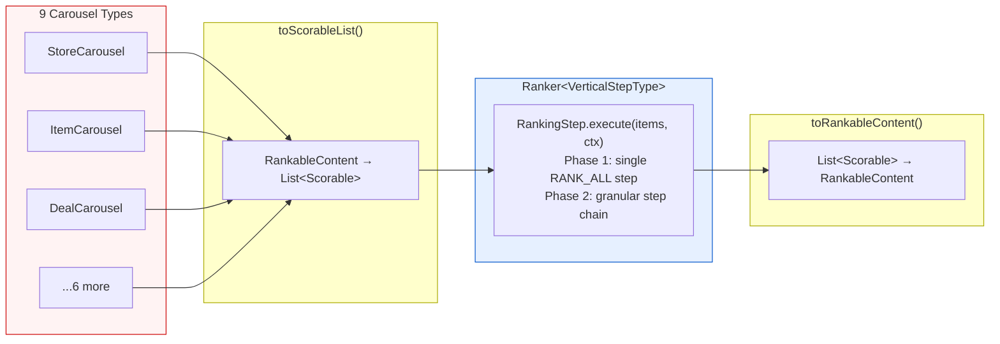
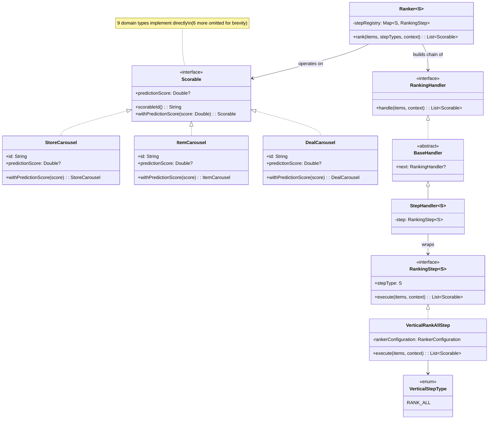
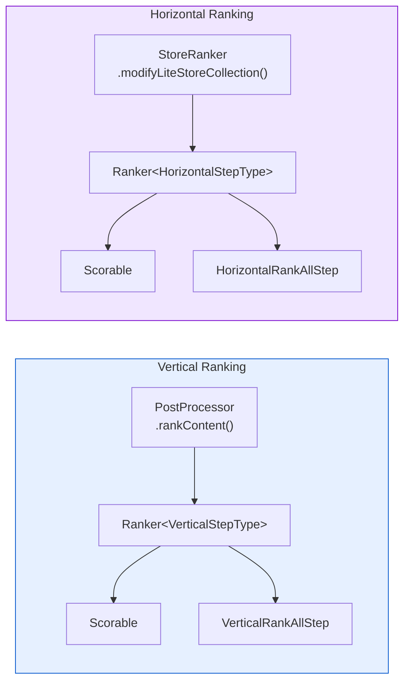
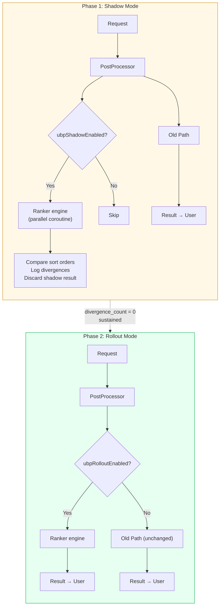

# [RFC] Ranking Abstraction Layer for Homepage Blending

| *Metadata* |  |
| :---- | :---- |
| **Author(s):** | Daniel Fonyo, Yu Zhang |
| **Status:** | Draft |
| **Origin:** | New |
| **History:** | Drafted: Mar 20, 2026 · Rewritten: Mar 23, 2026 (aligned with shipped implementation) |
| **Keywords:** | Homepage, ranking, blending, abstraction, interfaces, feed-service |
| **References:** | [Draft] Unified Blending Platform (Yu Zhang, Feb 2026) |

**Reviewers**

| Reviewer | Status | Notes |
| :---- | :---- | :---- |
| Yu Zhang | Not started | UBP vision author, HP MLE lead |
| Frank Zhang | Not started | HP tech lead |
| Dipali Ranjan | Not started | HP engineering |

**Dependencies**

| Dependency | Team | DRI | Status | Impact |
| :---- | :---- | :---- | :---- | :---- |
| feed-service | Homepage | Daniel Fonyo | Phase 1 vertical shipped | All changes live here |
| Sibyl | ML Platform | — | None | No changes — same gRPC calls |

---

# What?

Introduce ranking abstraction interfaces into feed-service that create a clean boundary between *what gets ranked* and *how ranking works*. Four interfaces:

- **`Scorable`** — unified interface implemented directly by domain types (`StoreCarousel`, `ItemCarousel`, etc.)
- **`RankingStep<S : Enum<S>>`** — domain logic contract (items in → items out)
- **`RankingHandler`** — infrastructure wrapper (chain of responsibility)
- **`Ranker<S : Enum<S>>`** — config-driven engine that assembles handler chains

These don't change any ranking behavior — they formalize existing conventions into compile-time contracts so that everything UBP needs can be built on top without rearchitecting.

**Thesis:** The homepage ranking pipeline cannot evolve toward UBP without interfaces. Every future UBP goal — experiment velocity, partner self-service, whole-page optimization — depends on having composable, testable ranking steps that operate on a uniform data type. This RFC proposes the interfaces and a safe delivery plan to get them into production.

**Phase 1 vertical is shipped.** `Scorable` is implemented on 9 vertical domain types. `Ranker<VerticalStepType>` with a single `RANK_ALL` step wrapping the entire legacy pipeline is wired in at `DefaultHomePagePostProcessor.rankContent()` (shadow mode, gated by `ubp_shadow_vertical_ranking`). This RFC asks for alignment that these are the right abstractions before proceeding to shadow validation and horizontal ranking.

---

# Why?

## The homepage grew faster than its infrastructure

The DoorDash homepage started as a single-vertical product — just restaurants. Over time it grew to serve 9+ content types on the same page: Rx stores, NV stores, item carousels, deal carousels, collections, map carousels, reels, and standalone store entities. Each was bolted on by different teams at different times.

The result: ranking logic is scattered across utility objects with no shared interface, no clean boundaries, and no way to test or configure one stage independently. Understanding what happens to a carousel's score requires reading 6+ files. Changing one experiment parameter requires touching 10-15 files and 2-3 weeks of HP engineer time.

## Three concrete problems

**1. No shared abstraction for carousel types.**
The pipeline handles 9 domain types (`StoreCarousel`, `ItemCarousel`, `DealCarousel`, `StoreCollection`, `CollectionV2`, `ItemCollection`, `MapCarousel`, `ReelsCarousel`, `StoreEntity`). These have no common interface. Every ranking stage branches on type:

```
Score stage  → if StoreCarousel? if ItemCarousel? if DealCarousel? ... (9 branches)
Blend stage  → if StoreCarousel? if ItemCarousel? if DealCarousel? ... (9 branches)
Boost stage  → if StoreCarousel? if ItemCarousel? if DealCarousel? ... (9 branches)
Pin stage    → if StoreCarousel? if ItemCarousel? if DealCarousel? ... (9 branches)
```

Adding a new carousel type means touching 10+ files across the pipeline.

**2. No abstraction for ranking stages.**
Scoring, boosting, blending, and pinning are inline method calls through utility objects (`BlendingUtil`, `BoostingBundle`, `EntityScorer`). They cannot be tested independently, swapped, or configured without modifying the call chain. Parameters live in 6+ locations (DVs, runtime JSONs, hardcoded constants).

**3. No test coverage on the ranking pipeline.**
There are zero tests covering the end-to-end ranking behavior. Changes are "edit and pray." There is no safe way to refactor or extend the pipeline.

## Why this matters for UBP

The Unified Blending Platform vision (Yu Zhang, Feb 2026) proposes a systematic, ML-driven framework replacing fragmented homepage blending with whole-page optimization. It promises:

- **10x experiment velocity** (2-3 weeks → 2-3 days)
- **Self-service experimentation** for partner teams (NV, Ads, Merch)
- **Unified value function** across all content types
- **Per-step observability** for debugging and counterfactual analysis

None of this is possible without clean interfaces. You cannot make ranking config-driven if there is no step abstraction to configure. You cannot let partners self-serve if there is no extension point. You cannot observe per-step scores if there are no steps.

**This RFC is the first step: establish the interfaces that make everything else buildable.**

---

## Goals

1. **Introduce `Scorable` interface** — implemented directly by 9 vertical domain types (no wrapper classes). `StoreCarousel`, `ItemCarousel`, etc. implement `Scorable` via `predictionScore` + `withPredictionScore()` copy pattern.
2. **Introduce ranking engine** — `RankingStep<S>` + `RankingHandler` + `Ranker<S>` with chain-of-responsibility dispatch.
3. **Align on these as the stable contract** — these interfaces and their signatures are the API surface all future UBP work builds on.
4. **Shadow validate** — prove the engine produces identical results to the old path before any traffic migrates.
5. **Preserve all existing behavior** — Phase 1 wraps the entire legacy pipeline in one `RANK_ALL` step. No behavior change.

## Non-Goals

| Not doing | Why |
| :---- | :---- |
| Rewriting ranking logic | `RANK_ALL` delegates to the same existing methods |
| Changing experiment behavior or traffic | This is pure infrastructure — no user-visible change |
| Self-service MLE experiments | Future work built on these interfaces |
| Unified value function | Future work — requires calibration infrastructure |
| Ads blending | Post-POC — requires shared scoring scale |
| Granular step decomposition | Phase 2 — break `RANK_ALL` into `MODEL_SCORING`, `DIVERSITY_RERANK`, etc. once Phase 1 is proven |

---

# Who?

| Person | Role |
| :---- | :---- |
| Daniel Fonyo | Implementation DRI — writes code, drives delivery |
| Yu Zhang | UBP vision author — alignment on interface contracts |
| Frank Zhang | HP tech lead — code review, architecture sign-off |
| Dipali Ranjan | HP engineering — code review |

---

# When?

| Phase | What | Status |
| :---- | :---- | :---- |
| **1. Scorable + engine** | `Scorable` on 9 vertical types, `RankingStep<S>`, `RankingHandler`, `Ranker<S>`, `VerticalRankAllStep` — all pure additions | **Shipped** |
| **2. Shadow validation** | Wire shadow path in `DefaultHomePagePostProcessor`. Run both paths, compare sort orders, log divergences. Target: `divergence_count = 0` | Next |
| **3. Horizontal** | Same interfaces applied to within-carousel ranking | After vertical proven |
| **4. Rollout** | DV-gated gradual migration: 1% → 5% → 25% → 50% → 100% | After shadow proven |
| **5. Granular steps** | Decompose `RANK_ALL` into composable steps | After rollout stable |

Each phase is independently shippable. If any phase shows risk, we stop and the old path continues serving 100% of traffic.

---

# Design

## Introduction

The ranking pipeline today is a chain of inline method calls with no interfaces between them:

```
reOrderGlobalEntitiesV2()
  └─ rankAndDedupeContent()
       └─ rankAndMergeContent()
            └─ rankContent()
                 └─ BaseEntityRankerConfiguration.rank()
                      ├─ getEntities()         — flatten 9 types via type-checks
                      ├─ getScoreBundle()       — Sibyl ML scoring
                      ├─ getBoostBundle()       — boosting + multipliers
                      ├─ getRankingBundle()     — pin vs flow separation
                      └─ getRankableContent()   — re-assemble typed containers
```

We introduce four interfaces that create clean boundaries at these seams. The existing methods don't change — they get wrapped by a single step that exposes them through a uniform contract.

The strategy is: **implement interface on existing types, rank uniformly, apply back**.



This diagram shows the core design: diverse types converge to one interface, pass through a step chain, and convert back. Domain types implement `Scorable` directly — no adapter wrappers.

## Architecture

### `Scorable` Interface (Implemented, Not Wrapped)

Today, every ranking stage branches on carousel type because there is no shared interface. With `Scorable`, the existing domain types implement the interface directly — everything downstream operates on a single type.

```kotlin
interface Scorable {
    fun scorableId(): String
    val predictionScore: Double?
    fun withPredictionScore(score: Double): Scorable
}
```

Domain types implement `Scorable` by adding `override` annotations to fields they already have, plus a one-line `withPredictionScore()` via Kotlin's `copy()`:

```kotlin
data class StoreCarousel(
    // ... existing fields ...
    override val predictionScore: Double?,
) : Carousel, BaseCarousel, SortablePlacement, Scorable {
    override fun scorableId(): String = id
    override fun withPredictionScore(score: Double): StoreCarousel = copy(predictionScore = score)
}
```

**Key design choice: interface inheritance, not adapter wrappers.** The fields (`id`, `predictionScore`) already exist on these types. `Scorable` formalizes an existing convention into a compile-time contract. No wrapper classes, no `applyBackTo()`, no mutable `var score` — `withPredictionScore()` returns an immutable copy.

**What this eliminates:** 9 branches x 4 stages = 36 type-checks scattered across files. After: 0 type-checks in the pipeline.

**What this enables:** New carousel type = implement `Scorable` on one class instead of 10+ file changes.

### Conversion Functions

`RankableContent` (the existing container for all carousel types) converts to/from `List<Scorable>`:

```kotlin
fun RankableContent.toScorableList(): List<Scorable>
fun List<Scorable>.toRankableContent(): RankableContent
```

`toScorableList()` flattens all carousel fields into a single list. `toRankableContent()` reconstructs the typed container by filtering instances back into their original fields. Round-trip preserves all items.

### Immutability Design

`Scorable` follows Kotlin data class conventions — immutable by default:

| Field | Mutable? | Why |
| :---- | :---- | :---- |
| `scorableId()` | No (function) | Identity — never changes |
| `predictionScore` | No (`val`) | Set via `withPredictionScore()` copy |
| `withPredictionScore()` | N/A | Returns new instance — original unchanged |

**No mutable state.** Steps produce new lists via `withPredictionScore()`. The engine collects the result. This is safer than the mutable adapter pattern and aligns with Kotlin idioms.

### `RankingStep<S : Enum<S>>`

The step interface is generic over a step type enum, allowing different ranking layers (vertical, horizontal) to have their own step type taxonomy:

```kotlin
interface RankingStep<S : Enum<S>> {
    val stepType: S
    suspend fun execute(items: List<Scorable>, context: RankingContext): List<Scorable>
}
```

Phase 1 has one step type (`RANK_ALL`) that wraps the entire legacy pipeline:

```kotlin
enum class VerticalStepType {
    RANK_ALL,
}
```

Phase 2 will add granular types: `MODEL_SCORING`, `MULTIPLIER_BOOST`, `DIVERSITY_RERANK`, `POSITION_BOOSTING`, `FIXED_PINNING`.

### `RankingHandler` (Chain of Responsibility)

Handlers wrap steps with infrastructure concerns (metrics, conditions, shadow validation):

```kotlin
interface RankingHandler {
    suspend fun handle(items: List<Scorable>, context: RankingContext): List<Scorable>
}

abstract class BaseHandler : RankingHandler {
    var next: RankingHandler? = null
    protected suspend fun next(items: List<Scorable>, context: RankingContext): List<Scorable>
}

class StepHandler<S : Enum<S>>(private val step: RankingStep<S>) : BaseHandler()
```

`StepHandler` wraps a `RankingStep` and chains to the next handler. The engine builds the chain; steps don't know about chaining.

### `Ranker<S : Enum<S>>` Engine

The engine assembles a handler chain from a step type list and executes it:

```kotlin
class Ranker<S : Enum<S>>(
    private val stepRegistry: Map<S, RankingStep<S>>,
) {
    suspend fun rank(
        items: List<Scorable>,
        stepTypes: List<S>,
        context: RankingContext,
    ): List<Scorable>

    private fun buildChain(stepTypes: List<S>): RankingHandler
}
```

Zero business logic — pure dispatch. The engine looks up each step type in the registry, wraps it in a `StepHandler`, chains them, and executes. Step order is determined by the `stepTypes` list passed in.

### `VerticalRankAllStep` (Phase 1)

The single Phase 1 step delegates to the existing `RankerConfiguration`:

```kotlin
class VerticalRankAllStep(
    private val rankerConfiguration: RankerConfiguration,
) : RankingStep<VerticalStepType> {
    override val stepType = VerticalStepType.RANK_ALL
    override suspend fun execute(items: List<Scorable>, context: RankingContext): List<Scorable>
}
```

This step calls `rankerConfiguration.rank()` — the same method the old path calls. Identical behavior, different dispatch path.

### Class Diagram



### Both Layers Side by Side

Same architecture, different step type enums. Vertical proven first, horizontal mirrors it.



### Safe Delivery: Shadow → Rollout

We never put users at risk. The migration has two phases:

**Shadow mode:** The old path always runs and always returns the result. The new path runs **in parallel** (via coroutine, when DV-enabled), its result is discarded, and sort orders are compared. We log every divergence. Target: `divergence_count = 0` across sustained traffic before proceeding.

**Rollout mode:** Once shadow proves zero divergence, a rollout DV gates the new path as primary. Ramped gradually: 1% → 5% → 25% → 50% → 100%. The old path is the `else` branch — compiles and runs identically.



**Characterization tests with UBP flag OFF must remain green at every stage** — proving the old path is untouched.

### Dependencies

**Upstream:** None. Internal to feed-service post-processing. Retrieval, grouping, and Sibyl are untouched.

**Downstream:** None. API response shape is identical. Client apps see no change.

## Service Level Objectives (SLO)

### External vs Internal

Purely internal. No new services, no new RPCs. All changes are within the existing feed-service process.

### Latency — Rollout Mode

Once the UBP path is the primary path (old path off), there is no duplication. `VerticalRankAllStep` wraps `RankerConfiguration.rank()` — same computation, same Sibyl calls, same runtime config reads.

| Operation | Additional latency |
| :---- | :---- |
| `toScorableList()` / `toRankableContent()` conversion | ~1-2ms |
| Step registry lookup + handler chain build | ~0.1ms |
| **Total additional overhead vs current path** | **<3ms** |

### Latency — Shadow Mode (Temporary)

Shadow mode runs old and new paths **in parallel** via coroutines. The user-facing response returns as soon as the old path completes — shadow never blocks the response.

**Wall-clock latency impact:** Minimal. Since both paths run concurrently, the request duration is `max(old_path, new_path)`, not the sum. The new path wraps the same methods as the old path, so it takes roughly the same time.

**Sibyl QPS doubles during shadow.** The old path makes its Sibyl call. The parallel `RANK_ALL` step (which calls `RankerConfiguration.rank()`) makes its own Sibyl call.

| Shadow impact | Cost | Mitigation |
| :---- | :---- | :---- |
| +1 Sibyl gRPC call per request | ~2x vertical Sibyl QPS for shadow traffic | Shadow only on small % (start at 1%). Monitor Sibyl p99 before ramping. |
| Compute (conversion, chain build, comparison) | ~5-15ms CPU per request | Parallel — does not block response |

**Mitigations:**
1. **Sampling** — shadow at low sample rate (e.g., 1-5% of traffic). Caps Sibyl QPS overhead.
2. **Shadow one layer at a time** — validate vertical first, then horizontal.
3. **Score reuse** — shadow `RANK_ALL` could reuse scores from old path instead of independent Sibyl call. Eliminates doubling but cannot validate scoring independently. Decision: start independent, switch if needed.
4. **Shadow is temporary** — once `divergence_count = 0` sustained, rollout replaces shadow.

### Failure

**Shadow mode:** All exceptions caught and swallowed. Shadow can never affect production result.

**Rollout mode:** If engine throws, DV is ramped down. Old path is the `else` branch.

**Rollback:** Disable the DV. Immediate. No deploy required.

## Contract Stability

**These interfaces are the long-term contract.** Once approved and shipped, they become the stable API surface that all future UBP work, MLE experiments, and partner integrations build against.

| Interface | What's being committed | Impact of getting it wrong |
| :---- | :---- | :---- |
| `Scorable` | `scorableId()`, `predictionScore`, `withPredictionScore()` | Every domain type, every step, and every future consumer of ranking depends on this shape |
| `RankingStep<S>` | `execute(items, context)` signature | Every step implementation, every engine dispatch depends on this signature |
| `RankingHandler` | `handle(items, context)` signature | Every infrastructure wrapper (metrics, shadow, tracing) depends on this |
| `Ranker<S>` | `rank(items, stepTypes, context)` signature | Every wiring point in the pipeline depends on this |

**What can change later:** New step type enum values. New `RankingStep` implementations. New `RankingHandler` wrappers. These are additive and non-breaking.

**What cannot change without migration:** Removing `Scorable` methods. Changing the `execute()` signature. Removing step type enum values that steps already depend on.

---

## What These Interfaces Unlock

| Future capability | How these interfaces enable it |
| :---- | :---- |
| **Config-driven experiments** | `RankingStep` + step type enum = experiments are pipeline config changes, not code changes |
| **Self-service MLE experimentation** | MLE declares `{model_name, traffic_pct}` — engine resolves to step sequence |
| **Per-layer traffic management** | Engine supports experiment resolution per layer — replaces DV waterfall |
| **Per-step observability** | Engine auto-emits `{item_id, step_type, score_before, score_after}` after each step |
| **Unified value function** | Calibration + value weight steps added as new `RankingStep` types — no engine change |
| **Partner self-service** | NV/Ads/Merch implement their own `RankingStep` — HP registers it once |
| **New carousel type onboarding** | Implement `Scorable` on one class instead of 10+ file changes |

## Alternative Designs

**1. Build UBP end-to-end in one shot.**
Rejected. Too much risk. The full UBP vision includes value functions, calibration, ads integration, and traffic management. Shipping all at once on the homepage — the front page of every DoorDash session — is unacceptable risk. Interfaces first, then incremental capabilities.

**2. Use adapter wrapper classes instead of interface inheritance.**
Rejected. The original design proposed `StoreCarouselRow`, `ItemCarouselRow`, etc. as wrapper classes around domain types. But the fields (`id`, `predictionScore`) already exist on the domain types. Wrapper classes add 9 new files, mutable `var score`, and `applyBackTo()` writeback complexity — all unnecessary. Interface inheritance formalizes existing fields into a contract with zero new classes.

**3. Wait for Pedregal (next-gen serving platform) and build on that.**
Rejected. Pedregal timeline is uncertain and addresses a different layer (retrieval/serving). The ranking abstraction problem exists independently. These interfaces work on the current system and transfer cleanly to any future serving platform.

**4. Refactor the existing code without interfaces.**
Rejected. Without a shared type (`Scorable`) and a step contract (`RankingStep`), any refactoring still results in scattered type-checks and inline method chains. Interfaces are the minimum structural change needed.

---

# Appendix

## A. Design Patterns Used

| Pattern | Where it appears | Why |
| :---- | :---- | :---- |
| **Interface inheritance** | Domain types implement `Scorable` directly | Formalizes existing fields into compile-time contract without wrapper overhead |
| **Strategy** | `RankingStep<S>` implementations | Each step is an interchangeable algorithm — the engine doesn't know which runs |
| **Chain of Responsibility** | `RankingHandler` chain | Handlers execute sequentially; step order is load-bearing |
| **Facade** | `Ranker.rank()` | Hides chain assembly, step dispatch, and context passing behind one call |
| **Template Method** | `BaseEntityRankerConfiguration.rank()` *(being replaced)* | The current pattern — rigid inheritance-based skeleton. UBP replaces with config-driven Chain of Responsibility |

**References:** Gamma et al., *Design Patterns* (1994). Feathers, *Working Effectively with Legacy Code* (2004).

---

## B. Existing Code: Key Files Reference

| What | File | Relevance |
| :---- | :---- | :---- |
| **Scorable interface** | `libraries/platform/.../models/Scorable.kt` | The core interface |
| **Ranking engine** | `libraries/common/.../ubp/RankingEngine.kt` | `Ranker`, `RankingStep`, `RankingHandler`, `BaseHandler`, `StepHandler` |
| **Vertical step type** | `libraries/common/.../ubp/VerticalStepType.kt` | `enum class VerticalStepType { RANK_ALL }` |
| **Vertical RANK_ALL step** | `libraries/common/.../ubp/VerticalRankAllStep.kt` | Delegates to `RankerConfiguration.rank()` |
| **Conversion functions** | `libraries/common/.../ubp/RankableContentConversions.kt` | `toScorableList()` / `toRankableContent()` |
| Vertical ranking entry point | `DefaultHomePagePostProcessor.reOrderGlobalEntitiesV2()` | Incision point for `Ranker<VerticalStepType>` |
| Current ranking skeleton | `BaseEntityRankerConfiguration.rank()` | Template Method being replaced |
| Carousel type flattening | `EntityRankerConfiguration.getEntities()` | What `Scorable` interface replaces |
| Sibyl ML scoring + blending | `EntityRankerConfiguration.getScoreBundleWithWorkflowHelper()` | Called by `VerticalRankAllStep` via `RankerConfiguration` |
| Horizontal ranking entry point | `DefaultHomePageStoreRanker.rank()` | Incision point for `Ranker<HorizontalStepType>` |
| Post-ranking fixups (NOT changing) | `NonRankableHomepageOrderingUtil` | NV pin, PAD=3, member pricing — stays as-is |

---

## C. Value Function Reference

The interfaces support an eventual unified value function:

```
EV(c, k) = pImp(k) × pAct(c) × vAct(c)

  pImp(k)  = P(user sees position k) — position decay, BE-owned
  pAct(c)  = P(user acts | they see c) — ML model output (Sibyl)
  vAct(c)  = Value of that action — gov_w × GOV + fiv_w × FIV + strategic_w × Strategic
```

**Phase 1 (current):** `RANK_ALL` wraps the entire pipeline — scoring, blending, and sorting in one step. The value function is implicit in the existing `BlendingUtil` logic.

**Phase 2:** Decompose into `MODEL_SCORING` (sets `pAct`), `CALIBRATION` (normalizes scores), `VALUE_WEIGHTING` (explicit `vAct`), `DIVERSITY` (reranking). Each becomes a separate `RankingStep` — the engine is unchanged, just more steps in the chain.

---

## D. Per-Step Tracing (Future Iteration)

The engine architecture supports per-step tracing because the engine dispatches to named steps sequentially. It can snapshot `predictionScore` before and after each step — giving full visibility into how each step affected each item's score.

Not part of the current proposal. Will be designed once the interfaces are in production and the step chain has more than one step.
